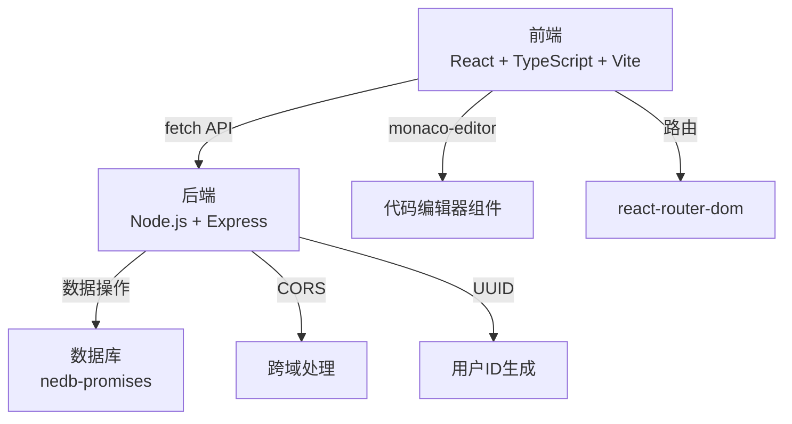
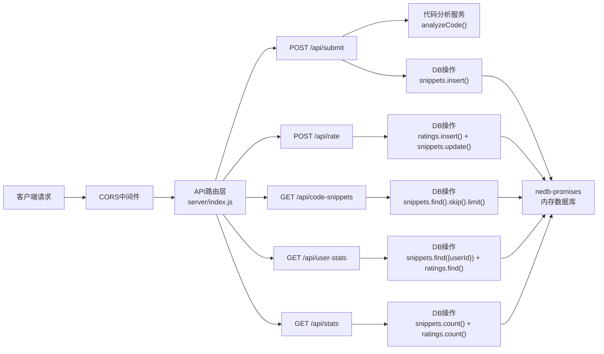
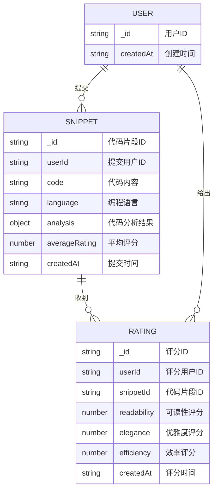

## 1. 架构设计

系统采用前后端分离架构，前端使用React + TypeScript + Vite，后端使用Node.js + Express，数据存储使用nedb-promises轻量级内存数据库。前后端通过REST API进行通信。



## 2. 技术描述

- **前端框架**：React 18 + TypeScript 5
- **构建工具**：Vite 5
- **代码编辑器**：monaco-editor 0.45
- **路由管理**：react-router-dom 6
- **状态管理**：React Hooks (useState, useEffect, useRef)
- **后端框架**：Express 4
- **数据库**：nedb-promises 6（轻量级嵌入式数据库）
- **跨域处理**：cors 2
- **唯一标识**：uuid 9
- **开发服务器**：Vite开发服务器（端口5173），代理/api到后端3001端口
- **后端服务器**：Express服务器（端口3001）

## 3. 路由定义

| 路由 | 页面组件 | 功能描述 |
|-------|---------|----------|
| `/` | 重定向到 `/submit` | 首页重定向 |
| `/submit` | SubmitPage | 提交代码页 |
| `/plaza` | PlazaPage | 风格广场页 |
| `/stats` | StatsPage | 我的战绩页 |

## 4. API 定义

### 4.1 类型定义

```typescript
// 代码分析结果
interface CodeAnalysis {
  lineCount: number;
  cyclomaticComplexity: number;
  commentRate: number;
  namingStyle: 'camelCase' | 'snake_case' | 'mixed';
  overallScore: number;
}

// 代码片段
interface CodeSnippet {
  _id: string;
  userId: string;
  code: string;
  language: 'javascript' | 'python';
  analysis: CodeAnalysis;
  ratings: Rating[];
  averageRating: number;
  createdAt: string;
}

// 评分记录
interface Rating {
  _id: string;
  userId: string;
  snippetId: string;
  readability: number;
  elegance: number;
  efficiency: number;
  createdAt: string;
}

// 用户战绩
interface UserStats {
  _id: string;
  snippetId: string;
  code: string;
  language: string;
  createdAt: string;
  analysis: CodeAnalysis;
  averageRating: number;
  maxRating: number;
  minRating: number;
  ratingCount: number;
  ratingDistribution: number[];
}
```

### 4.2 接口定义

| 方法 | 路径 | 请求参数 | 响应格式 | 功能描述 |
|------|------|----------|----------|----------|
| POST | `/api/submit` | `{ code: string, language: string, userId: string }` | `{ success: boolean, analysis: CodeAnalysis, snippetId: string }` | 提交代码并获取分析结果 |
| POST | `/api/rate` | `{ snippetId: string, userId: string, readability: number, elegance: number, efficiency: number }` | `{ success: boolean, averageRating: number }` | 提交评分 |
| GET | `/api/code-snippets` | `?page=1&limit=10&excludeUserId=xxx` | `{ snippets: CodeSnippet[], total: number }` | 分页获取匿名代码片段 |
| GET | `/api/user-stats` | `?userId=xxx` | `{ stats: UserStats[] }` | 获取用户提交历史及评分 |
| GET | `/api/stats` | - | `{ totalSnippets: number, totalRatings: number }` | 获取系统统计数据 |

## 5. 服务器架构图



## 6. 数据模型

### 6.1 数据模型定义



### 6.2 数据库初始化

nedb-promises会自动创建数据库文件，无需DDL语句。服务器启动时初始化两个数据集合：
- `snippets.db`：存储代码片段数据
- `ratings.db`：存储评分记录数据

初始化数据：系统启动时若无数据，自动插入10条示例代码片段用于展示。

## 7. 项目文件结构

```
auto8/
├── .trae/documents/
│   ├── prd.md                    # 产品需求文档
│   └── tech-architecture.md      # 技术架构文档
├── src/                          # 前端模块
│   ├── App.tsx                   # 主路由组件
│   ├── main.tsx                  # 入口文件
│   ├── components/
│   │   ├── CodeEditor.tsx        # 代码编辑器组件
│   │   ├── ScoringCard.tsx       # 评分卡片组件
│   │   ├── StatsTable.tsx        # 战绩表格组件
│   │   ├── AnalysisCard.tsx      # 分析摘要卡片组件
│   │   ├── StarRating.tsx        # 星级评分组件
│   │   └── RatingChart.tsx       # 评分分布柱状图组件
│   ├── pages/
│   │   ├── SubmitPage.tsx        # 提交代码页
│   │   ├── PlazaPage.tsx         # 风格广场页
│   │   └── StatsPage.tsx         # 我的战绩页
│   ├── utils/
│   │   ├── api.ts                # API调用封装
│   │   └── user.ts               # 用户ID管理
│   └── types/
│       └── index.ts              # TypeScript类型定义
├── server/                       # 后端模块
│   ├── index.js                  # Express服务器入口
│   ├── analyze.js                # 代码分析逻辑
│   └── data/                     # nedb数据库文件目录
├── index.html                    # HTML入口
├── vite.config.js                # Vite配置
├── tsconfig.json                 # TypeScript配置
└── package.json                  # 项目依赖配置
```
