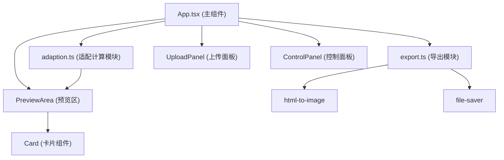

## 1. 架构设计

这是一个纯前端的单页应用，采用模块化架构，将业务逻辑与UI渲染分离。



## 2. 技术描述

- **前端框架**：React 18 + TypeScript
- **构建工具**：Vite 5.x + @vitejs/plugin-react
- **第三方依赖**：
  - `html-to-image`：将DOM节点转换为图片
  - `file-saver`：触发浏览器下载
- **状态管理**：使用 React useState/useEffect 管理本地状态（纯前端轻量应用，无需额外状态管理库）
- **初始化方式**：使用 `npm init vite-init@latest` 初始化 React + TypeScript 项目

### 文件结构与职责

| 文件路径 | 职责说明 | 调用关系 |
|----------|----------|----------|
| `package.json` | 项目依赖配置与脚本定义 | 被 npm 读取 |
| `index.html` | 应用入口页面，包含根容器 `div#root` | 被 Vite 加载 |
| `vite.config.js` | Vite 构建配置，启用 React 插件 | 被 Vite 读取 |
| `tsconfig.json` | TypeScript 编译配置，严格模式，target ES2020 | 被 TypeScript 编译器读取 |
| `src/App.tsx` | 主应用组件，管理全局状态，布局三栏结构 | 调用 `adaption.ts` 获取适配结果，调用 `export.ts` 执行导出，渲染 UploadPanel、ControlPanel、PreviewArea |
| `src/adaption.ts` | 适配计算模块，纯函数，无副作用 | 被 `App.tsx` 调用，输入图片和平台规格，输出适配结果 |
| `src/export.ts` | 导出模块，处理图片生成和下载 | 被 `App.tsx` 调用，输入 DOM 节点引用，调用 `html-to-image` 和 `file-saver` |
| `src/components/UploadPanel.tsx` | 上传面板组件，处理图片上传交互 | 被 `App.tsx` 渲染 |
| `src/components/ControlPanel.tsx` | 控制面板组件，平台选择和文字输入 | 被 `App.tsx` 渲染 |
| `src/components/PreviewArea.tsx` | 预览区组件，卡片容器 | 被 `App.tsx` 渲染，渲染 `Card` 组件 |
| `src/components/Card.tsx` | 单平台卡片组件，按规格渲染 | 被 `PreviewArea.tsx` 渲染 |

### 数据流向

```
用户输入 → App.tsx (状态管理) → adaption.ts (计算适配) → App.tsx (接收结果) → PreviewArea/Card (渲染预览)
                                                                 ↓
                                                           export.ts (导出下载)
```

## 3. 核心类型定义

```typescript
// 平台标识
type Platform = 'instagram' | 'twitter' | 'wechat';

// 平台规格定义
interface PlatformSpec {
  platform: Platform;
  name: string;
  width: number;
  height: number;
  color: string;
  titleFontSize: number;
  bodyFontSize: number;
  layout: 'square' | 'banner-top' | 'banner-split';
}

// 裁切区域
interface CropRect {
  x: number;
  y: number;
  width: number;
  height: number;
}

// 适配结果
interface AdaptionResult {
  platform: Platform;
  cropRect: CropRect;
  fontSize: {
    title: number;
    body: number;
  };
  scale: number;
}

// 应用状态
interface AppState {
  imageFile: File | null;
  imageUrl: string;
  imageSize: { width: number; height: number } | null;
  title: string;
  body: string;
  selectedPlatforms: Platform[];
  adaptionResults: AdaptionResult[];
  isExporting: boolean;
}
```

## 4. 模块功能说明

### adaption.ts - 适配计算模块

**核心函数**：
```typescript
calculateAdaption(
  imageSize: { width: number; height: number },
  specs: PlatformSpec[]
): AdaptionResult[]
```

**算法逻辑**：
1. 对每个平台规格，计算目标宽高比
2. 比较图片宽高比与目标宽高比，确定裁切方向
3. 计算等比缩放因子，确保图片完全填充目标区域
4. 计算居中裁切的坐标和尺寸
5. 根据缩放因子调整文字字号偏移

### export.ts - 导出模块

**核心函数**：
```typescript
exportCardAsPng(
  cardElement: HTMLElement,
  filename: string,
  platform: PlatformSpec
): Promise<void>
```

**执行流程**：
1. 调用 `html-to-image.toBlob()` 将 DOM 节点转换为 Blob
2. 使用 `file-saver.saveAs()` 触发浏览器下载
3. 文件名格式：`{平台名}_{时间戳}.png`

## 5. 组件拆分

### UploadPanel.tsx
- 处理文件选择和拖拽上传
- 验证文件类型和大小
- 显示上传区域和缩略图
- 波纹动画效果

### ControlPanel.tsx
- 平台多选复选框组
- 标题输入框（最多50字）
- 正文输入框（最多200字，实时字数统计）
- 300ms防抖处理文字输入

### PreviewArea.tsx
- 卡片容器，并排布局
- 统一卡片高度
- 渲染选中的平台卡片

### Card.tsx
- 按平台规格渲染图片和文字
- 应用适配计算结果
- 0.2s过渡动画

## 6. 性能优化

- **图片预加载**：上传后立即加载图片获取尺寸，使用 `new Image()` 异步加载
- **防抖处理**：文字输入使用 `useDebounce` 自定义Hook，300ms延迟更新
- **React.memo**：卡片组件使用 memo 避免不必要的重渲染
- **CSS过渡**：使用 CSS transition 实现流畅动画，避免 JS 动画开销
