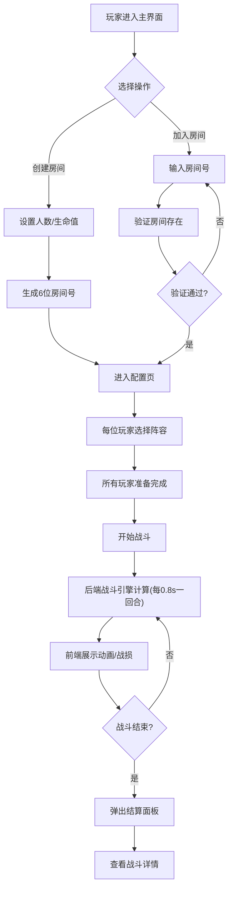

## 1. 产品概述

回合制战术桌游裁决器是一款自动化战斗模拟工具，解决策略桌游玩家在计算战损、技能触发顺序等环节的争论问题，提供公平、透明、高效的游戏流程裁决服务。

- 核心目标：消除人工计算误差，规范战斗流程，提升桌游体验
- 目标用户：策略桌游爱好者、桌游聚会参与者
- 市场价值：填补桌游数字化裁决工具空白，可扩展支持多种桌游规则

## 2. 核心功能

### 2.1 用户角色

| 角色 | 注册方式 | 核心权限 |
|------|----------|----------|
| 玩家 | 直接进入（无需注册） | 创建/加入房间、配置阵容、参与战斗、查看战报 |

### 2.2 功能模块

1. **主界面**：房间创建入口、房间加入入口、房间号输入
2. **配置页**：玩家阵容选择、游戏规则设置、战斗开始
3. **战斗面板**：实时战损显示、单位动画、技能效果、战报流
4. **结算面板**：战斗结果展示、剩余单位状态、技能触发统计

### 2.3 页面详情

| 页面名称 | 模块名称 | 功能描述 |
|----------|----------|----------|
| 主界面 | 房间创建模块 | 6位房间号生成、玩家人数设置(2-4人)、初始生命值分配 |
| 主界面 | 房间加入模块 | 房间号输入验证、房间存在性检查 |
| 配置页 | 阵容选择模块 | 九宫格卡片展示、战士/法师/射手选择、选中动画效果 |
| 配置页 | 游戏设置模块 | 玩家列表展示、开始战斗按钮 |
| 战斗面板 | 战损条模块 | 双方总血量实时更新、红到绿渐变、弹性过渡动画 |
| 战斗面板 | 单位展示模块 | 单位位置显示、悬停放大、点击查看详情 |
| 战斗面板 | 战报流模块 | 攻击记录、技能触发、伤害数值展示 |
| 战斗面板 | 动画模块 | 单位移动、攻击、技能圆形波扩散动画 |
| 结算面板 | 结果展示模块 | 胜负判定、剩余单位状态、技能触发次数统计 |
| 公共组件 | Toast提示 | 玩家进出房间通知、系统消息 |
| 公共组件 | 退出按钮 | 房间退出、广播通知其他玩家 |

## 3. 核心流程

玩家进入主界面后，可选择创建新房间或加入已有房间。创建房间时设置玩家人数和初始生命值，系统生成6位房间号。房间创建者邀请其他玩家通过房间号加入。所有玩家加入后，每位玩家选择3个单位的预设阵容（战士/法师/射手）。准备完成后开始战斗，后端战斗引擎按每回合0.8秒自动计算战损和技能触发，前端实时展示动画和战损变化。战斗结束后弹出结算面板，显示详细战斗数据。

## 4. 用户界面设计

### 4.1 设计风格

- 主色调：深蓝紫渐变背景 (#0f0c29 → #302b63 → #24243e)
- 强调色：蓝紫渐变按钮 (#667eea → #764ba2)、金色选中边框 (#FFD700)
- 按钮风格：圆角32px，毛玻璃效果（背景模糊12px，半透明白色边框1px）
- 卡片风格：圆角12px，毛玻璃效果，悬停放大1.05倍（0.2s过渡）
- 字体选择：展示字体使用 Orbitron（科技感强），正文字体使用 Noto Sans SC
- 排版层级：标题24px粗体，副标题18px，正文14px，辅助文字12px

### 4.2 页面设计概述

| 页面名称 | 模块名称 | UI元素 |
|----------|----------|--------|
| 主界面 | 房间创建区 | 渐变背景、毛玻璃卡片、蓝紫渐变按钮（脉冲动画）、数字输入框 |
| 主界面 | 房间加入区 | 房间号输入框、6位数字校验、加入按钮 |
| 配置页 | 阵容选择区 | 3×3九宫格卡片布局（120×160px）、金色选中边框、弹跳缩放动画 |
| 配置页 | 玩家列表区 | 玩家头像、名称、阵容预览、准备状态 |
| 战斗面板 | 战损条区 | 顶部固定、红到绿渐变条、宽度百分比、0.5s弹性过渡 |
| 战斗面板 | 战场区 | 双方单位分列布局、单位卡片（90×120px移动端）、技能波动画 |
| 战斗面板 | 战报区 | 右侧滚动列表、时间戳、伤害数值、技能图标 |
| 结算面板 | 弹窗区 | 半透明黑色遮罩、500×400px白卡、圆角24px、淡入上滑动画 |
| 公共组件 | Toast | 右上角、从右滑入、停留2.5s、淡出 |
| 公共组件 | 退出按钮 | 右上角固定、悬停变色 |

### 4.3 响应式设计

- 桌面端（≥768px）：战斗面板并排布局，卡片120×160px
- 移动端（<768px）：战斗面板纵向堆叠，卡片缩小至90px宽，战损条缩窄
- 交互动画在所有尺寸保持一致
- 触控优化：按钮最小44×44px触控区域，列表项垂直间距≥8px

### 4.4 动画规范

- 创建按钮点击：0.2s脉冲收缩后跳转
- 卡片选中：0.3s弹跳缩放（scale: 1.05 → 1.0）
- 战损条变化：0.5s弹性过渡（cubic-bezier(0.68, -0.55, 0.265, 1.55)）
- 技能动画：圆形波扩散（scale: 0 → 1.5，opacity: 1 → 0），持续0.4s
- 结算面板：0.3s淡入（opacity: 0 → 1）+ 向上滑入（translateY: 20px → 0）
- Toast提示：从右滑入（translateX: 100% → 0），停留2.5s，淡出（opacity: 1 → 0）
- 战斗回合间隔：0.8秒
- 单位悬停：0.2s放大1.05倍

## 5. 性能约束

- 每个战斗回合计算+动画播放 ≤ 1秒（不含网络延迟）
- 前端帧率稳定 ≥ 30fps
- 动画无卡顿、掉帧
- 内存占用峰值 ≤ 200MB
- API响应时间 ≤ 200ms
