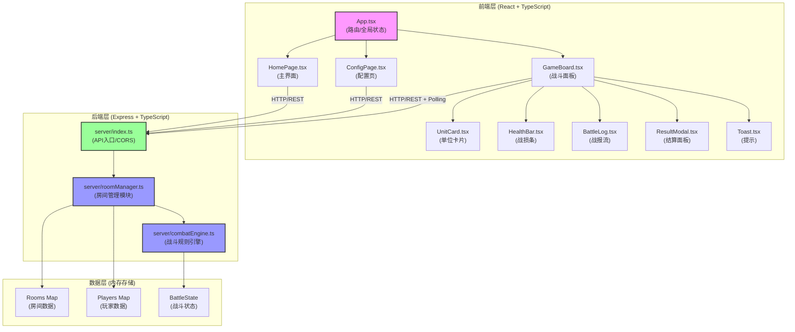
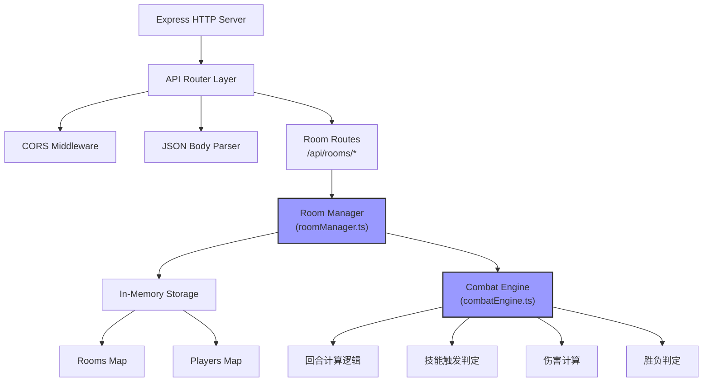

## 1. 架构设计



### 数据流向说明
1. **前端 → 后端**：用户操作通过HTTP REST API发送到Express服务器
2. **server/index.ts → roomManager.ts**：API路由将请求转发给房间管理模块
3. **roomManager.ts → combatEngine.ts**：战斗开始时，房间管理模块调用战斗引擎
4. **combatEngine.ts → roomManager.ts**：战斗计算结果返回给房间管理模块
5. **roomManager.ts → 前端**：房间状态和战斗结果通过API响应返回给前端
6. **前端状态分发**：App.tsx接收数据后分发给各子组件渲染

## 2. 技术描述

- **前端框架**：React 18 + TypeScript 5 + Vite 5
- **状态管理**：Zustand（轻量级状态管理）
- **样式方案**：Tailwind CSS 3 + CSS Animations
- **图标库**：Lucide React
- **后端框架**：Express 4 + TypeScript
- **HTTP客户端**：Fetch API（原生）
- **数据存储**：内存Map（无需数据库）
- **实时更新**：HTTP轮询（每500ms）
- **构建工具**：Vite 5
- **包管理器**：npm

## 3. 项目结构

```
auto84/
├── package.json              # 项目依赖与脚本
├── vite.config.js            # Vite构建配置（含React插件）
├── tsconfig.json             # TypeScript配置（严格模式）
├── index.html                # 入口页面
├── server/                   # 后端代码
│   ├── index.ts              # Express服务器入口
│   ├── roomManager.ts        # 房间管理模块
│   ├── combatEngine.ts       # 战斗规则引擎模块
│   └── types.ts              # 后端类型定义
├── src/                      # 前端代码
│   ├── main.tsx              # React入口
│   ├── App.tsx               # 主组件（路由/全局布局）
│   ├── index.css             # 全局样式
│   ├── types/                # 类型定义
│   │   └── index.ts          # 共享类型
│   ├── store/                # 状态管理
│   │   └── useGameStore.ts   # 游戏状态store
│   ├── pages/                # 页面组件
│   │   ├── HomePage.tsx      # 主界面
│   │   └── ConfigPage.tsx    # 配置页
│   ├── components/           # 可复用组件
│   │   ├── GameBoard.tsx     # 游戏战斗面板
│   │   ├── UnitCard.tsx      # 单位卡片
│   │   ├── HealthBar.tsx     # 战损条
│   │   ├── BattleLog.tsx     # 战报流
│   │   ├── ResultModal.tsx   # 结算面板
│   │   ├── Toast.tsx         # Toast提示
│   │   └── ExitButton.tsx    # 退出按钮
│   ├── hooks/                # 自定义Hooks
│   │   ├── useRoomPolling.ts # 房间轮询Hook
│   │   └── useAnimation.ts   # 动画控制Hook
│   ├── utils/                # 工具函数
│   │   ├── api.ts            # API请求封装
│   │   └── animations.css    # 动画关键帧
│   └── data/                 # 静态数据
│       └── units.ts          # 单位预设数据
└── .trae/
    └── documents/
        ├── PRD.md
        └── technical-architecture.md
```

### 文件调用关系
1. [package.json](file:///d:/Pro/tasks/auto84/package.json) → 定义所有依赖和启动脚本
2. [vite.config.js](file:///d:/Pro/tasks/auto84/vite.config.js) → 配置Vite和React插件
3. [index.html](file:///d:/Pro/tasks/auto84/index.html) → 加载根组件
4. [server/index.ts](file:///d:/Pro/tasks/auto84/server/index.ts) → 引用 roomManager，暴露API路由
5. [server/roomManager.ts](file:///d:/Pro/tasks/auto84/server/roomManager.ts) → 引用 combatEngine，管理房间状态
6. [server/combatEngine.ts](file:///d:/Pro/tasks/auto84/server/combatEngine.ts) → 独立模块，仅通过接口与roomManager通信
7. [src/App.tsx](file:///d:/Pro/tasks/auto84/src/App.tsx) → 路由管理，引用各页面组件
8. [src/pages/HomePage.tsx](file:///d:/Pro/tasks/auto84/src/pages/HomePage.tsx) → 主界面，调用API创建/加入房间
9. [src/pages/ConfigPage.tsx](file:///d:/Pro/tasks/auto84/src/pages/ConfigPage.tsx) → 配置页，选择阵容
10. [src/components/GameBoard.tsx](file:///d:/Pro/tasks/auto84/src/components/GameBoard.tsx) → 战斗面板，引用 UnitCard/HealthBar/BattleLog/ResultModal
11. [src/utils/api.ts](file:///d:/Pro/tasks/auto84/src/utils/api.ts) → 封装所有后端API调用

## 4. 路由定义

| 前端路由 | 页面 | 说明 |
|----------|------|------|
| / | HomePage | 主界面 - 创建/加入房间 |
| /room/:roomId/config | ConfigPage | 配置页 - 选择阵容 |
| /room/:roomId/battle | GameBoard | 战斗面板 - 实时战斗 |

## 5. API定义

### 类型定义

```typescript
// 单位类型
type UnitType = 'warrior' | 'mage' | 'archer';

interface Unit {
  id: string;
  type: UnitType;
  name: string;
  attack: number;
  health: number;
  maxHealth: number;
  skillCooldown: number;
  currentCooldown: number;
  skillTriggered: number;
  playerId: string;
}

interface Player {
  id: string;
  name: string;
  roomId: string;
  units: Unit[];
  isReady: boolean;
  totalHealth: number;
  maxTotalHealth: number;
}

interface Room {
  id: string;
  maxPlayers: number;
  initialHealth: number;
  players: Player[];
  status: 'waiting' | 'configuring' | 'battling' | 'finished';
  currentRound: number;
  battleLogs: BattleLogEntry[];
  winner: string | null;
  createdAt: number;
}

interface BattleLogEntry {
  round: number;
  timestamp: number;
  type: 'attack' | 'skill' | 'death';
  attackerId: string;
  targetId: string;
  damage: number;
  skillName?: string;
}

interface CombatResult {
  round: number;
  logs: BattleLogEntry[];
  updatedUnits: Unit[];
  isFinished: boolean;
  winner: string | null;
}
```

### API接口

| 方法 | 路径 | 请求体 | 响应 | 说明 |
|------|------|--------|------|------|
| POST | /api/rooms | { maxPlayers: number, initialHealth: number, playerName: string } | { roomId: string, playerId: string, room: Room } | 创建房间 |
| POST | /api/rooms/:roomId/join | { playerName: string } | { playerId: string, room: Room } | 加入房间 |
| GET | /api/rooms/:roomId | - | { room: Room } | 获取房间信息 |
| POST | /api/rooms/:roomId/units | { playerId: string, unitTypes: UnitType[] } | { room: Room } | 选择阵容 |
| POST | /api/rooms/:roomId/ready | { playerId: string } | { room: Room } | 玩家准备就绪 |
| POST | /api/rooms/:roomId/start | { playerId: string } | { room: Room } | 开始战斗 |
| POST | /api/rooms/:roomId/combat | { playerId: string } | { result: CombatResult, room: Room } | 执行一回合战斗 |
| POST | /api/rooms/:roomId/leave | { playerId: string } | { room: Room } | 退出房间 |
| GET | /api/rooms/:roomId/poll | { since: number } | { room: Room, events: ToastEvent[] } | 轮询更新 |

### 房间管理与战斗引擎接口

```typescript
// roomManager.ts 暴露给 combatEngine 的接口
interface RoomManagerForEngine {
  getRoomUnits(roomId: string): Unit[];
  updateRoomState(roomId: string, state: Partial<Room>): void;
}

// combatEngine.ts 暴露给 roomManager 的接口
interface CombatEngine {
  executeRound(
    units: Unit[],
    round: number
  ): CombatResult;
}
```

## 6. 服务器架构



### 模块职责说明

**Room Manager (roomManager.ts)**
- 房间生命周期管理（创建/销毁）
- 玩家加入/离开管理
- 玩家阵容配置管理
- 游戏状态流转（waiting → configuring → battling → finished）
- 调用战斗引擎执行战斗回合
- 维护房间内存数据
- 提供轮询事件队列

**Combat Engine (combatEngine.ts)**
- 独立模块，无外部依赖
- 接收单位列表和当前回合数
- 计算单位行动顺序（基于速度/类型）
- 执行普通攻击和技能攻击
- 计算伤害数值
- 判定技能触发条件和冷却
- 判定胜负条件
- 返回战斗结果（战报、更新后的单位、胜负）

## 7. 预设单位数据

```typescript
// src/data/units.ts
export const UNIT_PRESETS: Record<UnitType, Omit<Unit, 'id' | 'playerId' | 'currentCooldown' | 'skillTriggered'>> = {
  warrior: {
    type: 'warrior',
    name: '战士',
    attack: 25,
    health: 120,
    maxHealth: 120,
    skillCooldown: 3,
  },
  mage: {
    type: 'mage',
    name: '法师',
    attack: 40,
    health: 70,
    maxHealth: 70,
    skillCooldown: 2,
  },
  archer: {
    type: 'archer',
    name: '射手',
    attack: 30,
    health: 90,
    maxHealth: 90,
    skillCooldown: 2,
  },
};

export const UNIT_SKILLS: Record<UnitType, { name: string; description: string; damageMultiplier: number }> = {
  warrior: {
    name: '重击',
    description: '造成1.8倍伤害',
    damageMultiplier: 1.8,
  },
  mage: {
    name: '火球术',
    description: '造成2.2倍伤害',
    damageMultiplier: 2.2,
  },
  archer: {
    name: '连射',
    description: '攻击两次，每次0.8倍伤害',
    damageMultiplier: 0.8,
  },
};
```

## 8. 性能优化策略

1. **前端渲染优化**
   - 使用 React.memo 包装频繁渲染的组件（UnitCard, HealthBar）
   - 使用 useMemo/useCallback 避免不必要的重渲染
   - 战斗动画使用 CSS transforms 和 opacity（GPU加速）
   - 战报流使用虚拟滚动（仅渲染可视区域）

2. **后端性能优化**
   - 内存存储使用 Map 而非对象（O(1) 查找）
   - 战斗计算纯函数化，无副作用
   - 轮询响应仅返回增量数据

3. **动画优化**
   - 使用 CSS Animations 而非 JavaScript 动画
   - 避免布局抖动（layout thrashing）
   - 动画元素使用 will-change 提示浏览器

4. **构建优化**
   - Vite 代码分割，按路由分包
   - 生产环境启用压缩和 Tree Shaking
   - 图片资源懒加载
