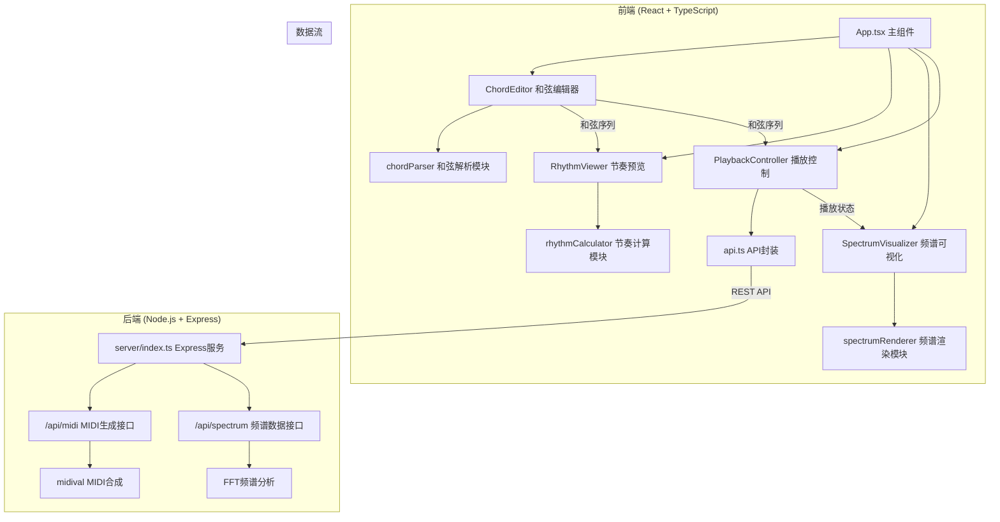
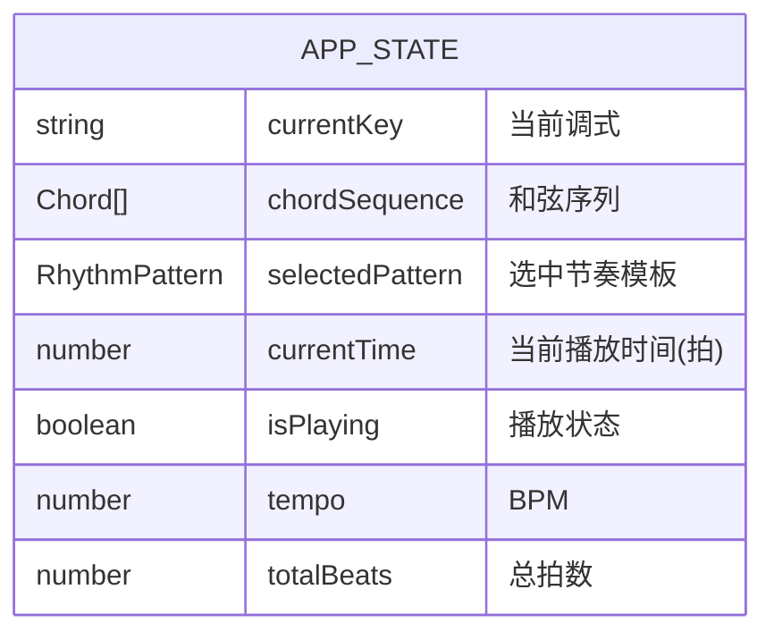

## 1. 架构设计



## 2. 技术栈描述

### 前端技术栈
- **框架**：React@18 + TypeScript@5
- **构建工具**：Vite@5
- **样式方案**：CSS Modules + CSS Variables
- **HTTP客户端**：Axios@1.6
- **音频处理**：Web Audio API
- **图形渲染**：Canvas API
- **状态管理**：React Hooks (useState, useEffect, useRef)

### 后端技术栈
- **运行时**：Node.js@18
- **框架**：Express@4
- **跨域处理**：cors@2.8
- **MIDI合成**：midival@1.0
- **音频分析**：Web Audio API (AudioContext + AnalyserNode)

### 开发工具
- 包管理器：npm@10
- TypeScript严格模式：启用
- 热更新：Vite HMR
- 代理配置：Vite server proxy

## 3. 目录结构

```
auto86/
├── package.json              # 项目依赖和脚本
├── index.html                # 入口HTML
├── vite.config.js            # Vite配置
├── tsconfig.json             # TypeScript配置
├── src/
│   ├── main.tsx              # React入口
│   ├── App.tsx               # 主应用组件
│   ├── ChordEditor.tsx       # 和弦编辑器组件
│   ├── RhythmViewer.tsx      # 节奏预览组件
│   ├── SpectrumVisualizer.tsx # 频谱可视化组件
│   ├── api.ts                # API调用封装
│   ├── utils/
│   │   ├── chordParser.ts    # 和弦解析模块
│   │   ├── rhythmCalculator.ts # 节奏计算模块
│   │   └── constants.ts      # 常量定义
│   └── styles/
│       ├── global.css        # 全局样式
│       └── variables.css     # CSS变量
└── server/
    └── index.ts              # Express后端服务
```

## 4. 核心模块设计

### 4.1 和弦解析模块 (chordParser.ts)
```typescript
export interface Note {
  string: number;      // 弦号 0-5 (从最细到最粗)
  fret: number;        // 品位 0-12
}

export interface Chord {
  id: string;
  notes: Note[];
  type: 'major' | 'minor' | 'dominant7';
  rootNote: string;
  duration: number;    // 持续拍数
  color: string;
}

// 识别指法对应的和弦类型
export function identifyChord(notes: Note[]): Chord['type'];

// 根据调式生成可用和弦列表
export function getDiatonicChords(key: string): Chord[];

// 计算和弦根音
export function calculateRootNote(notes: Note[]): string;
```

### 4.2 节奏计算模块 (rhythmCalculator.ts)
```typescript
export interface RhythmPattern {
  id: string;
  name: string;
  timeSignature: '4/4' | '3/4' | '6/8' | '12/8';
  beatPattern: boolean[];  // true=弹奏, false=休止
  description: string;
}

export interface RhythmBlock {
  startTime: number;       // 起始时间 (拍)
  duration: number;        // 持续时间 (拍)
  chordId: string | null;  // 和弦ID，null为空拍
  color: string;
}

// 根据和弦序列和节奏模板生成时间轴数据
export function generateTimeline(
  chords: Chord[],
  pattern: RhythmPattern,
  totalBeats: number
): RhythmBlock[];

// 内置节奏模板
export const RHYTHM_PATTERNS: RhythmPattern[];
```

## 5. API 接口定义

### 5.1 MIDI生成接口
**POST /api/midi/generate**
```typescript
// Request
interface MidiGenerateRequest {
  chords: Chord[];
  tempo: number;           // BPM
  rhythmPattern: RhythmPattern;
  loop: boolean;
}

// Response
interface MidiGenerateResponse {
  success: boolean;
  audioUrl?: string;       // Base64编码的音频数据
  duration?: number;       // 总时长(秒)
  error?: string;
}
```

### 5.2 频谱数据接口
**GET /api/spectrum/stream**
```typescript
// Response (Server-Sent Events)
interface SpectrumData {
  timestamp: number;
  frequencies: number[];   // 频域数据，长度256
  magnitudes: number[];    // 幅度值 0-1
}
```

## 6. 数据模型

### 6.1 应用状态


### 6.2 常量定义
```typescript
// 调式列表
export const KEYS = ['C', 'C#', 'D', 'D#', 'E', 'F', 'F#', 'G', 'G#', 'A', 'A#', 'B'];
export const KEY_MODES = ['大调', '小调'];

// 六线谱配置
export const STRING_COUNT = 6;
export const FRET_COUNT = 13; // 0-12品
export const STRING_SPACING = 12; // px
export const FRET_WIDTH = 40; // px

// 和弦颜色映射
export const CHORD_COLORS = {
  major: '#FF6B6B',
  minor: '#48C9B0',
  dominant7: '#F39C12',
};

// 时间轴配置
export const BEAT_WIDTH = 48; // px
export const MAX_BEATS = 16;
export const SLIDER_WIDTH = 768; // px

// 动画配置
export const ANIMATION_DURATIONS = {
  click: 200, // ms
  drag: 100, // ms
  fade: 200, // ms
  breath: 300, // ms
};
```

## 7. 性能优化策略

### 7.1 前端优化
- **Canvas渲染优化**：使用requestAnimationFrame，仅重绘变化区域
- **状态管理**：使用useMemo/useCallback避免不必要重渲染
- **音频预加载**：提前生成MIDI数据，减少播放延迟
- **节流防抖**：拖动事件使用requestAnimationFrame节流

### 7.2 后端优化
- **WebSocket/SSE**：频谱数据使用Server-Sent Events推送，减少HTTP开销
- **缓存策略**：相同和弦序列的MIDI数据缓存复用
- **流式处理**：频谱分析实时处理，不等待完整音频

## 8. 构建与部署

### 开发启动
```bash
npm install    # 安装依赖
npm run dev    # 同时启动前后端
```

### Vite配置要点
- 端口：前端3000，后端3001
- 代理：`/api/*` → `http://localhost:3001`
- 热更新：启用
- TypeScript严格模式：开启
