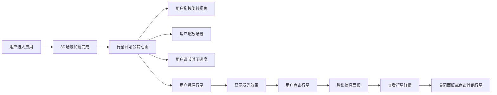
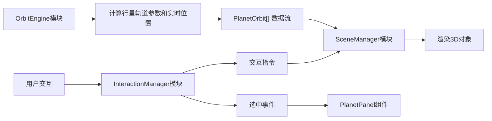

## 1. 产品概述

交互式日心说行星轨道可视化应用，通过3D动态模拟帮助用户直观理解太阳系天体运动规律。解决现有工具过于学术化或缺乏沉浸式交互体验的问题，为天文教育和太空探索爱好者提供直观、互动的学习工具。

### 1.1 产品目标
- 提供沉浸式3D太阳系可视化体验
- 准确展示八大行星轨道运动的真实比例关系
- 通过交互帮助用户理解天体运动规律
- 支持教育场景下的演示和自主探索

### 1.2 目标用户
- 天文教育工作者和学生
- 太空探索爱好者
- 科普内容创作者

---

## 2. 核心功能

### 2.1 功能模块

1. **3D太阳系主场景**：八大行星绕太阳公转动画、轨道线渲染、星空背景
2. **行星交互系统**：悬停光晕、点击选中、信息面板弹出
3. **视角控制系统**：拖拽旋转、缩放、平移、自动旋转、视角重置
4. **时间控制系统**：公转速度调节、暂停/播放
5. **行星信息展示**：详情面板、摘要列表

### 2.2 页面详情

| 页面名称 | 模块名称 | 功能描述 |
|---------|---------|----------|
| 主场景页面 | 3D场景模块 | 渲染太阳、八大行星、轨道线、星空粒子背景 |
| 主场景页面 | 行星交互模块 | 鼠标悬停显示光晕、点击弹出详细信息面板 |
| 主场景页面 | 视角控制模块 | 左下角控制面板：重置视角、放大/缩小、自动旋转开关 |
| 主场景页面 | 时间控制模块 | 顶部时间滑块：调节公转速度（0.1x-100x） |
| 主场景页面 | 信息摘要模块 | 右侧行星列表：显示所有行星状态，选中高亮 |

---

## 3. 核心流程

### 3.1 主要用户流程

### 3.2 数据流向

---

## 4. 用户界面设计

### 4.1 设计风格

**整体风格**：深空科技感，沉浸式宇宙探索体验

**配色方案**：
- 主背景：#0A0A1A（深空蓝黑）
- 面板背景：#1A1A2E（半透明深蓝）
- 边框色：#2A2A3E
- 文字主色：#FFFFFF
- 文字次色：#B0B0B0
- 强调色：#4CAF50（选中高亮）
- 危险色：#FF5252（关闭按钮）

**行星配色**：
- 水星：#B0B0B0（灰色）
- 金星：#FFD700（淡黄色）
- 地球：#4CAF50（蓝绿色）
- 火星：#E53935（红棕色）
- 木星：#FF9800（橘黄色）
- 土星：#FFC107（金黄色，带光环）
- 天王星：#00BCD4（青绿色）
- 海王星：#1565C0（深蓝色）

**排版**：
- 采用现代无衬线字体
- 标题：16px 加粗
- 正文：14px 常规
- 辅助文字：12px 浅色

**交互元素**：
- 统一圆角：8px
- 悬停过渡：0.2s 背景色变化
- 按钮尺寸：48x48px
- 滑块动画：0.15s 弹性松手

### 4.2 页面布局

**桌面端（≥768px）**：
- 左侧80%：3D场景区域
- 右侧20%：行星信息摘要面板（固定宽度，可滚动）
- 顶部居中：时间控制条
- 左下角：视角控制面板
- 点击行星后：信息面板在行星附近弹出

**移动端（<768px）**：
- 全屏3D场景
- 底部抽屉式摘要面板（高200px，可向上滑动）
- 其他控件位置自适应

### 4.3 3D场景设计

**环境设置**：
- 背景：#0A0A1A 深空色
- 星空粒子：2000颗白色星星，1-3px大小，随机闪烁

**光照设置**：
- 点光源：太阳位置发射白光，照亮行星
- 环境光：弱环境光确保暗面可见

**相机设置**：
- 透视相机
- 初始位置：距离太阳约50单位，45°俯角
- 支持OrbitControls：拖拽旋转、滚轮缩放、右键平移

**动画效果**：
- 行星沿椭圆轨道匀速运动
- 公转周期按真实比例（水星最快，海王星最慢）
- 土星带光环旋转
- 星空粒子每2秒闪烁一次

### 4.4 响应式设计

- **桌面端优先**：完整功能布局
- **平板端（768px-1024px）**：右侧面板宽度调整为25%
- **移动端（<768px）**：右侧面板转为底部抽屉，控件尺寸适配触摸操作
- **触摸优化**：支持双指缩放、点击选中

---

## 5. 性能约束

- 目标帧率：稳定45FPS以上
- 点击响应时间：<100ms
- 粒子系统数量：2000颗星星（性能上限）
- 内存占用：<200MB
