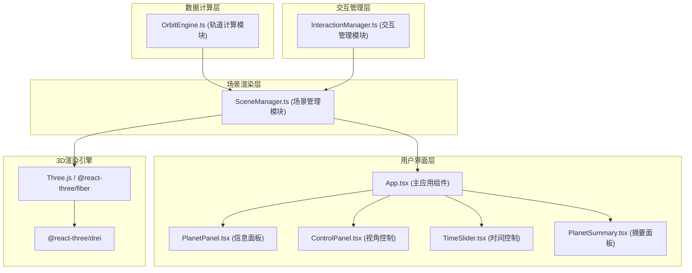
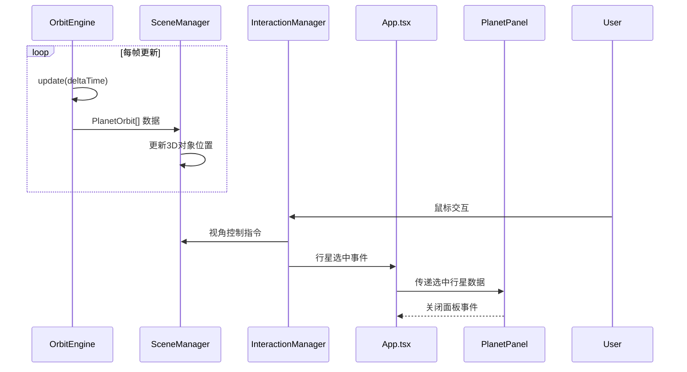

## 1. 架构设计

### 1.1 整体架构



### 1.2 模块调用关系



---

## 2. 技术栈

### 2.1 前端技术

| 技术 | 版本 | 用途 |
|-----|------|------|
| React | 18.x | 前端框架 |
| React DOM | 18.x | DOM渲染 |
| TypeScript | 5.x | 类型安全 |
| Vite | 5.x | 构建工具 |
| @vitejs/plugin-react | 4.x | React插件 |
| Three.js | 0.160.x | 3D渲染引擎 |
| @react-three/fiber | 8.x | React Three.js绑定 |
| @react-three/drei | 9.x | Three.js辅助组件库 |
| zustand | 4.x | 状态管理 |

### 2.2 项目初始化

使用Vite创建React + TypeScript项目：
```bash
npm init vite-init@latest -y . -- --template react-ts --force
```

---

## 3. 文件结构

```
auto88/
├── .trae/
│   └── documents/
│       ├── prd.md
│       └── tech-arch.md
├── node_modules/
├── public/
├── src/
│   ├── modules/
│   │   ├── OrbitEngine.ts       # 轨道计算模块
│   │   ├── SceneManager.ts      # 场景管理模块
│   │   └── InteractionManager.ts # 交互管理模块
│   ├── components/
│   │   ├── PlanetPanel.tsx      # 行星信息面板
│   │   ├── ControlPanel.tsx     # 视角控制面板
│   │   ├── TimeSlider.tsx       # 时间控制滑块
│   │   ├── PlanetSummary.tsx    # 行星摘要面板
│   │   ├── SolarSystem.tsx      # 3D太阳系组件
│   │   ├── Planet.tsx           # 行星3D组件
│   │   ├── OrbitLine.tsx        # 轨道线组件
│   │   ├── StarField.tsx        # 星空粒子组件
│   │   └── Sun.tsx              # 太阳组件
│   ├── store/
│   │   └── useSolarSystemStore.ts # 全局状态管理
│   ├── types/
│   │   └── index.ts             # 类型定义
│   ├── App.tsx                  # 主应用组件
│   ├── main.tsx                 # 入口文件
│   └── index.css                # 全局样式
├── index.html
├── package.json
├── tsconfig.json
├── vite.config.js
└── README.md
```

### 3.1 文件调用关系

1. **App.tsx** 依赖：
   - `src/modules/OrbitEngine.ts` - 获取轨道数据
   - `src/modules/InteractionManager.ts` - 处理交互
   - `src/components/SolarSystem.tsx` - 渲染3D场景
   - `src/components/PlanetPanel.tsx` - 显示信息面板
   - `src/components/ControlPanel.tsx` - 视角控制
   - `src/components/TimeSlider.tsx` - 时间控制
   - `src/components/PlanetSummary.tsx` - 摘要面板

2. **SolarSystem.tsx** 依赖：
   - `src/modules/SceneManager.ts` - 场景管理
   - `src/components/Sun.tsx` - 太阳
   - `src/components/Planet.tsx` - 行星
   - `src/components/OrbitLine.tsx` - 轨道线
   - `src/components/StarField.tsx` - 星空

3. **OrbitEngine.ts** 输出：
   - `PlanetOrbit[]` 数据结构供 SceneManager 使用

4. **InteractionManager.ts** 输出：
   - 交互事件供 SceneManager 和 App.tsx 使用

---

## 4. 数据模型

### 4.1 核心类型定义

```typescript
// 行星基础数据
interface PlanetData {
  name: string;
  nameCN: string;
  color: string;
  radius: number;           // 3D场景中的半径
  realRadius: number;       // 真实半径（km）
  semiMajorAxis: number;    // 半长轴（AU）
  eccentricity: number;     // 离心率
  orbitalPeriod: number;    // 公转周期（天）
  distanceFromSun: number;  // 距太阳距离（AU）
  hasRings?: boolean;       // 是否有光环
}

// 行星轨道状态
interface PlanetOrbit {
  id: string;
  data: PlanetData;
  angle: number;            // 当前角度（弧度）
  position: { x: number; y: number; z: number }; // 3D位置
  orbitalSpeed: number;     // 公转角速度
}

// 交互事件
interface InteractionEvent {
  type: 'hover' | 'click' | 'drag' | 'zoom' | 'pan';
  planetId?: string;
  position?: { x: number; y: number };
  delta?: { x: number; y: number };
}

// 应用状态
interface SolarSystemState {
  planets: PlanetOrbit[];
  selectedPlanetId: string | null;
  hoveredPlanetId: string | null;
  timeScale: number;        // 时间缩放系数
  isAutoRotating: boolean;
  showStarField: boolean;
}
```

### 4.2 行星数据常量

```typescript
const PLANETS_DATA: PlanetData[] = [
  {
    name: 'Mercury',
    nameCN: '水星',
    color: '#B0B0B0',
    radius: 0.4,
    realRadius: 2440,
    semiMajorAxis: 0.39,
    eccentricity: 0.206,
    orbitalPeriod: 88,
    distanceFromSun: 0.39,
  },
  // ... 其他行星
];
```

---

## 5. 模块接口定义

### 5.1 OrbitEngine 接口

```typescript
class OrbitEngine {
  constructor(planetsData: PlanetData[], scaleFactor?: number);
  
  // 更新所有行星位置（每帧调用）
  update(deltaTime: number, timeScale: number): PlanetOrbit[];
  
  // 获取指定行星当前状态
  getPlanetOrbit(planetId: string): PlanetOrbit | undefined;
  
  // 获取所有行星状态
  getAllPlanets(): PlanetOrbit[];
  
  // 重置所有行星到初始位置
  reset(): void;
}
```

**数据流向**：OrbitEngine → SceneManager（传递 PlanetOrbit[]）

### 5.2 SceneManager 接口

```typescript
class SceneManager {
  constructor(scene: THREE.Scene, camera: THREE.PerspectiveCamera);
  
  // 接收轨道数据更新3D对象
  updatePlanets(planetOrbits: PlanetOrbit[]): void;
  
  // 设置悬停行星（显示光晕）
  setHoveredPlanet(planetId: string | null): void;
  
  // 设置选中行星
  setSelectedPlanet(planetId: string | null): void;
  
  // 切换星空背景
  toggleStarField(show: boolean): void;
  
  // 重置视角
  resetCamera(): void;
  
  // 缩放视角
  zoomCamera(factor: number): void;
  
  // 设置自动旋转
  setAutoRotate(enabled: boolean): void;
  
  // 射线检测获取点击的行星
  raycast(screenX: number, screenY: number): string | null;
}
```

**数据流向**：
- OrbitEngine → SceneManager（PlanetOrbit[]）
- InteractionManager → SceneManager（交互指令）
- SceneManager → 渲染层（3D对象更新）

### 5.3 InteractionManager 接口

```typescript
class InteractionManager {
  constructor(
    domElement: HTMLElement,
    sceneManager: SceneManager,
    eventHandlers: {
      onPlanetClick: (planetId: string) => void;
      onPlanetHover: (planetId: string | null) => void;
      onViewChange?: () => void;
    }
  );
  
  // 处理鼠标按下
  handleMouseDown(event: MouseEvent): void;
  
  // 处理鼠标移动
  handleMouseMove(event: MouseEvent): void;
  
  // 处理鼠标释放
  handleMouseUp(event: MouseEvent): void;
  
  // 处理滚轮
  handleWheel(event: WheelEvent): void;
  
  // 处理触摸事件
  handleTouchStart(event: TouchEvent): void;
  handleTouchMove(event: TouchEvent): void;
  handleTouchEnd(event: TouchEvent): void;
  
  // 销毁事件监听
  dispose(): void;
}
```

**数据流向**：
- 用户输入 → InteractionManager（原始事件）
- InteractionManager → SceneManager（交互指令）
- InteractionManager → App.tsx（选中/悬停事件）

---

## 6. 状态管理

使用 zustand 管理全局状态：

```typescript
// src/store/useSolarSystemStore.ts
import { create } from 'zustand';
import { PlanetOrbit, SolarSystemState } from '@/types';

interface SolarSystemActions {
  setPlanets: (planets: PlanetOrbit[]) => void;
  selectPlanet: (planetId: string | null) => void;
  hoverPlanet: (planetId: string | null) => void;
  setTimeScale: (scale: number) => void;
  toggleAutoRotate: () => void;
  toggleStarField: () => void;
}

export const useSolarSystemStore = create<SolarSystemState & SolarSystemActions>((set) => ({
  planets: [],
  selectedPlanetId: null,
  hoveredPlanetId: null,
  timeScale: 1,
  isAutoRotating: false,
  showStarField: true,
  
  setPlanets: (planets) => set({ planets }),
  selectPlanet: (planetId) => set({ selectedPlanetId: planetId }),
  hoverPlanet: (planetId) => set({ hoveredPlanetId: planetId }),
  setTimeScale: (scale) => set({ timeScale: scale }),
  toggleAutoRotate: () => set((state) => ({ isAutoRotating: !state.isAutoRotating })),
  toggleStarField: () => set((state) => ({ showStarField: !state.showStarField })),
}));
```

---

## 7. 性能优化策略

1. **对象池化**：行星和轨道线对象在初始化时创建，避免频繁销毁重建
2. **按需更新**：仅当轨道数据变化时更新3D对象位置
3. **粒子系统优化**：使用 BufferGeometry 批量渲染2000颗星星
4. **帧率控制**：使用 requestAnimationFrame 的 deltaTime 确保动画速度一致
5. **事件节流**：鼠标移动事件使用 requestAnimationFrame 节流
6. **图层分离**：星空粒子使用单独的图层，不影响行星交互检测
7. **内存管理**：组件卸载时正确销毁 Three.js 对象和事件监听

---

## 8. 构建配置

### 8.1 vite.config.js

```javascript
import { defineConfig } from 'vite';
import react from '@vitejs/plugin-react';
import path from 'path';

export default defineConfig({
  plugins: [react()],
  resolve: {
    alias: {
      '@': path.resolve(__dirname, './src'),
    },
  },
  server: {
    port: 5173,
    open: true,
  },
});
```

### 8.2 tsconfig.json

```json
{
  "compilerOptions": {
    "target": "ES2020",
    "useDefineForClassFields": true,
    "lib": ["ES2020", "DOM", "DOM.Iterable"],
    "module": "ESNext",
    "skipLibCheck": true,
    "moduleResolution": "bundler",
    "allowImportingTsExtensions": true,
    "resolveJsonModule": true,
    "isolatedModules": true,
    "noEmit": true,
    "jsx": "react-jsx",
    "strict": true,
    "noUnusedLocals": true,
    "noUnusedParameters": true,
    "noFallthroughCasesInSwitch": true,
    "baseUrl": ".",
    "paths": {
      "@/*": ["src/*"]
    }
  },
  "include": ["src"],
  "references": [{ "path": "./tsconfig.node.json" }]
}
```

### 8.3 package.json 依赖

```json
{
  "name": "interactive-solar-system",
  "private": true,
  "version": "0.1.0",
  "type": "module",
  "scripts": {
    "dev": "vite",
    "build": "tsc && vite build",
    "lint": "eslint . --ext ts,tsx --report-unused-disable-directives --max-warnings 0",
    "preview": "vite preview"
  },
  "dependencies": {
    "react": "^18.2.0",
    "react-dom": "^18.2.0",
    "three": "^0.160.0",
    "@react-three/fiber": "^8.15.12",
    "@react-three/drei": "^9.92.7",
    "zustand": "^4.4.7"
  },
  "devDependencies": {
    "@types/react": "^18.2.43",
    "@types/react-dom": "^18.2.17",
    "@types/three": "^0.160.0",
    "@typescript-eslint/eslint-plugin": "^6.14.0",
    "@typescript-eslint/parser": "^6.14.0",
    "@vitejs/plugin-react": "^4.2.1",
    "eslint": "^8.55.0",
    "eslint-plugin-react-hooks": "^4.6.0",
    "eslint-plugin-react-refresh": "^0.4.5",
    "typescript": "^5.2.2",
    "vite": "^5.0.8"
  }
}
```
