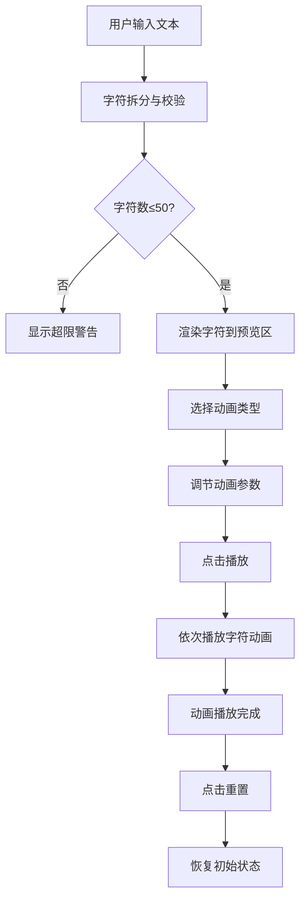

## 1. 产品概述

交互式文字拆分与动画排版工具，让用户输入英文单词或短句，将其拆分为独立字符并赋予精美入场动画，打造动态排版效果。

- **核心价值**：为设计师、开发者和创意人士提供直观的文字动画预览工具，快速生成字符级动画效果
- **目标用户**：前端开发者、UI/UX设计师、内容创作者、教学演示人员
- **市场定位**：轻量级在线动效设计工具，专注于文字拆分级动画的快速预览与参数调节

## 2. 核心功能

### 2.1 用户角色

| 角色 | 注册方式 | 核心权限 |
|------|----------|----------|
| 普通用户 | 无需注册 | 使用全部动画功能，自定义参数调节 |

### 2.2 功能模块

1. **文本输入模块**：文本输入框、字符计数、超限提示
2. **动画预览模块**：字符拆分展示、动画播放、重置功能
3. **动画控制面板**：预设动画选择、播放控制、参数调节滑块

### 2.3 页面详情

| 页面名称 | 模块名称 | 功能描述 |
|----------|----------|----------|
| 主页面 | 文本输入区 | 支持输入最多50字符英文文本，实时显示字符数，超限时红色警告 |
| 主页面 | 预览区域 | 宽100%高280px，浅灰背景圆角12px，字符水平居中排列，展示动画效果 |
| 主页面 | 动画控制面板 | 6种预设动画选择、播放/重置按钮、持续时间滑块、延迟滑块 |

## 3. 核心流程

用户在输入框中输入文本 → 系统自动拆分为单个字符 → 选择预设动画类型 → 调节动画参数（持续时间、延迟）→ 点击播放按钮 → 字符按顺序依次播放入场动画 → 点击重置恢复初始状态

## 4. 用户界面设计

### 4.1 设计风格

- **主色调**：紫色系，主色 `#6C63FF`，辅色 `#8B5CF6`
- **背景色**：页面背景 `#FAFAFA`，卡片背景 `#FFFFFF`，预览区背景 `#F5F5F5`
- **按钮风格**：渐变背景（#6C63FF → #8B5CF6），圆角10px，悬停色相偏移5deg，点击缩放0.95
- **字体**：现代无衬线字体，清晰易读
- **布局风格**：单栏垂直布局，卡片式设计，统一圆角风格（8-12px）
- **交互反馈**：所有控件0.2s过渡动画，hover状态变化柔和

### 4.2 页面设计概述

| 页面名称 | 模块名称 | UI元素 |
|----------|----------|--------|
| 主页面 | 文本输入区 | 输入框（70%宽，48px高，圆角12px），聚焦边框变色，字符计数提示 |
| 主页面 | 预览区域 | 浅灰背景卡片，字符水平居中排列，支持6种入场动画 |
| 主页面 | 动画控制面板 | 动画选择器、播放/重置按钮（120x44px）、两个滑块控件 |

### 4.3 响应式

- 桌面端优先设计，最小宽度支持1024px
- 宽屏适配：输入区和控制面板最大宽度900px，居中显示
- 预览区宽度自适应100%，高度固定280px

### 4.4 动画效果

- **淡入**：opacity 0→1，0.5s
- **弹跳**：y从-80px到0，spring阻尼10
- **旋转**：rotateY 0→360deg，1s
- **翻转**：scaleX从-1到1，0.6s
- **滑入**：x从-120px到0，0.8s
- **缩放**：scale从0.2到1，0.5s
- **波浪效果**：每个字符依次延迟0.06s启动

### 4.5 性能指标

- 30个以上字符时保持60fps帧率
- 重置响应时间不超过50ms
- 动画流畅无卡顿
