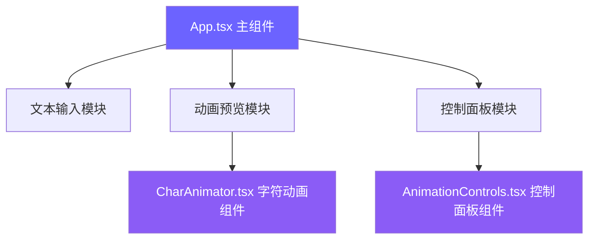

## 1. 架构设计



## 2. 技术描述

- **前端框架**：React@18 + TypeScript
- **构建工具**：Vite@5 + @vitejs/plugin-react
- **动画库**：framer-motion@11
- **开发语言**：TypeScript（严格模式）
- **样式方案**：CSS-in-JS + 内联样式
- **状态管理**：React useState Hooks
- **包管理器**：npm

## 3. 项目文件结构

| 文件路径 | 用途说明 |
|----------|----------|
| `package.json` | 项目依赖与脚本配置 |
| `index.html` | 入口HTML页面 |
| `vite.config.js` | Vite构建配置 |
| `tsconfig.json` | TypeScript严格模式配置 |
| `src/App.tsx` | 主组件，管理输入文本状态和整体布局 |
| `src/CharAnimator.tsx` | 字符动画组件，接收字符和动画类型props |
| `src/AnimationControls.tsx` | 控制面板组件，预设动画选择和播放控制 |

## 4. 组件API定义

### 4.1 CharAnimator 组件

```typescript
interface CharAnimatorProps {
  char: string;
  animationType: 'fadeIn' | 'bounce' | 'rotate' | 'flip' | 'slideIn' | 'scale';
  delay: number;
  duration: number;
  isPlaying: boolean;
  animationKey: number;
}
```

### 4.2 AnimationControls 组件

```typescript
interface AnimationControlsProps {
  animationType: string;
  onAnimationTypeChange: (type: string) => void;
  duration: number;
  onDurationChange: (duration: number) => void;
  delay: number;
  onDelayChange: (delay: number) => void;
  onPlay: () => void;
  onReset: () => void;
  isPlaying: boolean;
}
```

### 4.3 预设动画类型

| 动画类型 | 初始状态 | 结束状态 | 默认时长 | 效果描述 |
|----------|----------|----------|----------|----------|
| fadeIn | opacity: 0 | opacity: 1 | 0.5s | 淡入效果 |
| bounce | y: -80px | y: 0 | spring | 弹跳下落 |
| rotate | rotateY: 0deg | rotateY: 360deg | 1s | 3D旋转 |
| flip | scaleX: -1 | scaleX: 1 | 0.6s | 水平翻转 |
| slideIn | x: -120px | x: 0 | 0.8s | 左侧滑入 |
| scale | scale: 0.2 | scale: 1 | 0.5s | 缩放出现 |

## 5. 状态管理

```typescript
// App.tsx 中的状态
const [text, setText] = useState<string>('Hello World');
const [animationType, setAnimationType] = useState<string>('fadeIn');
const [duration, setDuration] = useState<number>(0.5);
const [charDelay, setCharDelay] = useState<number>(0.06);
const [isPlaying, setIsPlaying] = useState<boolean>(false);
const [animationKey, setAnimationKey] = useState<number>(0);
```

## 6. 性能优化策略

1. **动画性能**：使用 framer-motion 的 GPU 加速属性（transform、opacity）
2. **重置机制**：通过 key 变化强制组件重新挂载，立即中断动画
3. **字符数限制**：最多50字符，防止性能问题
4. **will-change**：对动画元素添加 will-change 提示浏览器优化
5. **避免布局抖动**：所有动画使用 transform 属性，不触发重排
