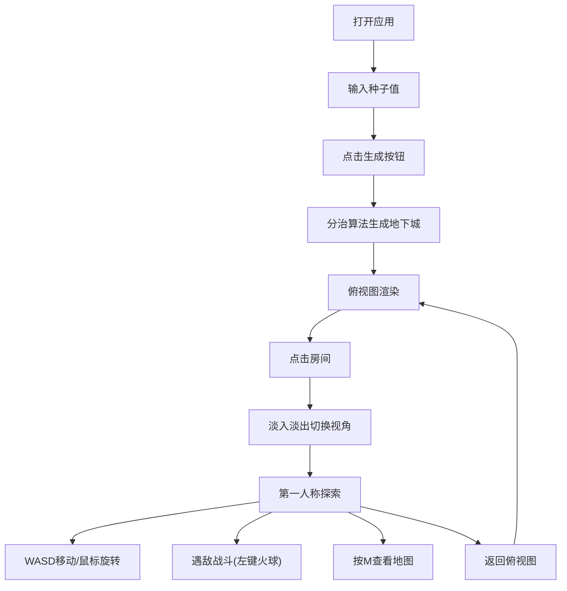

## 1. 产品概述

泰拉瑞亚风格地下城自动生成与探索应用，解决2D沙盒游戏开发中手动设计地下迷宫费时费力、缺乏随机性和可重玩性的问题。用户可通过种子值生成随机地下城，在俯视图与第一人称视角间切换探索，与怪物战斗并收集宝箱。

- 目标用户：游戏开发者、2D沙盒游戏爱好者
- 核心价值：提供可复用的地下城生成算法参考，兼具娱乐性与技术展示价值

## 2. 核心功能

### 2.1 功能模块

1. **地下城生成模块**：基于种子值和分治算法生成随机地下城网格
2. **俯视图渲染模块**：以2D网格形式展示地下城整体布局
3. **第一人称探索模块**：伪3D射线投射渲染，支持WASD移动和鼠标旋转
4. **战斗系统模块**：火球发射、敌人AI、伤害判定
5. **地图UI模块**：半透明小地图展示探索进度
6. **信息面板模块**：种子输入、生成控制、状态显示、图例

### 2.2 页面详情

| 页面名称 | 模块名称 | 功能描述 |
|----------|----------|----------|
| 主界面 | 地下城生成 | 输入种子值，点击生成按钮创建6x6以上地下城网格 |
| 主界面 | 俯视图渲染 | 不同颜色标识房间类型，白色方块标记连通口 |
| 主界面 | 第一人称探索 | 射线投射伪3D渲染，WASD移动，鼠标旋转视角 |
| 主界面 | 战斗系统 | 左键发射火球，击败怪物房间敌人后触发安全提示 |
| 主界面 | 地图面板 | M键切换半透明地图，显示已探索区域和当前位置 |
| 主界面 | 信息面板 | 种子输入框、生成按钮、房间图例、状态提示 |

## 3. 核心流程

用户打开应用 → 输入种子值（或使用默认时间戳）→ 点击生成按钮 → 算法生成地下城 → 俯视图展示 → 点击房间进入第一人称视角（淡入淡出过渡）→ WASD移动探索 → 遇敌战斗（左键发射火球）→ 按M查看地图 → 可返回俯视图点击其他房间

## 4. 用户界面设计

### 4.1 设计风格

- **主色调**：深灰#1A1A1A背景，石灰色#808080文字，黄金色#FFD700强调
- **房间配色**：核心房间深红#8B0000、宝箱房间金色#FFD700、怪物房间紫色#800080、通道灰色#A0A0A0
- **按钮样式**：圆角8px，渐变#555555到#333333，按下缩放0.95，悬停亮度+15%
- **布局风格**：左侧游戏视图75%（800x600画布居中，留白16px），右侧信息面板25%（宽220px，渐变#2B2B2B到#1A1A1A）
- **动效**：视角切换0.5秒淡入淡出，按钮悬停0.2秒变亮，玩家位置标记0.5秒闪烁，击败敌人房间绿光闪烁0.5秒

### 4.2 页面设计概述

| 页面名称 | 模块名称 | UI元素 |
|----------|----------|--------|
| 主界面 | 游戏视图 | 800x600 Canvas，黑色背景，居中放置，周围16px留白 |
| 主界面 | 信息面板 | 种子输入框、生成按钮(120x40px)、4种房间图例、状态提示区 |
| 主界面 | 地图覆盖层 | 300x300px半透明#000000AA背景，左上角悬浮，闪烁白色三角标记 |
| 主界面 | 第一人称视图 | 160x120分辨率射线投射渲染，石砖纹理墙壁，震动效果 |

### 4.3 响应式适配

- 桌面优先设计，最小适配1280px宽屏幕
- 游戏视图最小尺寸600x450px
- 信息面板最小宽度180px
- 画布保持居中，留白自适应

## 5. 性能要求

- 6x6网格生成时间 ≤ 200毫秒
- 第一人称渲染帧率 ≥ 30FPS（普通笔记本电脑）
- 内存占用控制合理，无内存泄漏
