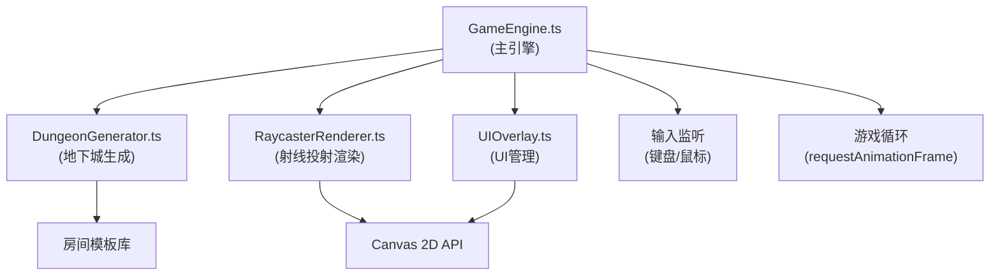

## 1. 架构设计



## 2. 技术描述

- **前端技术栈**：TypeScript 5.0 + Vite 5.0 + 原生Canvas API
- **构建工具**：Vite
- **无后端**：纯前端应用，所有逻辑在浏览器端执行
- **随机数生成**：种子化伪随机数生成器，确保可复现性
- **渲染方式**：Canvas 2D API，俯视图和伪3D射线投射

## 3. 文件结构

```
project-root/
├── package.json
├── index.html
├── vite.config.js
├── tsconfig.json
└── src/
    ├── GameEngine.ts       # 主引擎，游戏循环、状态管理
    ├── DungeonGenerator.ts # 地下城生成算法
    ├── RaycasterRenderer.ts # 伪3D射线投射渲染
    ├── UIOverlay.ts        # UI管理、输入处理
    └── types.ts            # 类型定义（内部创建）
```

## 4. 核心数据模型

### 4.1 房间类型

```typescript
enum RoomType {
  CORE = 'core',           // 核心房间
  TREASURE = 'treasure',   // 宝箱房间
  MONSTER = 'monster',     // 怪物房间
  CORRIDOR = 'corridor',   // 通道
  EMPTY = 'empty'          // 空房间
}
```

### 4.2 房间数据

```typescript
interface Room {
  x: number;               // 网格X坐标
  y: number;               // 网格Y坐标
  width: number;           // 房间宽度(格)
  height: number;          // 房间高度(格)
  type: RoomType;          // 房间类型
  templateId: number;      // 使用的模板ID
  connections: {           // 连通方向
    north: boolean;
    south: boolean;
    east: boolean;
    west: boolean;
  };
  explored: boolean;       // 是否已探索
  enemies: Enemy[];        // 敌人列表
  treasures: number;       // 宝箱数量
  cleared: boolean;        // 是否已清理(怪物房间)
}
```

### 4.3 玩家数据

```typescript
interface Player {
  x: number;               // 世界坐标X
  y: number;               // 世界坐标Y
  angle: number;           // 朝向角度(弧度)
  currentRoomX: number;    // 当前房间网格X
  currentRoomY: number;    // 当前房间网格Y
  treasuresCollected: number; // 已收集宝箱数
}
```

### 4.4 地下城数据

```typescript
interface Dungeon {
  seed: number;            // 种子值
  gridWidth: number;       // 网格宽度(房间数)
  gridHeight: number;      // 网格高度(房间数)
  rooms: Room[][];         // 房间网格
  coreRoom: { x: number; y: number }; // 核心房间位置
}
```

## 5. 核心算法

### 5.1 随机分治生成算法

1. 创建初始网格（最小6x6）
2. 随机选择核心房间位置（面积最大）
3. 分治划分区域，随机放置宝箱房间(2-3个)和怪物房间(3-5个)
4. 生成通道连接所有房间（宽度2-3格）
5. 为每个房间分配模板，设置连通口方向
6. 确保整个地下城连通

### 5.2 射线投射渲染算法

1. 玩家位置为原点，按90度视野发射160条射线
2. DDA算法计算射线与墙壁交点
3. 根据距离计算墙面高度，应用鱼眼修正
4. 程序生成石砖纹理采样
5. 绘制地面、墙壁、天花板

### 5.3 房间模板库

- 10个预设模板：5x5、7x7、9x9正方形
- 每个模板有不同内部布局和连通口方向配置
- 模板包含墙壁布局、障碍物位置等数据

## 6. 性能优化

- 预计算房间模板数据
- 射线投射使用整数运算优化
- 只渲染视野范围内的内容
- 地图覆盖层使用离屏Canvas缓存
- 使用requestAnimationFrame控制渲染帧率
- 对象池管理火球和敌人实例
