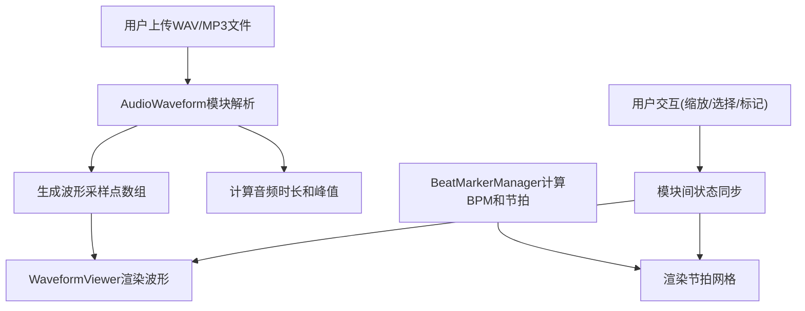

## 1. 产品概述

音乐波形可视化编辑器是一款面向音乐教育者、音频制作人和音乐学习者的专业工具，解决传统音频编辑器波形显示单一、难以直观关联节拍与波形内容、无法在波形上做标记注释的痛点。通过将波形可视化、节拍识别网格和交互式标记系统深度融合，大幅提升音乐教学和后期沟通效率。

- 核心价值：让音频波形"可看、可标、可理解"，实现乐谱节拍与波形内容的直观对应
- 目标用户：音乐教师、音频工程师、音乐制作人、音乐学习者

## 2. 核心功能

### 2.1 功能模块

1. **音频解析模块**：支持WAV/MP3格式上传，使用Wavesurfer.js解析音频数据，生成波形采样点和时长信息
2. **波形可视化模块**：65%区域渲染渐变蓝青色波形，带音量峰值标记和0.5秒刻度标尺
3. **节拍网格模块**：自动识别BPM，生成4/4拍透明网格，节拍点用绿色圆点标记
4. **区域选择模块**：鼠标拖拽选择波形区域，高亮显示，带可拖动边界手柄
5. **标记管理模块**：30%右侧面板，支持8种颜色标记的增删改查，波形图上显示三角形标记
6. **缩放交互模块**：鼠标滚轮0.5x-4x平滑缩放，0.3s过渡动画

### 2.2 页面详情

| 页面名称 | 模块名称 | 功能描述 |
|-----------|-------------|---------------------|
| 主界面 | 顶部信息面板 | 显示选中区域的精确起止时间，实时更新 |
| 主界面 | 波形显示区 | 占65%宽度，渐变波形、峰值标记、节拍网格、标记点、选择区域 |
| 主界面 | 标记管理面板 | 占30%宽度，标记列表、添加/删除/排序功能、颜色选择器 |

## 3. 核心流程

用户上传音频文件 → 系统解析音频并计算波形数据 → 渲染波形图和节拍网格 → 用户可缩放/选择区域/添加标记 → 所有操作实时同步到界面

## 4. 用户界面设计

### 4.1 设计风格

- **主色调**：渐变蓝青（#1E88E5 → #00ACC1）波形填充，深灰背景（#1A1A2E）
- **强调色**：亮白（#FFFFFF）峰值标记，浅绿（#4CAF50）节拍点，淡黄（#FFEB3B30）选中区域
- **标记色板**：红#E53935、橙#FB8C00、黄#FDD835、绿#43A047、青#00BCD4、蓝#1E88E5、紫#8E24AA、粉#D81B60
- **字体**：使用现代无衬线字体，清晰易读
- **动效**：0.3s缩放过渡，0.15s脉冲缩放动画，平滑流畅
- **布局**：左右分栏（65% / 30%），信息面板悬浮左上角

### 4.2 页面设计概览

| 页面名称 | 模块名称 | UI元素 |
|-----------|-------------|-------------|
| 主界面 | 波形显示区 | 渐变波形、白色峰值短线、半透明网格、绿色节拍圆点、彩色三角标记、淡黄选择蒙层、白色边界手柄、底部时间标尺 |
| 主界面 | 信息面板 | 深色半透明背景、起止时间精确显示、0.1s精度 |
| 主界面 | 标记面板 | 极浅灰背景（#F5F5F5）、左侧边框、添加标记按钮、颜色选择器、标记列表（56px项高、5px颜色竖条、浅蓝选中态、脉冲动画） |

### 4.3 响应式设计

- 桌面端优先，最低支持1280px宽度
- 波形区域最小宽度保持可交互性
- 标记面板在小屏幕上可折叠

## 5. 性能指标

- 音频解析与波形渲染：≤500ms（≤10MB文件）
- 标记增删操作：<100ms响应延迟
- 缩放动画：60fps流畅度
- 内存占用：≤200MB
