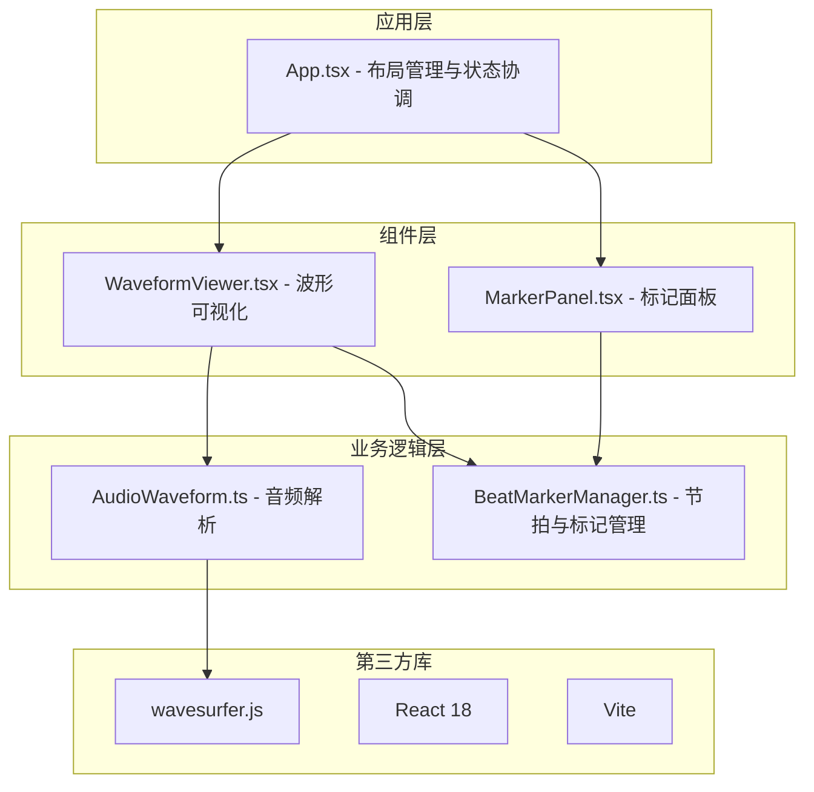

## 1. 架构设计



## 2. 技术选型

- **前端框架**：React 18 + TypeScript 5（严格模式）
- **构建工具**：Vite 5 + @vitejs/plugin-react
- **音频处理**：wavesurfer.js 7.x
- **样式方案**：内联样式 + CSS变量（无需额外CSS框架，保持轻量）
- **状态管理**：React useState/useReducer + 模块内部状态（无需Zustand，避免过度设计）

## 3. 模块接口定义

### 3.1 AudioWaveform 模块接口

```typescript
interface WaveformData {
  peaks: number[];
  duration: number;
  sampleRate: number;
  numberOfChannels: number;
}

interface AudioWaveformInterface {
  loadAudio(file: File): Promise<WaveformData>;
  destroy(): void;
  getPeaks(): number[];
  getDuration(): number;
}
```

### 3.2 BeatMarkerManager 模块接口

```typescript
interface Marker {
  id: string;
  time: number;
  text: string;
  color: string;
}

interface BeatGrid {
  bpm: number;
  timeSignature: number;
  beatTimes: number[];
}

interface Selection {
  start: number;
  end: number;
}

interface BeatMarkerManagerInterface {
  calculateBeatGrid(waveformData: WaveformData, bpm?: number): BeatGrid;
  addMarker(marker: Omit<Marker, 'id'>): Marker;
  removeMarker(id: string): void;
  updateMarker(id: string, updates: Partial<Marker>): Marker;
  reorderMarkers(newOrder: string[]): void;
  getMarkers(): Marker[];
  setSelection(selection: Selection | null): void;
  getSelection(): Selection | null;
  onSelectionChange(callback: (selection: Selection | null) => void): () => void;
  onMarkersChange(callback: (markers: Marker[]) => void): () => void;
}
```

### 3.3 预设颜色常量

```typescript
const MARKER_COLORS = [
  '#E53935', '#FB8C00', '#FDD835', '#43A047',
  '#00BCD4', '#1E88E5', '#8E24AA', '#D81B60'
];
```

## 4. 组件Props定义

### 4.1 WaveformViewer Props

```typescript
interface WaveformViewerProps {
  waveformData: WaveformData | null;
  beatGrid: BeatGrid | null;
  markers: Marker[];
  selection: Selection | null;
  zoomLevel: number;
  onSelectionChange: (selection: Selection | null) => void;
  onZoomChange: (zoom: number) => void;
}
```

### 4.2 MarkerPanel Props

```typescript
interface MarkerPanelProps {
  markers: Marker[];
  selection: Selection | null;
  currentTime: number;
  onAddMarker: (marker: Omit<Marker, 'id'>) => void;
  onRemoveMarker: (id: string) => void;
  onReorderMarkers: (newOrder: string[]) => void;
  onSelectMarker: (time: number) => void;
}
```

## 5. 性能优化策略

1. **波形数据缓存**：解析后的波形数据缓存，避免重复计算
2. **Canvas分层渲染**：波形层、网格层、标记层分离，按需重绘
3. **requestAnimationFrame**：所有动画使用RAF确保60fps
4. **节流防抖**：缩放操作节流，鼠标移动防抖
5. **懒加载**：音频数据分块处理，大文件渐进式渲染
6. **事件委托**：标记列表使用事件委托减少监听器数量

## 6. 项目文件结构

```
auto95/
├── package.json
├── index.html
├── vite.config.js
├── tsconfig.json
└── src/
    ├── App.tsx              # 主应用组件，布局与状态协调
    ├── AudioWaveform.ts     # 音频解析模块
    ├── BeatMarkerManager.ts # 节拍识别与标记管理
    ├── WaveformViewer.tsx   # 波形可视化组件
    └── MarkerPanel.tsx      # 标记面板组件
```

## 7. 关键技术实现点

1. **BPM计算**：基于波形能量检测，使用自相关算法估算BPM
2. **波形渲染**：Canvas 2D绘制线性渐变填充波形
3. **交互处理**：鼠标事件坐标与时间轴转换
4. **平滑缩放**：CSS transform + transition实现0.3s过渡
5. **拖拽排序**：原生HTML5 Drag and Drop API实现标记重排
