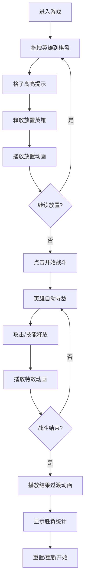

## 1. 产品概述
像素风格自走棋战斗模拟器，玩家在棋盘上摆放不同种族和职业的英雄棋子，观看自动对战过程。

- 核心玩法：拖拽英雄卡片到棋盘，编排阵容，观看自动战斗
- 目标用户：策略游戏爱好者、像素风格游戏玩家
- 产品价值：提供轻松有趣的策略对战体验，无需复杂操作即可享受战斗乐趣

## 2. 核心功能

### 2.1 用户角色
无需用户注册，单玩家模式。

### 2.2 功能模块
1. **主战斗页面**：棋盘区域、英雄卡片侧边栏、战斗控制区、结果展示
2. **英雄系统**：多种族多职业英雄，各具攻击力、生命值、技能特性
3. **战斗系统**：自动寻敌、攻击判定、技能释放、胜负判定
4. **交互系统**：拖拽放置、高亮提示、视角缩放、动画效果

### 2.3 页面详情

| 页面名称 | 模块名称 | 功能描述 |
|-----------|-------------|---------------------|
| 主战斗页面 | 棋盘区域 | 6x4网格，动态边框光效，可放置英雄，显示战斗单位 |
| 主战斗页面 | 英雄侧边栏 | 底部横向排列英雄卡片，显示职业图标、属性条 |
| 主战斗页面 | 战斗控制 | 开始战斗按钮、重置按钮、战斗状态提示 |
| 主战斗页面 | 结果展示 | 战斗结束后全屏过渡动画，显示胜负和存活统计 |
| 主战斗页面 | 特效系统 | 受击闪烁、技能特效（火焰环绕）、放置动画 |

## 3. 核心流程

用户从底部侧边栏拖拽英雄卡片到棋盘格子上，格子高亮显示可放置区域。放置完成后点击"开始战斗"按钮，英雄自动寻找最近敌人攻击，优先攻击同排敌人，攻击间隔1000ms。战斗过程中播放受击闪烁和技能特效。战斗结束后显示胜负结果和存活英雄统计，播放胜利/失败全屏过渡动画。

## 4. 用户界面设计

### 4.1 设计风格
- **主色调**：深色背景 (#0a0a0f)，搭配金色 (#ffd700) 和红色 (#dc143c) 点缀
- **像素风格**：所有元素采用像素艺术风格，英雄使用像素精灵图
- **卡片样式**：像素边框，英雄头像区域，属性条（生命值/攻击力），职业图标
- **字体**：像素风格字体，标题用大号加粗像素字
- **动效**：8-bit风格动画，帧动画，闪烁效果，粒子特效

### 4.2 页面设计概述

| 页面名称 | 模块名称 | UI元素 |
|-----------|-------------|-------------|
| 主战斗页面 | 棋盘区域 | 6x4网格，格子有微弱动态边框光效，hover时高亮，可放置时绿色高亮 |
| 主战斗页面 | 英雄侧边栏 | 底部横向滚动，像素卡片，半透明拖拽影子 |
| 主战斗页面 | 战斗控制 | 金色边框按钮，像素字体，点击反馈 |
| 主战斗页面 | 特效系统 | 受击白色闪烁，火焰环绕红色粒子，技能释放黄色闪光 |
| 主战斗页面 | 结果展示 | 全屏过渡，金色胜利/红色失败渐变，像素统计数字 |

### 4.3 响应性
- 桌面端优先，全屏布局，自适应窗口大小
- Canvas自适应缩放，保持6x4网格比例
- 触摸设备支持触摸拖拽操作

### 4.4 性能要求
- 60FPS稳定运行
- 6v6大规模战斗无卡顿
- 优化渲染循环，使用离屏渲染和脏矩形更新
