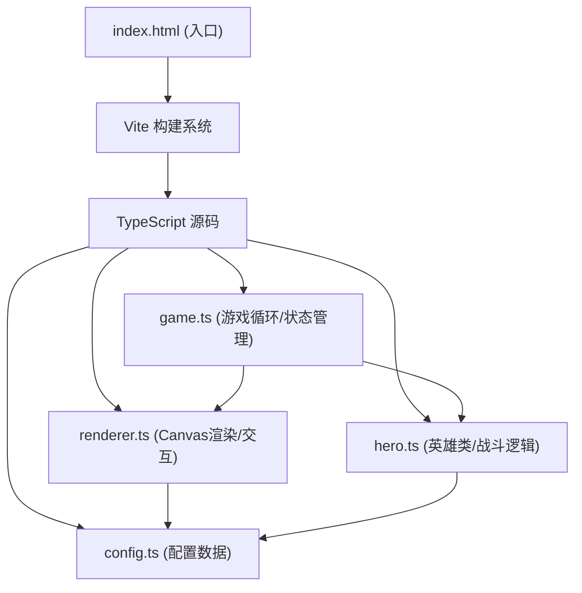

## 1. 架构设计



## 2. 技术描述
- **前端框架**：纯 TypeScript，无额外UI框架
- **构建工具**：Vite@5.x
- **渲染方式**：HTML5 Canvas 2D API
- **动画系统**：requestAnimationFrame 游戏循环
- **依赖包**：typescript@5.x、vite@5.x

## 3. 项目结构

| 文件路径 | 用途 |
|---------|------|
| `/package.json` | 项目配置、依赖、启动脚本 |
| `/index.html` | 入口页面，全屏Canvas容器 |
| `/vite.config.js` | Vite 基本配置 |
| `/tsconfig.json` | TypeScript 严格模式配置 |
| `/src/config.ts` | 英雄配置数据（种族、职业、技能参数） |
| `/src/hero.ts` | 英雄类（属性、技能、目标选择、攻击行为） |
| `/src/game.ts` | 核心游戏循环（棋盘状态、战斗逻辑、胜负判定） |
| `/src/renderer.ts` | 画布渲染（棋盘、英雄、特效、UI、鼠标交互、拖拽） |

## 4. 核心模块定义

### 4.1 英雄数据结构

```typescript
interface HeroConfig {
  id: string;
  name: string;
  race: 'human' | 'orc' | 'elf' | 'undead';
  class: 'warrior' | 'mage' | 'archer' | 'healer';
  maxHp: number;
  attack: number;
  attackRange: number;
  skill: SkillConfig;
  pixelColor: string;
}

interface SkillConfig {
  name: string;
  type: 'damage' | 'buff' | 'aoe';
  damage: number;
  cooldown: number;
  range: number;
  effect: 'fire' | 'heal' | 'shield';
}
```

### 4.2 游戏状态

```typescript
enum GamePhase {
  PREPARING = 'preparing',
  FIGHTING = 'fighting',
  FINISHED = 'finished'
}

interface GameState {
  phase: GamePhase;
  board: (Hero | null)[][]; // 6x4
  playerHeroes: Hero[];
  enemyHeroes: Hero[];
  winner: 'player' | 'enemy' | null;
  round: number;
}
```

## 5. 渲染性能优化策略

1. **分层渲染**：棋盘层、英雄层、特效层分离
2. **离屏Canvas**：静态棋盘元素预渲染
3. **脏区域更新**：仅重绘变化区域
4. **对象池**：特效粒子复用，避免频繁GC
5. **帧率控制**：逻辑更新与渲染分离，固定60FPS

## 6. 交互事件处理

| 事件 | 处理逻辑 |
|------|---------|
| mousedown | 检测英雄卡片点击，开始拖拽 |
| mousemove | 更新拖拽影子位置，检测棋盘格子hover |
| mouseup | 放置英雄到目标格子（如合法） |
| click | 点击英雄切换，触发视角平滑缩放 |
| touchstart/touchmove/touchend | 触摸设备对应处理 |
