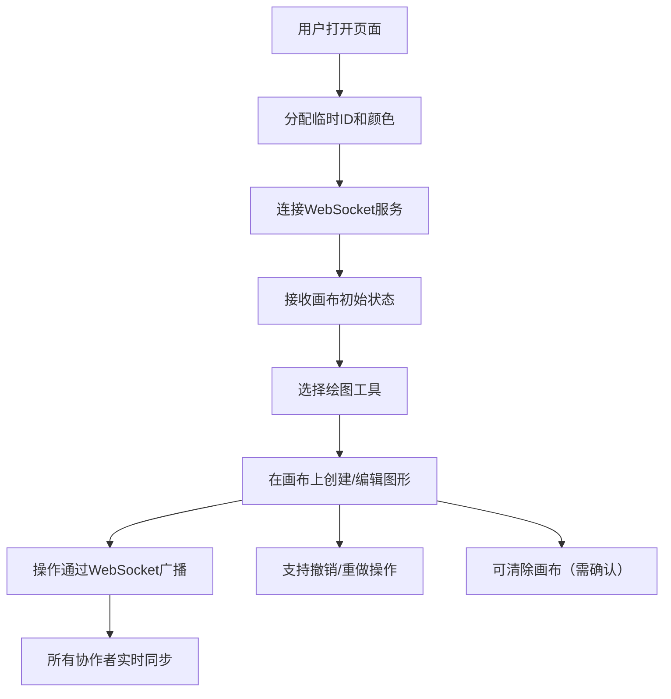

## 1. 产品概述

实时协作矢量插画应用，解决团队在白板或设计工具中难以多人同步编辑矢量图形的问题。

- 面向设计团队、产品团队和远程协作群体，提供多人实时协作的矢量绘图白板
- 通过 WebSocket 实现低延迟（≤300ms）的图形同步，支持无限撤销/重做，提供流畅的绘制体验

## 2. 核心功能

### 2.1 用户角色

| 角色 | 注册方式 | 核心权限 |
|------|----------|----------|
| 协作者 | 自动分配临时ID | 创建、编辑、删除图形；查看其他协作者光标；使用撤销/重做 |

### 2.2 功能模块

1. **主画布**：SVG 矢量画布，支持图形渲染、鼠标交互、选中锚点
2. **顶部工具栏**：绘图模式切换（圆形/矩形/三角形/直线/自由曲线）、撤销/重做、清除画布
3. **右侧属性面板**：填充色、边框颜色、边框粗细调节
4. **实时协作模块**：光标同步、在线用户列表、操作广播

### 2.3 页面详情

| 页面名称 | 模块名称 | 功能描述 |
|----------|----------|----------|
| 主应用 | 画布区域 | SVG 网格背景，渲染所有矢量图形，处理拖拽/缩放/旋转/选中交互 |
| 主应用 | 工具栏 | 5种绘图工具按钮、撤销/重做按钮、清除画布按钮（带确认弹窗） |
| 主应用 | 属性面板 | 填充色选择器（预设色板+十六进制输入）、边框颜色选择器、边框粗细滑块（1-10px） |
| 主应用 | 在线用户区 | 右上角显示在线用户头像和用户名，新用户加入/离开有淡入淡出动画 |
| 主应用 | 光标指示 | 每个协作者光标显示为带用户名的彩色圆形标签，实时更新位置 |

## 3. 核心流程

用户打开页面 → 自动分配临时用户ID和颜色 → 连接 WebSocket → 接收当前画布状态 → 选择绘图工具在画布上创建图形 → 拖拽/缩放/旋转图形或修改属性 → 操作通过 WebSocket 广播到所有协作者 → 支持撤销/重做（Ctrl+Z / Ctrl+Shift+Z）→ 可点击清除画布（带确认）

## 4. 用户界面设计

### 4.1 设计风格

- **主色调**：蓝紫色渐变背景（从 #667eea 到 #764ba2）
- **毛玻璃风格**：工具栏和控制面板使用半透明磨砂效果（backdrop-filter: blur(20px)）
- **画布背景**：浅灰网格线，间距 20px，网格线颜色 #e0e0e0
- **选中效果**：蓝色虚线边框 + 4个锚点（边角圆形，边中点方形）
- **按钮动效**：hover 时轻微上浮+阴影加深，点击时压扁效果
- **过渡动画**：所有动画时长 200-300ms，使用 ease-out 缓动函数

### 4.2 页面设计概述

| 页面名称 | 模块名称 | UI 元素 |
|----------|----------|---------|
| 主应用 | 工具栏 | 毛玻璃半透明背景，圆形工具按钮带图标，悬停上浮动画 |
| 主应用 | 画布 | 网格背景，矢量图形带选中边框和锚点，拖拽/缩放/旋转反馈 |
| 主应用 | 属性面板 | 毛玻璃背景，预设色板网格，十六进制输入框，滑块控件 |
| 主应用 | 在线用户 | 右上角浮动，头像圆形缩略图+用户名，淡入淡出动画 |
| 主应用 | 协作光标 | 彩色圆形+用户名标签，跟随鼠标实时移动 |

### 4.3 响应式

- 桌面端优先（≥768px）：右侧属性面板展开，工具栏标准布局
- 移动端（<768px）：属性面板收到底部折叠栏，工具栏图标缩小紧凑布局
- 触摸设备：优化触摸区域大小，支持触摸拖拽和缩放

### 4.4 性能要求

- 同时存在 200 个图形时，拖拽操作帧率 ≥ 30fps
- 撤销/重做响应时间 ≤ 100ms
- WebSocket 同步延迟 ≤ 300ms
