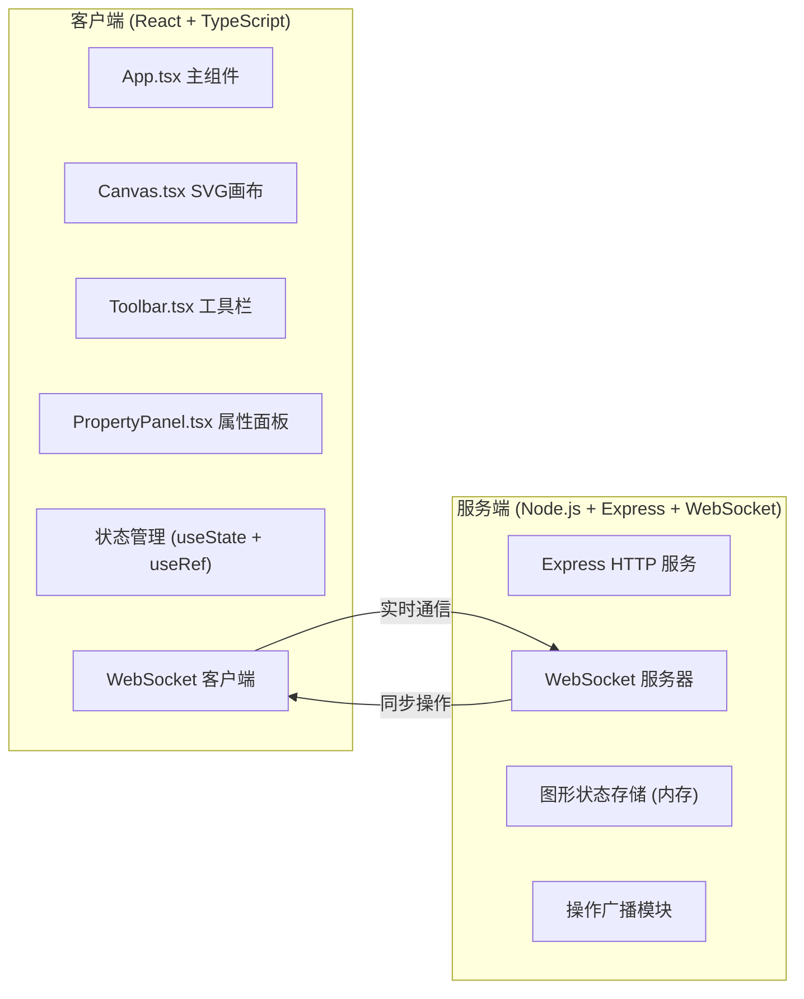
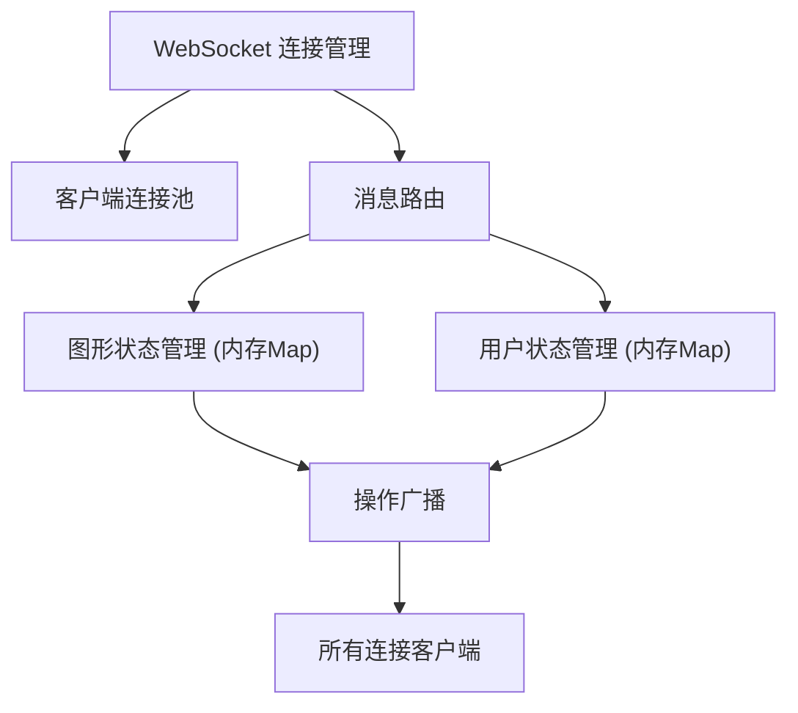
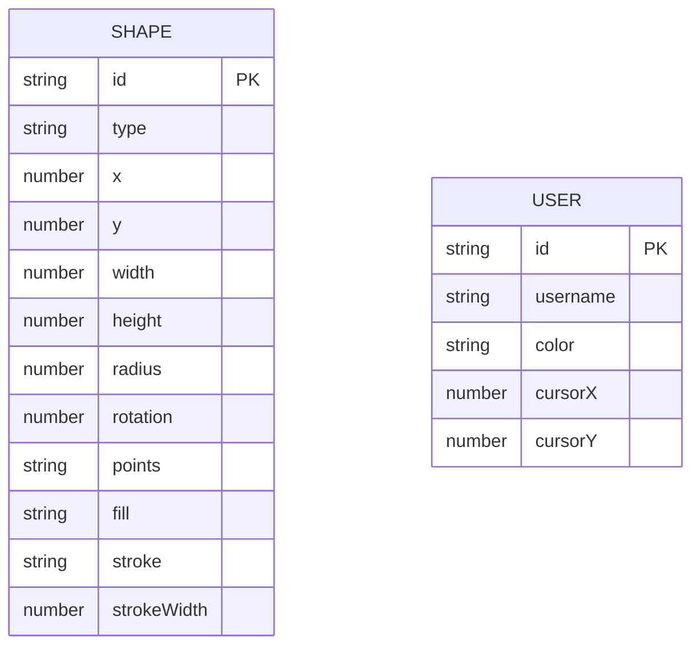

## 1. 架构设计



## 2. 技术描述

- **前端**：React@18 + TypeScript + Vite
- **样式**：原生 CSS（支持 Glassmorphism 毛玻璃效果）
- **后端**：Express@4 + ws (WebSocket 库) + uuid
- **初始化工具**：Vite
- **数据存储**：服务端内存存储图形数据（无数据库）

## 3. 项目文件结构

```
auto10/
├── package.json
├── index.html
├── tsconfig.json
├── vite.config.js
├── server/
│   └── index.js          # Express + WebSocket 服务端
└── src/
    ├── App.tsx           # 主组件，状态管理、布局
    ├── Canvas.tsx        # SVG画布组件，交互处理
    ├── Toolbar.tsx       # 工具栏组件
    ├── PropertyPanel.tsx # 属性面板组件
    └── types.ts          # TypeScript 类型定义（可选）
```

## 4. API / WebSocket 协议定义

### WebSocket 消息格式

```typescript
// 客户端 → 服务端
type ClientMessage =
  | { type: 'INIT' }
  | { type: 'ADD_SHAPE'; shape: Shape }
  | { type: 'UPDATE_SHAPE'; id: string; updates: Partial<Shape> }
  | { type: 'DELETE_SHAPE'; id: string }
  | { type: 'CLEAR_ALL' }
  | { type: 'CURSOR'; x: number; y: number; username: string; color: string }
  | { type: 'USER_LEAVE' }

// 服务端 → 客户端
type ServerMessage =
  | { type: 'INIT'; shapes: Shape[]; users: User[]; userId: string }
  | { type: 'SHAPE_ADDED'; shape: Shape }
  | { type: 'SHAPE_UPDATED'; id: string; updates: Partial<Shape> }
  | { type: 'SHAPE_DELETED'; id: string }
  | { type: 'ALL_CLEARED' }
  | { type: 'CURSOR_UPDATE'; userId: string; x: number; y: number; username: string; color: string }
  | { type: 'USER_JOINED'; user: User }
  | { type: 'USER_LEFT'; userId: string }

// 数据类型
interface Shape {
  id: string
  type: 'circle' | 'rect' | 'triangle' | 'line' | 'path'
  x: number
  y: number
  width?: number
  height?: number
  radius?: number
  rotation?: number
  points?: string
  fill: string
  stroke: string
  strokeWidth: number
}

interface User {
  id: string
  username: string
  color: string
  cursor?: { x: number; y: number }
}
```

## 5. 服务端架构



## 6. 数据模型

### 6.1 数据模型定义



### 6.2 状态管理说明

- **服务端**：使用内存 Map 存储 `shapes` (id → Shape) 和 `users` (id → User)
- **客户端**：使用 React useState 管理 shapes 数组、选中图形ID、用户列表、光标位置等
- **撤销/重做**：客户端维护两个栈 `undoStack` 和 `redoStack`，每次操作 push 到 undoStack，撤销时 pop 并反向操作
