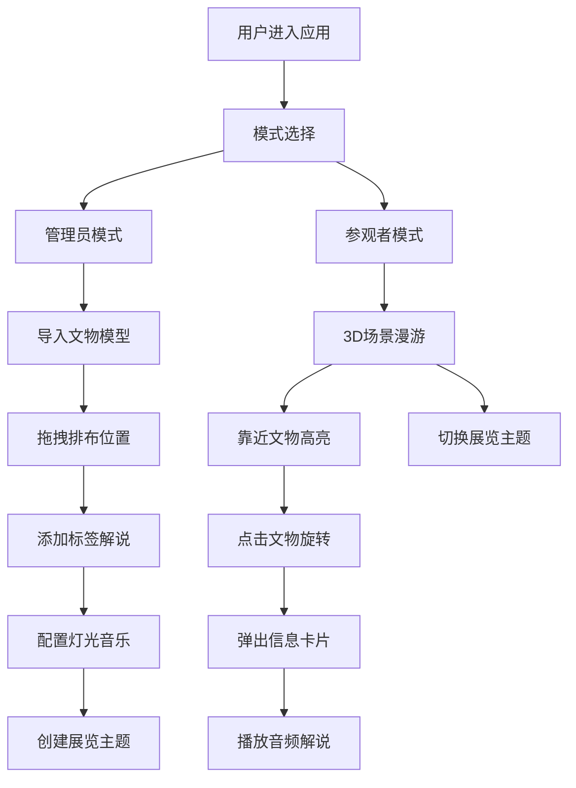

## 1. 产品概述

虚拟文物展览空间管理与交互浏览应用，为博物馆策展人提供3D文物数字化展示工具，让参观者通过网页沉浸式探索虚拟展览。

- 核心目的：解决传统图片视频无法提供自由交互体验的问题，构建可管理、可交互的3D虚拟展厅
- 目标用户：博物馆策展人（管理员）、普通参观者
- 市场价值：打破物理空间限制，实现文物数字化保护与传播，提供沉浸式文化体验

## 2. 核心特性

### 2.1 用户角色

| 角色 | 认证方式 | 核心权限 |
|------|----------|----------|
| 管理员 | 模式切换按钮 | 文物导入、位置排布、标签编辑、展厅配置、主题管理 |
| 参观者 | 模式切换按钮 | 3D场景漫游、文物交互、信息查看、音频解说 |

### 2.2 功能模块

1. **3D场景模块**：文物渲染、光照系统、相机控制、碰撞检测
2. **管理员面板**：文物导入、列表管理、位置拖拽、展厅配置、主题切换
3. **参观者交互**：第一人称漫游、文物点击、信息卡片、音频解说
4. **主题管理**：多主题切换、场景重建、加载动画
5. **展厅配置**：灯光氛围切换、背景音乐切换

### 2.3 页面详情

| 页面名称 | 模块名称 | 功能描述 |
|----------|----------|----------|
| 主页面 | 导航栏 | 展览名称显示、主题下拉菜单、模式切换按钮 |
| 主页面 | 3D渲染区域 | 文物展示、自由漫游、交互点击、粒子光晕 |
| 主页面 | 管理员面板 | 文物导入、列表展示、位置编辑、展厅配置 |
| 主页面 | 信息卡片 | 文物详情展示、音频播放按钮 |
| 主页面 | 加载动画 | 主题切换时的环形进度条 |

## 3. 核心流程

### 管理员流程
策展人进入应用 → 切换至管理员模式 → 导入GLTF文物模型 → 拖拽调整文物位置 → 添加标签和音频解说 → 配置灯光和音乐 → 创建/切换展览主题 → 保存配置

### 参观者流程
参观者进入应用 → 浏览3D展厅 → WASD移动+鼠标旋转视角 → 靠近文物自动高亮 → 点击文物旋转展示 → 弹出信息卡片 → 播放音频解说 → 切换不同展览主题

## 4. 用户界面设计

### 4.1 设计风格
- **主色调**：深灰渐变(#0f0f1a → #1a1a3a)作为背景，金色(#d4af37, #ffd700)作为强调色，蓝色(#4a90d9)作为交互色
- **按钮风格**：圆角8px，毛玻璃半透明效果，悬停时缩放1.05倍，0.3秒过渡
- **字体**：标题使用Cinzel（古典装饰字体），正文使用Cormorant Garamond（优雅衬线字体）
- **布局风格**：暗黑沉浸式主题，层级分明的卡片式布局，大量使用半透明毛玻璃效果
- **图标风格**：线性简约图标，金色描边，与整体古典博物馆风格统一

### 4.2 页面设计概览

| 页面名称 | 模块名称 | UI元素 |
|----------|----------|--------|
| 主页面 | 导航栏 | 固定顶部60px，半透明背景rgba(15,15,26,0.8)，模糊12px，左侧展览名称，右侧主题下拉和模式切换 |
| 主页面 | 3D场景 | 径向渐变背景，文物基座半透明圆形平台，粒子光晕环绕，自定义十字准星光标 |
| 主页面 | 管理员面板 | 左侧毛玻璃面板，深色渐变卡片(#1a1a2e→#16213e)，圆角12px，实时位置信息 |
| 主页面 | 信息卡片 | 右侧滑入，宽度350px，毛玻璃效果，标题下划线，金色时期标签，波形动画按钮 |
| 主页面 | 加载动画 | 全屏覆盖，旋转环形进度条，蓝紫渐变 |

### 4.3 响应式设计
- **桌面端(>1024px)**：完整布局，左侧管理面板常驻，右侧信息卡片滑入
- **平板端(768-1024px)**：管理面板折叠为悬浮图标，点击展开全屏半面板
- **手机端(<768px)**：纯3D漫游模式，管理功能通过底部浮动按钮触发全屏覆盖面板

### 4.4 3D场景设计
- **环境**：深灰到深蓝径向渐变背景，营造博物馆沉浸感
- **光照**：三色预设（展览暖色3000K/考古中性4500K/神秘冷色7000K），1秒平滑过渡
- **相机**：第一人称控制，WASD移动（2单位/秒），鼠标拖拽旋转（灵敏度0.3）
- **交互**：射线检测点击，距离<3单位自动高亮（0.3秒淡入，强度0.5），点击绕Y轴360度旋转（2秒，ease-in-out）
- **特效**：60粒子光晕（#ffd700，大小0.05，缓慢旋转），文物基座编号平台（直径1.5单位）
- **性能**：15个文物+900粒子保持≥30FPS，模型面数≤3000三角面，加载≤2秒
