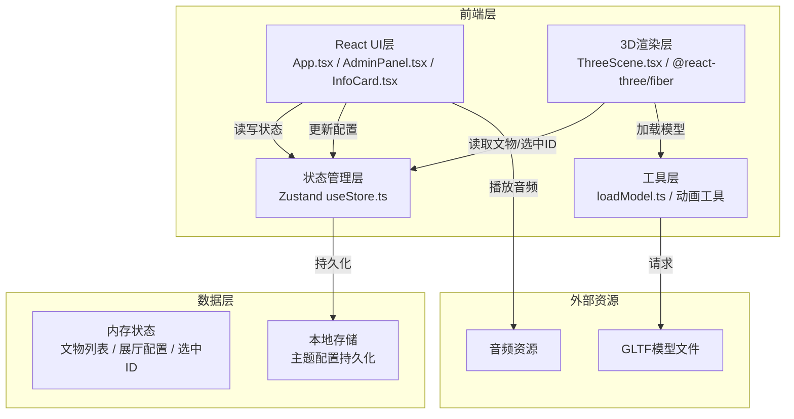
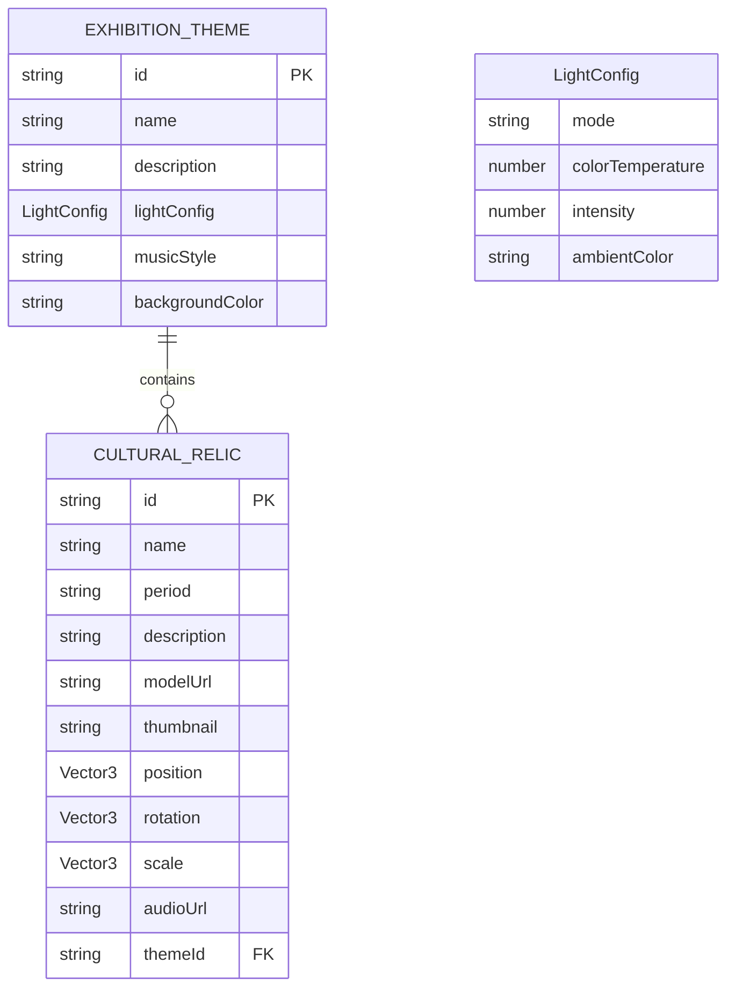

## 1. 架构设计



## 2. 技术描述

- **前端框架**：React@18 + TypeScript@5 + Vite@5
- **3D渲染**：three@0.160 + @react-three/fiber@8 + @react-three/drei@9 + three-stdlib@2
- **状态管理**：Zustand@4
- **样式方案**：CSS Modules + CSS Variables（避免Tailwind以获得更精细的动画控制）
- **构建工具**：Vite@5 + @vitejs/plugin-react@4
- **其他依赖**：uuid@9（生成唯一ID）
- **无后端**：纯前端应用，数据存储于localStorage，使用Mock示例数据

## 3. 路由定义

| 路由 | 用途 |
|------|------|
| / | 主应用入口，3D展厅 + 管理面板 |

*注：单页应用，通过状态切换管理员/参观者模式，无多页面路由*

## 4. 数据模型

### 4.1 数据模型定义



### 4.2 TypeScript 类型定义

```typescript
// 文物数据模型
interface CulturalRelic {
  id: string;
  name: string;
  period: string;
  description: string;
  modelUrl: string;
  thumbnail: string;
  position: { x: number; y: number; z: number };
  rotation: { x: number; y: number; z: number };
  scale: { x: number; y: number; z: number };
  audioUrl?: string;
  themeId: string;
}

// 灯光配置
interface LightConfig {
  mode: 'exhibition' | 'archaeology' | 'mystery';
  colorTemperature: number;
  intensity: number;
  ambientColor: string;
  directionalColor: string;
}

// 展览主题
interface ExhibitionTheme {
  id: string;
  name: string;
  description: string;
  lightConfig: LightConfig;
  musicStyle: 'classical' | 'ambient' | 'epic';
  backgroundColor: string;
  relics: CulturalRelic[];
}

// 全局状态
interface AppState {
  themes: ExhibitionTheme[];
  currentThemeId: string;
  selectedRelicId: string | null;
  isAdminMode: boolean;
  isLoading: boolean;
  draggingRelicId: string | null;
  // Actions
  addRelic: (relic: Omit<CulturalRelic, 'id'>) => void;
  updateRelic: (id: string, updates: Partial<CulturalRelic>) => void;
  removeRelic: (id: string) => void;
  selectRelic: (id: string | null) => void;
  setAdminMode: (isAdmin: boolean) => void;
  setCurrentTheme: (themeId: string) => void;
  addTheme: (theme: Omit<ExhibitionTheme, 'id' | 'relics'>) => void;
  updateLightConfig: (config: Partial<LightConfig>) => void;
  setMusicStyle: (style: 'classical' | 'ambient' | 'epic') => void;
  setDraggingRelic: (id: string | null) => void;
  setLoading: (loading: boolean) => void;
}
```

## 5. 文件结构与调用关系

```
src/
├── main.tsx                    # 应用入口 → 挂载App.tsx
├── App.tsx                     # 主组件 → 路由/布局/全局状态分发
│   ├── components/
│   │   ├── ThreeScene.tsx      # 3D场景 → Canvas + 相机 + 灯光 + 文物组
│   │   │   └── RelicObject.tsx # 单文物渲染 → 模型加载 + 粒子 + 交互
│   │   ├── AdminPanel.tsx      # 管理面板 → 文物列表 + 配置表单
│   │   ├── InfoCard.tsx        # 信息卡片 → 文物详情 + 音频播放
│   │   ├── Navigation.tsx      # 导航栏 → 主题切换 + 模式切换
│   │   └── LoadingScreen.tsx   # 加载动画 → 环形进度条
│   ├── store/
│   │   └── useStore.ts         # Zustand状态 → 所有组件共享
│   ├── utils/
│   │   ├── loadModel.ts        # GLTF加载器 → ThreeScene调用
│   │   ├── colorUtils.ts       # 色温转换 → 灯光配置
│   │   └── animationUtils.ts   # 缓动函数 → 动画效果
│   ├── types/
│   │   └── index.ts            # TypeScript类型定义
│   ├── data/
│   │   └── mockData.ts         # 示例文物数据
│   └── styles/
│       ├── global.css          # 全局样式 + CSS变量
│       └── animations.css      # 动画关键帧定义
```

**数据流向**：
1. `useStore.ts` → `App.tsx` → 分发至 `ThreeScene.tsx` / `AdminPanel.tsx` / `Navigation.tsx`
2. `AdminPanel.tsx` → 用户操作 → 调用 `useStore` action → 更新状态 → `ThreeScene.tsx` 重新渲染
3. `ThreeScene.tsx` → 射线检测点击 → 调用 `selectRelic` → `InfoCard.tsx` 显示
4. `loadModel.ts` → 被 `RelicObject.tsx` 调用 → 返回 Group 对象 → 添加到场景

## 6. 核心实现要点

### 6.1 3D交互实现
- **第一人称控制**：使用 `@react-three/drei` 的 `PointerLockControls` + 自定义 WASD 移动逻辑
- **拖拽排布**：使用 `three-stdlib` 的 `DragControls`，管理员模式下启用
- **射线检测**：`useFrame` 中每帧执行射线检测，计算与文物的距离触发高亮
- **旋转动画**：点击文物时使用 `gsap` 或自定义缓动函数实现 Y 轴 360° 旋转

### 6.2 性能优化
- **实例化渲染**：粒子系统使用 `InstancedMesh` 而非单独 Mesh
- **LOD**：远处文物降低细节级别
- **视锥体剔除**：Three.js 原生视锥体剔除
- **帧节流**：非交互状态下降低渲染帧率

### 6.3 动画实现
- **灯光过渡**：使用 `useFrame` 插值更新灯光颜色和强度
- **音乐切换**：Web Audio API 实现淡入淡出
- **UI过渡**：CSS transitions 实现滑入、淡入效果
