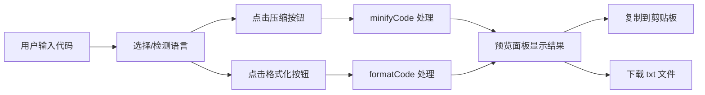

## 1. 产品概述

交互式代码压缩与格式化工具，支持 JavaScript、TypeScript、CSS 和 HTML 四种语言，提供实时预览、复制和下载功能，帮助开发者快速处理代码片段。

- 主要用途：代码压缩减小体积、代码格式化美化可读性
- 目标用户：前端开发者、网页设计师、编程学习者
- 产品价值：零配置、即时可用、多语言支持的在线代码处理工具

## 2. 核心功能

### 2.1 功能模块

1. **代码编辑器**：基于 Monaco Editor，支持语法高亮、行号显示、深色主题
2. **工具条**：语言选择下拉框、压缩按钮、格式化按钮
3. **结果预览**：实时显示处理后的代码，带淡入动画
4. **操作按钮**：复制结果、下载代码文件
5. **状态栏**：显示当前语言和代码字符数

### 2.2 页面详情

| 页面名称 | 模块名称 | 功能描述 |
|-----------|-------------|---------------------|
| 主页 | 代码编辑器 | Monaco Editor 实现，支持 4 种语言语法高亮，深色主题，自动检测语言 |
| 主页 | 工具条 | 语言选择下拉框（带图标）、压缩按钮、格式化按钮，带动画交互 |
| 主页 | 结果预览 | 右侧面板显示处理结果，淡入动画，格式化统计信息 |
| 主页 | 操作区 | 复制按钮（toast 提示）、下载按钮（脉冲动画） |
| 主页 | 分隔条 | 可拖拽调整左右面板宽度，拖拽时高亮 |
| 主页 | 状态栏 | 显示当前语言和字符数统计 |

## 3. 核心流程

用户输入或粘贴代码 → 选择语言（或自动检测）→ 点击压缩/格式化按钮 → 右侧面板实时显示处理结果 → 用户复制或下载结果

## 4. 用户界面设计

### 4.1 设计风格

- **主色调**：深色主题，背景色 `#1E1E1E`，两侧纯黑 `#000`
- **强调色**：按钮蓝色、压缩成功绿色、格式化橙色、分隔条高亮蓝 `#007ACC`
- **文字颜色**：编辑器 `#D4D4D4`，预览区 `#CCCCCC`
- **按钮风格**：圆角矩形，悬停和点击有缩放过渡动画
- **布局风格**：左右两栏布局，左侧 60% 编辑器，右侧 40% 预览
- **图标**：语言选项带图标，操作按钮带简洁图标

### 4.2 页面设计概览

| 页面名称 | 模块名称 | UI 元素 |
|-----------|-------------|-------------|
| 主页 | 代码编辑器 | Monaco Editor、深色主题、语法高亮、行号、光标闪烁动画 |
| 主页 | 工具条 | 50px 高度、背景 `#333333`、按钮间距 12px、下拉框带图标 |
| 主页 | 分隔条 | 2px 灰色、可拖拽、高亮蓝色 `#007ACC` |
| 主页 | 预览面板 | 背景 `#252526`、文字 `#CCCCCC`、淡入动画 0.3s |
| 主页 | 统计行 | 半透明浅绿背景 `rgba(0,200,0,0.1)` |
| 主页 | 操作按钮 | 复制按钮（"已复制"状态 1.5s）、下载按钮（脉冲动画 0.3s） |
| 主页 | 状态栏 | 底部显示语言和字符数 |

### 4.3 响应式

- 桌面端为主，左右两栏布局
- 小屏幕下可考虑上下布局，但本次以桌面端为主要目标
- 拖拽分隔条支持鼠标操作

### 4.4 动效设计

- 按钮点击缩放动画 0.2s
- 结果展示淡入动画 0.3s
- 复制按钮状态切换（复制→已复制→复制）1.5s
- 下载按钮脉冲动画 0.3s
- 光标闪烁动画 0.5s 周期
- 分隔条拖拽高亮效果
- Toast 提示 2 秒淡出
