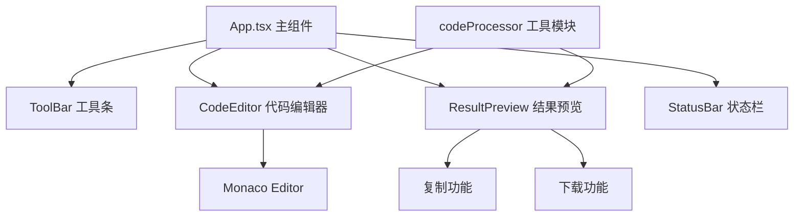
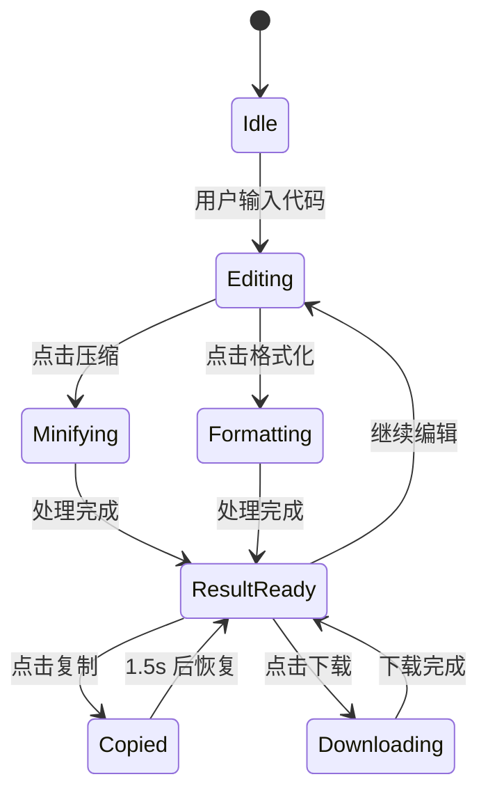

## 1. 架构设计



## 2. 技术描述

- **前端框架**：React 18 + TypeScript
- **构建工具**：Vite
- **代码编辑器**：monaco-editor
- **文件下载**：file-saver
- **状态管理**：React useState/useEffect（轻量应用，无需额外状态库）
- **样式方案**：原生 CSS（配合 CSS Modules 或内联样式，按项目约定）

## 3. 文件结构

```
├── package.json
├── vite.config.js
├── tsconfig.json
├── index.html
└── src/
    ├── main.tsx          # React 应用入口
    ├── App.tsx           # 主布局组件
    ├── components/
    │   ├── CodeEditor.tsx      # Monaco 代码编辑器
    │   ├── ResultPreview.tsx   # 结果预览面板
    │   └── ToolBar.tsx         # 工具条组件
    └── utils/
        └── codeProcessor.ts    # 代码处理工具
```

## 4. 模块定义

### 4.1 codeProcessor 工具模块

**位置**：`src/utils/codeProcessor.ts`

**导出函数**：
- `minifyCode(code: string, language: string): string` - 压缩代码
- `formatCode(code: string, language: string): { code: string; charReduction: number; indentCount: number }` - 格式化代码

**支持语言**：javascript, typescript, css, html

### 4.2 CodeEditor 组件

**Props**：
- `value: string` - 代码内容
- `language: string` - 语言类型
- `onChange: (value: string) => void` - 内容变化回调
- `onLanguageDetect?: (language: string) => void` - 自动检测语言回调

### 4.3 ToolBar 组件

**Props**：
- `language: string` - 当前语言
- `onLanguageChange: (lang: string) => void` - 语言切换
- `onMinify: () => void` - 压缩按钮点击
- `onFormat: () => void` - 格式化按钮点击

### 4.4 ResultPreview 组件

**Props**：
- `code: string` - 结果代码
- `language: string` - 语言类型
- `stats?: { charReduction: number; indentCount: number }` - 格式化统计
- `isMinified?: boolean` - 是否为压缩结果

### 4.5 状态流



## 5. 性能优化

- 代码量少于 100 字符时快速处理，延迟 < 100ms
- 1 万字符以内处理耗时不超过 50ms
- 使用 requestAnimationFrame 优化动画性能
- 避免不必要的重渲染
