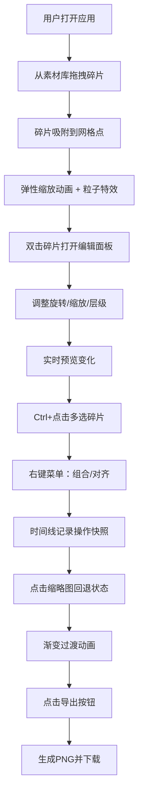

## 1. 产品概述

手绘风格拼贴画创作应用，帮助用户在浏览器中体验数字拼贴画创作的乐趣，解决传统数字绘画工具操作复杂、缺乏随机性和趣味性的问题。

- 核心功能：拖拽式碎片拼贴、实时编辑、历史回退、图片导出
- 目标用户：创意爱好者、设计师、普通用户
- 产品价值：降低数字艺术创作门槛，提供有趣的拼贴体验

## 2. 核心功能

### 2.1 功能模块

1. **主画布区域**：800x600像素画布，支持碎片拖拽、吸附、选中和编辑
2. **素材库面板**：右侧碎片素材库，3种形状（圆形、三角形、不规则多边形），每种10种颜色纹理变体
3. **编辑面板**：双击碎片弹出，支持旋转、缩放、层级调整
4. **多选操作**：Ctrl+点击多选，支持整体拖拽、组合/解散、对齐操作
5. **时间线面板**：底部历史记录，缩略图展示，支持一键回退
6. **顶部工具栏**：撤销、重做、清空、导出按钮

### 2.2 页面详情

| 页面名称 | 模块名称 | 功能描述 |
|-----------|-------------|---------------------|
| 主页面 | 主画布 | 800x600米白色背景，支持碎片拖拽放置、吸附到网格点、弹性缩放动画、粒子溅射特效 |
| 主页面 | 素材库 | 右侧240px宽度，卡片式碎片展示，悬停上浮动画，拖拽到画布放置 |
| 主页面 | 编辑面板 | 毛玻璃效果，旋转滑块（0-360°，步进5°）、缩放滑块（0.5-2.0x，步进0.1）、层级调整按钮 |
| 主页面 | 时间线 | 底部80px高度，半透明深灰背景，操作缩略图，点击回退，渐变过渡动画 |
| 主页面 | 工具栏 | 顶部50px高度，深棕色背景，撤销/重做/清空/导出按钮，旋转动画 |

## 3. 核心流程

### 3.1 用户操作流程

用户打开应用 → 从素材库拖拽碎片 → 碎片吸附到网格点 → 弹性动画+粒子特效 → 双击碎片编辑（旋转/缩放/层级）→ Ctrl+点击多选碎片 → 组合/对齐操作 → 时间线记录所有操作 → 点击历史缩略图回退 → 导出PNG图片

### 3.2 流程图

## 4. 用户界面设计

### 4.1 设计风格

- **整体风格**：手绘涂鸦风格，圆润感，趣味性
- **主色调**：暖黄色 #F5E6CA
- **辅色调**：深棕色 #4A3B32，浅蓝色 #B0C4DE
- **背景色**：画布米白色，素材库浅灰 #F0EBE3，时间线深灰 #2C2C2C
- **按钮风格**：圆形按钮，圆角卡片，毛玻璃面板
- **动画效果**：所有操作0.2-0.3秒平滑过渡，弹性动画，粒子特效
- **字体**：采用手写风格或圆润无衬线字体

### 4.2 页面设计概述

| 页面名称 | 模块名称 | UI元素 |
|-----------|-------------|-------------|
| 主页面 | 主画布 | 800x600米白色，网格点（间距40px，吸附范围20px），碎片渲染，选中虚线框（8px间距），8个控制点 |
| 主页面 | 素材库 | 240px宽度，渐变标题条（浅蓝→暖黄），60x60px卡片（圆角8px），悬停上浮3px，阴影加深 |
| 主页面 | 编辑面板 | 半透明毛玻璃，背景虚化10px，滑块控件，凹陷按钮动画，数值实时同步 |
| 主页面 | 时间线 | 80px高度，#2C2C2C背景，80x60px缩略图（圆角4px），横向滚动 |
| 主页面 | 工具栏 | 50px高度，#4A3B32背景，白色图标，悬停变#F5E6CA，0.2秒旋转动画 |

### 4.3 响应式设计

- **桌面端**（≥900px）：右侧素材库（240px），主画布居中，时间线底部
- **移动端**（<900px）：素材库折叠为底部横条（120px高度），可向上滑动展开，时间线宽度自适应

### 4.4 性能指标

- 拖拽帧率：60FPS
- 50个碎片操作延迟：≤300ms
- 导出图片耗时：≤500ms
