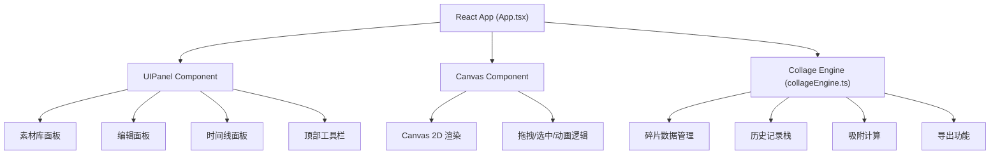

## 1. 架构设计



## 2. 技术选型

- **前端框架**：React 18 + TypeScript
- **构建工具**：Vite
- **状态管理**：React useState/useReducer（轻量级，无需额外库）
- **Canvas渲染**：原生Canvas 2D API
- **第三方库**：
  - file-saver：导出PNG文件保存
  - uuid：生成唯一ID
- **样式方案**：CSS Modules + CSS Variables（手绘风格需要精细控制）

## 3. 项目文件结构

```
auto109/
├── package.json
├── index.html
├── vite.config.js
├── tsconfig.json
└── src/
    ├── main.tsx              # React入口
    ├── App.tsx               # 主应用组件
    ├── components/
    │   ├── Canvas.tsx        # Canvas渲染组件
    │   └── UIPanel.tsx       # UI面板组件
    └── utils/
        └── collageEngine.ts  # 核心逻辑引擎
```

## 4. 数据模型

### 4.1 碎片数据结构

```typescript
interface Fragment {
  id: string;
  type: 'circle' | 'triangle' | 'polygon';
  color: string;
  texture: string;
  x: number;
  y: number;
  rotation: number;
  scale: number;
  zIndex: number;
  groupId?: string;
}

interface HistoryState {
  id: string;
  timestamp: number;
  fragments: Fragment[];
  thumbnail: string;
  actionType: 'add' | 'move' | 'rotate' | 'scale' | 'delete' | 'group' | 'ungroup';
}

interface Particle {
  x: number;
  y: number;
  vx: number;
  vy: number;
  color: string;
  life: number;
  maxLife: number;
  size: number;
}
```

### 4.2 素材库配置

```typescript
interface MaterialConfig {
  type: 'circle' | 'triangle' | 'polygon';
  variants: Array<{
    color: string;
    texture: string;
  }>;
}

// 每种形状10种颜色纹理变体
const MATERIALS: MaterialConfig[] = [
  { type: 'circle', variants: [...10种变体] },
  { type: 'triangle', variants: [...10种变体] },
  { type: 'polygon', variants: [...10种变体] },
];
```

## 5. 核心算法

### 5.1 网格吸附算法

```typescript
function snapToGrid(x: number, y: number, gridSize = 40, snapRange = 20): { x: number; y: number } {
  const gridX = Math.round(x / gridSize) * gridSize;
  const gridY = Math.round(y / gridSize) * gridSize;
  const dist = Math.sqrt((x - gridX) ** 2 + (y - gridY) ** 2);
  if (dist <= snapRange) {
    return { x: gridX, y: gridY };
  }
  return { x, y };
}
```

### 5.2 弹性动画缓动函数

```typescript
function elasticEaseOut(t: number): number {
  if (t === 0) return 0;
  if (t === 1) return 1;
  return Math.pow(2, -10 * t) * Math.sin((t - 0.075) * (2 * Math.PI) / 0.3) + 1;
}
```

### 5.3 碰撞检测（点是否在碎片内）

```typescript
function isPointInFragment(px: number, py: number, fragment: Fragment): boolean {
  // 应用逆变换：平移 -> 旋转 -> 缩放
  const dx = px - fragment.x;
  const dy = py - fragment.y;
  const rad = -fragment.rotation * Math.PI / 180;
  const localX = (dx * Math.cos(rad) - dy * Math.sin(rad)) / fragment.scale;
  const localY = (dx * Math.sin(rad) + dy * Math.cos(rad)) / fragment.scale;
  
  // 根据形状检测
  switch (fragment.type) {
    case 'circle':
      return localX * localX + localY * localY <= 30 * 30;
    case 'triangle':
      return pointInTriangle(localX, localY, ...);
    case 'polygon':
      return pointInPolygon(localX, localY, ...);
    default:
      return false;
  }
}
```

## 6. 性能优化策略

1. **Canvas分层渲染**：碎片层、选中框层、粒子层分离
2. **requestAnimationFrame统一调度**：所有动画使用同一帧循环
3. **离屏Canvas缓存**：缩略图生成使用离屏Canvas
4. **事件节流**：mousemove事件使用requestAnimationFrame节流
5. **对象池**：粒子对象复用，避免频繁GC
6. **局部重绘**：只重绘变化区域（dirty rectangles）

## 7. 状态管理

使用React的useReducer管理全局状态：

```typescript
type Action =
  | { type: 'ADD_FRAGMENT'; payload: Fragment }
  | { type: 'UPDATE_FRAGMENT'; payload: { id: string; changes: Partial<Fragment> } }
  | { type: 'DELETE_FRAGMENT'; payload: string }
  | { type: 'GROUP_FRAGMENTS'; payload: { ids: string[]; groupId: string } }
  | { type: 'UNGROUP_FRAGMENTS'; payload: string }
  | { type: 'UNDO' }
  | { type: 'REDO' }
  | { type: 'JUMP_TO_HISTORY'; payload: number }
  | { type: 'CLEAR_ALL' };
```
