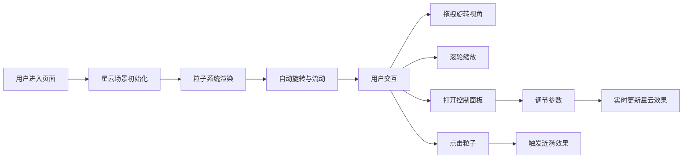

## 1. 产品概述

3D粒子星云交互可视化应用，模拟动态星云在深空背景中的流动与演化。用户可以通过鼠标交互探索星云，调节粒子参数，并通过点击触发涟漪效果。

- **目标用户**：对3D可视化、粒子效果感兴趣的开发者和设计师
- **核心价值**：提供沉浸式的星云视觉体验，展示高性能WebGL粒子渲染技术

## 2. 核心特性

### 2.1 功能模块

1. **3D星云场景**：由数万个粒子构成的彩色星云，支持自转与流动动画
2. **交互控制**：鼠标拖拽旋转视角、滚轮缩放
3. **控制面板**：悬浮式参数调节面板，支持粒子密度、颜色、旋转速度、流动方向调节
4. **涟漪效果**：点击粒子触发向外扩散的涟漪动画

### 2.2 页面详情

| 页面名称 | 模块名称 | 功能描述 |
|---------|---------|---------|
| 主页面 | 3D星云场景 | 粒子渲染、自转、流动动画、深空背景 |
| 主页面 | 视角控制 | 鼠标拖拽旋转、滚轮缩放 |
| 主页面 | 控制面板 | 参数滑块调节、收起/展开动画 |
| 主页面 | 涟漪效果 | 点击触发粒子扩散动画 |

## 3. 核心流程

## 4. 用户界面设计

### 4.1 设计风格
- **设计主题**：深空科技风
- **主色调**：深空蓝黑渐变背景
- **强调色**：紫色、蓝色、粉色、金色（粒子渐变色彩）
- **UI风格**：半透明毛玻璃效果、圆角边框、渐变滑块

### 4.2 页面设计概览

| 页面名称 | 模块名称 | UI元素 |
|---------|---------|--------|
| 主页面 | 星云场景 | 3D粒子、静态星星、深空背景 |
| 主页面 | 控制面板 | 毛玻璃面板、渐变色滑块、圆角设计、收起/展开动画 |
| 主页面 | 触发按钮 | 右下角圆形浮动按钮 |

### 4.3 响应式
- 桌面端优先设计
- 控制面板自适应布局
- 触控设备支持手势操作

### 4.4 3D场景指导
- **环境**：深空黑蓝渐变背景，点缀静态白色小星星
- **光照**：粒子自发光，无需额外光源
- **相机**：透视相机，初始距离适中，支持轨道控制
- **动画**：星云整体缓慢自转，粒子流动效果，涟漪扩散动画
- **性能**：使用BufferGeometry和shader实现GPU加速，确保5万粒子时30fps以上
