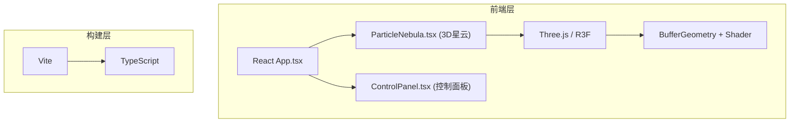

## 1. 架构设计



## 2. 技术描述

- **前端框架**：React 18 + TypeScript
- **3D引擎**：Three.js + @react-three/fiber + @react-three/drei
- **构建工具**：Vite
- **状态管理**：React useState/useRef (轻量级状态)
- **样式方案**：CSS Modules / 内联样式 (毛玻璃效果)

## 3. 项目结构

```
src/
├── App.tsx              # 主组件，场景状态管理
├── ParticleNebula.tsx   # 粒子星云渲染组件
├── ControlPanel.tsx     # 控制面板组件
└── main.tsx             # 入口文件
```

## 4. 核心技术点

### 4.1 粒子系统
- 使用 `BufferGeometry` 管理数万个粒子
- 自定义 `ShaderMaterial` 实现GPU加速动画
- 粒子属性：位置、颜色、大小、透明度

### 4.2 交互控制
- `OrbitControls` 实现视角旋转缩放
- Raycaster 实现粒子点击检测
- 涟漪效果通过 shader uniform 实现

### 4.3 性能优化
- GPU 粒子动画（shader 层面计算）
- BufferGeometry 批量渲染
- 动态调整粒子数量时平滑过渡

## 5. 数据模型

### 5.1 粒子配置状态
```typescript
interface NebulaConfig {
  particleCount: number;      // 粒子数量 20000-50000
  colorSpeed: number;         // 颜色周期速度 0.1-1.0
  rotationSpeed: number;      // 旋转速度 0.0-0.5
  flowDirection: {            // 流动方向
    x: number;
    y: number;
    z: number;
  };
}
```

### 5.2 涟漪效果状态
```typescript
interface RippleEffect {
  active: boolean;
  center: Vector3;
  radius: number;
  startTime: number;
  duration: number;
}
```
