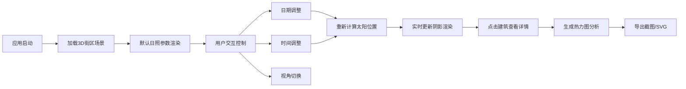

## 1. 产品概述

日照阴影动态模拟与可视化分析应用，为城市规划师提供新建楼宇对周边环境日照影响的直观评估工具。通过交互式3D场景展示不同季节、时间点的阴影动态变化，支持热力图分析与数据导出，解决传统2D图纸难以直观呈现动态日照效果的痛点。

- 核心价值：提升城市规划效率，通过实时可视化降低日照评估的专业门槛
- 目标用户：城市规划师、建筑设计师、市政工程师

## 2. 核心特性

### 2.1 功能模块

1. **3D场景主界面**：街区建筑模型渲染、实时阴影投射、自由视角浏览
2. **太阳控制面板**：日期选择、时间滑块、四季标识显示
3. **阴影分析模块**：建筑物信息面板、阴影覆盖热力图、统计饼图
4. **数据导出模块**：场景截图导出、热力图SVG矢量导出

### 2.2 页面详情

| 页面名称 | 模块名称 | 功能描述 |
|-----------|-------------|---------------------|
| 主应用页 | 3D场景区域 | 渲染10栋不同形状高度的建筑物、100x100地面网格、动态阴影投射，支持鼠标/WASD浏览 |
| 主应用页 | 顶部导航栏 | 显示应用名称、当前模拟时间（等宽字体金色）、四季标识 |
| 主应用页 | 日月控制卡片 | 日期选择器（1.1-12.31）、时间滑块（06:00-20:00步长15分钟，渐变轨道）、视角切换 |
| 主应用页 | 分析卡片 | 生成热力图按钮、阴影覆盖百分比饼图预览 |
| 主应用页 | 导出卡片 | 导出截图按钮（PNG 1920x1080）、导出热力图按钮（SVG） |
| 主应用页 | 建筑信息弹窗 | 显示选中建筑的高度、占地面积、被遮挡面积百分比 |

## 3. 核心流程

用户打开应用 → 加载预设3D街区场景 → 调整日期和时间控制太阳位置 → 实时预览阴影变化 → 点击建筑查看日照数据 → 生成阴影热力图 → 导出分析结果

## 4. 用户界面设计

### 4.1 设计风格
- 主背景色：#1E1E2E（深空蓝灰）
- 面板背景：#2A2A3E（稍浅蓝灰）
- 文字颜色：#E0E0E0（浅灰白）
- 强调色：#50B8E0（青蓝）、#FFD700（金色）、#FF6B6B（暖红）
- 按钮风格：圆角8px，hover背景加深20%，active水波纹效果
- 字体：标题使用无衬线现代字体，时间显示使用monospace等宽字体
- 布局：左侧75%为3D主场景，右侧300px固定控制面板，顶部导航栏

### 4.2 视觉细节
- 统一圆角8px，卡片带细微内阴影
- 时间滑块：轨道暖黄到冷蓝渐变，thumb缩放1.1倍加外发光
- 导出按钮：0.3秒水波纹扩散动画
- 热力图：0.8秒淡入、0.5秒淡出动画
- 阴影过渡：0.5秒平滑动画过渡
- 饼图：d3.js渐变色渲染
- 太阳球体：日出暖橙→正午白→日落暖橙颜色渐变

### 4.3 响应式
- 桌面端优先设计（≥1440px最佳体验）
- 控制层面板宽度固定300px，3D场景自适应剩余空间
- 小屏设备控制面板切换为底部抽屉式布局

### 4.4 3D场景指导
- 环境：深色深空背景，浅灰色半透明地面带网格辅助线
- 光照：主光源为可移动的太阳光（方向光+发光球体可视化），半球光模拟环境补光
- 阴影：PCFSoftShadowMap软阴影，1024x1024阴影贴图分辨率
- 相机：默认45度俯视透视投影，支持OrbitControls轨道控制+WASD平移
- 建筑材质：不同建筑使用差异化的蓝灰色调金属质感材质
- 性能：帧率目标稳定30+ FPS，阴影更新延迟≤200ms
