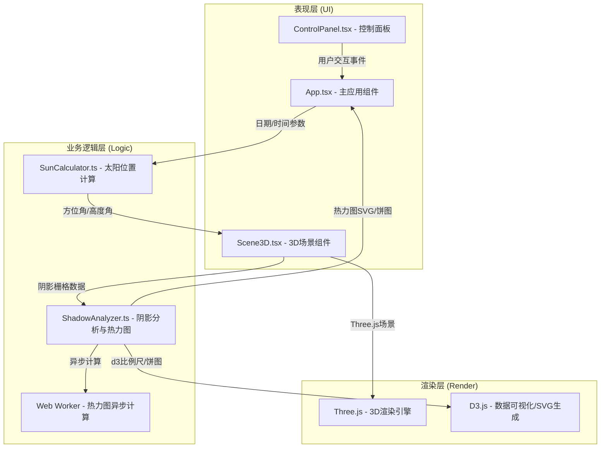

## 1. 架构设计



## 2. 技术说明

- 前端框架：React@18 + TypeScript@5
- 构建工具：Vite@5 + @vitejs/plugin-react
- 3D渲染：three@0.160 + @types/three
- 数据可视化：d3@7 + @types/d3
- 文件导出：file-saver@2 + @types/file-saver
- 状态管理：React Hooks (useState, useRef, useEffect, useCallback)

## 3. 核心目录结构

```
src/
├── main.tsx                    # 应用入口
├── App.tsx                     # 主应用组件(状态中心)
├── index.css                   # 全局样式
├── types/
│   └── index.ts                # 全局类型定义
├── components/
│   ├── Scene3D.tsx             # Three.js 3D场景组件
│   ├── ControlPanel.tsx        # 右侧控制面板组件
│   ├── SunControlCard.tsx      # 日月控制卡片
│   ├── AnalysisCard.tsx        # 分析卡片(热力图+饼图)
│   ├── ExportCard.tsx          # 导出卡片
│   ├── BuildingInfo.tsx        # 建筑信息弹窗
│   └── TopNavbar.tsx           # 顶部导航栏
└── utils/
    ├── SunCalculator.ts        # 太阳位置计算模块
    ├── ShadowAnalyzer.ts       # 阴影分析与热力图模块
    ├── heatmap.worker.ts       # Web Worker热力图计算
    └── exportUtils.ts          # 截图/导出工具
```

## 4. 类型定义

```typescript
// 建筑数据结构
interface Building {
  id: string;
  type: 'cube' | 'cylinder' | 'L-shape';
  position: { x: number; z: number };
  dimensions: { width: number; depth: number; height: number };
  color: string;
  shadowAreaPercent?: number;
  footprintArea?: number;
}

// 太阳位置
interface SunPosition {
  azimuth: number;    // 方位角(弧度)
  altitude: number;   // 高度角(弧度)
  color: string;      // 太阳颜色
}

// 阴影栅格数据
interface ShadowGridData {
  resolution: number;  // 10x10 => 100个单元格
  gridSize: number;    // 100x100地面
  cells: ShadowCell[];
}

interface ShadowCell {
  x: number;
  z: number;
  shadowValue: number;  // 0-1阴影覆盖率
}

// 热力图统计
interface HeatmapStats {
  noShadowPercent: number;
  partialShadowPercent: number;
  fullShadowPercent: number;
}
```

## 5. 数据流规范

### 5.1 太阳位置计算流程
```
ControlPanel(date, time) 
  → App(更新state) 
    → SunCalculator.calculate(date, time, lat=39.9) 
      → { azimuth, altitude, color }
        → Scene3D(更新DirectionalLight位置, 太阳球体位置, 触发阴影重算)
```

### 5.2 阴影分析流程
```
用户点击"生成热力图"
  → Scene3D.captureShadowGrid() 
    → ShadowGridData
      → ShadowAnalyzer.generateHeatmap(gridData)
        → Web Worker异步计算(≤3s)
          → { svgString, pieData, stats }
            → App.state更新
              → 场景叠加半透明热力图
              → 控制面板饼图渲染
```

### 5.3 导出流程
```
导出截图 → Scene3D.renderToPNG(1920x1080) → 添加时间水印 → file-saver下载
导出热力图 → ShadowAnalyzer.exportSVG(svg+pieChart) → 合并SVG → file-saver下载
```

## 6. 性能优化策略

1. **阴影计算优化**
   - 使用PCFSoftShadowMap而非更高级的VSM，平衡质量与性能
   - 阴影贴图1024x1024，避免过大带宽开销
   - 仅当太阳位置变化时触发shadowMap.needsUpdate
   - 太阳光.target固定为场景中心，避免频繁矩阵计算

2. **渲染循环优化**
   - 时间滑块拖动时使用节流(throttle 16ms)，确保≤200ms延迟
   - 阴影动画使用lerp线性插值0.5秒过渡
   - 热力图使用Web Worker计算，避免UI线程阻塞

3. **3D场景优化**
   - 10栋建筑，几何体一次性创建不动态销毁
   - 建筑使用MeshStandardMaterial但roughness/metalness合理设置
   - 地面为单PlaneGeometry+网格辅助线，非动态合并

4. **内存管理**
   - 组件卸载时dispose所有几何体、材质、renderTarget
   - 取消所有animationFrame和event listener
   - Web Worker使用完terminate

## 7. Three.js场景配置要点

```typescript
// Renderer配置
renderer.shadowMap.enabled = true;
renderer.shadowMap.type = THREE.PCFSoftShadowMap;
renderer.setPixelRatio(Math.min(window.devicePixelRatio, 2));

// 太阳光
sunLight = new THREE.DirectionalLight(0xffffff, 1.2);
sunLight.castShadow = true;
sunLight.shadow.mapSize.set(1024, 1024);
sunLight.shadow.camera.near = 0.5;
sunLight.shadow.camera.far = 300;
sunLight.shadow.camera.left = -60;
sunLight.shadow.camera.right = 60;
sunLight.shadow.camera.top = 60;
sunLight.shadow.camera.bottom = -60;

// 相机
camera = new THREE.PerspectiveCamera(45, aspect, 0.1, 1000);
camera.position.set(80, 80, 80);
camera.lookAt(0, 0, 0);

// OrbitControls + WASD
controls.enableDamping = true;
controls.dampingFactor = 0.08;
controls.minDistance = 30;
controls.maxDistance = 200;
```
