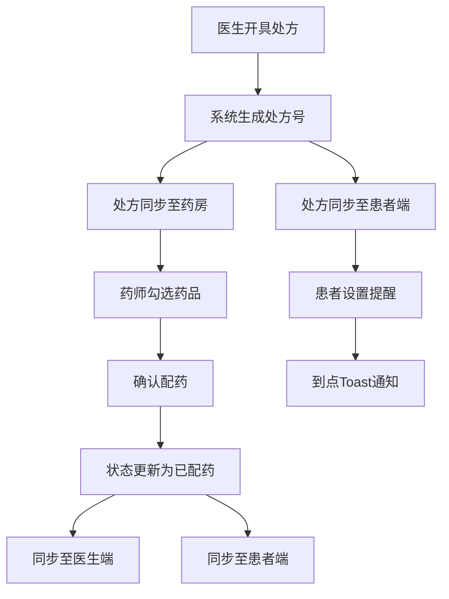

## 1. 产品概述
电子处方流转与用药提醒服务应用，连接医生、患者和药房三方，实现电子处方的开具、流转、配药和用药提醒全流程管理。
- 解决传统纸质处方流转效率低、患者用药依从性差的问题
- 目标用户包括医生、患者和药师三类角色，提升医疗服务效率和患者用药安全

## 2. 核心特性

### 2.1 用户角色
| 角色 | 登录方式 | 核心权限 |
|------|----------|----------|
| 医生 | 直接进入 | 搜索患者、开具处方、查看处方列表 |
| 患者 | 手机号验证码（1234）登录 | 查看处方、设置用药提醒、接收通知 |
| 药师 | 直接进入 | 接收处方、标记配药状态、筛选处方 |

### 2.2 功能模块
1. **角色选择页**：三角色卡片选择，淡入淡出过渡动画
2. **医生端面板**：患者搜索、处方表单、近期处方列表
3. **患者端视图**：处方列表展示、用药提醒设置、Toast通知
4. **药房端视图**：处方筛选、配药详情弹窗、状态更新

### 2.3 页面详情
| 页面名称 | 模块名称 | 功能描述 |
|----------|----------|----------|
| 角色选择页 | 角色卡片 | 三列网格布局，悬浮上移和阴影放大效果，淡入淡出过渡 |
| 医生端面板 | 患者搜索 | 手机号搜索，不存在自动创建患者档案，300ms防抖 |
| 医生端面板 | 处方表单 | 药品名称、剂量、用法、用药天数输入，提交生成唯一处方号 |
| 医生端面板 | 处方列表 | 按创建时间倒序，支持搜索，淡入动画，左侧蓝色细条 |
| 患者端视图 | 登录模块 | 手机号输入+验证码（1234）验证 |
| 患者端视图 | 处方列表 | 卡片流布局，状态色条（绿色有效/灰色过期），展开详情 |
| 患者端视图 | 提醒设置 | iOS风格滑块开关，多选提醒时间，Toast通知带音效 |
| 药房端视图 | 筛选器 | 毛玻璃下拉菜单（全部/待配药/已配药），默认待配药 |
| 药房端视图 | 处方卡片 | 悬停背景变色，点击弹出配药详情模态框 |
| 药房端视图 | 配药弹窗 | 药品清单逐项勾选，全部勾选后确认配药，状态同步更新 |

## 3. 核心流程

### 3.1 处方开具流程
医生搜索患者手机号 → 系统自动创建/获取患者档案 → 医生填写处方药品信息 → 提交生成唯一处方号（有效期7天）→ 处方同步到药房和患者端

### 3.2 患者用药流程
患者输入手机号+验证码登录 → 查看名下所有处方 → 点击处方查看详情 → 设置每日用药提醒时间 → 到点触发Toast通知（带音效）

### 3.3 药房配药流程
药师查看待配药处方列表 → 点击处方查看配药详情 → 逐项勾选已配药品 → 全部勾选后确认配药 → 处方状态更新为已配药 → 同步到医生和患者端

## 4. 用户界面设计

### 4.1 设计风格
- 主色调：浅蓝#E0F2FE和白色，强调色中蓝#3B82F6
- 按钮样式：圆角6px，聚焦边框蓝色+微光效果
- 字体：系统默认无衬线字体，标题1.25rem，正文0.875rem
- 布局：flex-wrap自适应，支持320px到1920px屏幕
- 动画：卡片淡入0.3s，角色切换淡入淡出0.2s，悬浮上移-4px+阴影增大20%

### 4.2 页面设计概览
| 页面名称 | 模块名称 | UI元素 |
|----------|----------|--------|
| 角色选择页 | 角色卡片 | 三列网格居中，白色卡片，蓝色强调，悬浮效果，淡入淡出过渡 |
| 医生端面板 | 左右分栏 | 左：搜索+表单（圆角输入框，聚焦微光），右：处方列表（左侧蓝色细条，间距12px） |
| 患者端视图 | 处方卡片 | 宽350px卡片流，左侧色条（绿/灰），iOS风格滑块开关，右下角Toast通知 |
| 药房端视图 | 筛选+列表 | 毛玻璃下拉筛选，卡片悬停变浅蓝#DBEAFE，半遮罩模态框（rgba(0,0,0,0.4)） |

### 4.3 响应式设计
- Desktop-first设计，使用flex-wrap自适应布局
- 320px窄屏单列布局，768px以上双列/三列布局
- 触摸交互优化，确保移动端可点击区域足够
