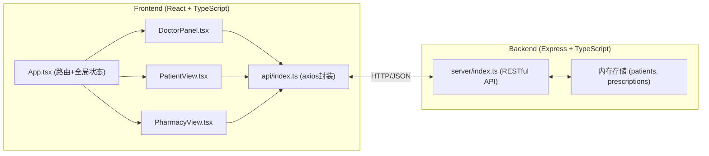
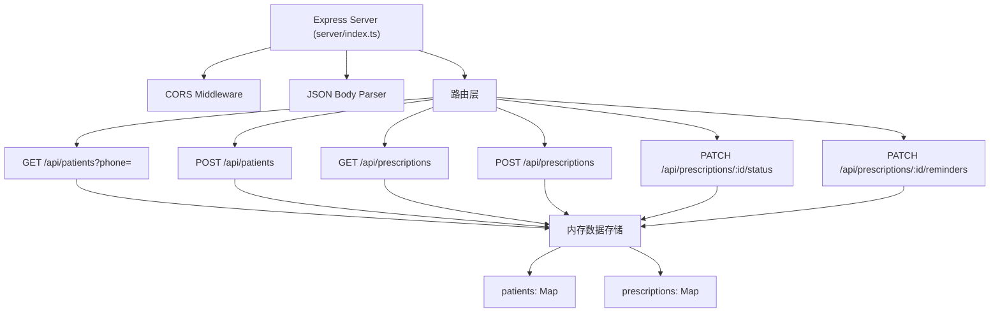
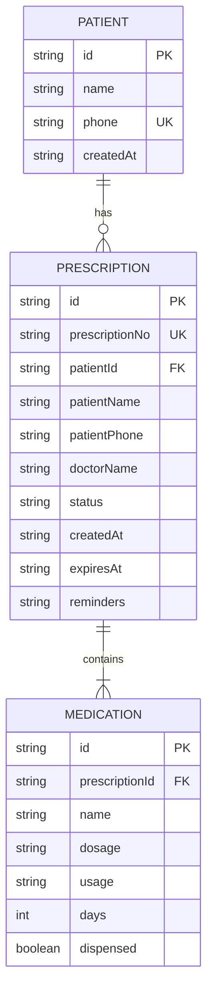

## 1. 架构设计



## 2. 技术描述
- **前端**：React 18 + TypeScript + Vite
- **后端**：Express 4 + TypeScript，内存存储
- **状态管理**：React useState/useEffect，无需额外状态管理库
- **路由**：React Router DOM v6
- **HTTP客户端**：Axios
- **工具库**：uuid（唯一ID）、date-fns（日期处理）
- **样式**：原生CSS + CSS变量，不使用Tailwind（用户未指定）

## 3. 路由定义
| 前端路由 | 用途 |
|----------|------|
| / | 角色选择页面 |
| /doctor | 医生端面板 |
| /patient | 患者端登录/视图 |
| /pharmacy | 药房端视图 |

| 后端API | 方法 | 用途 |
|---------|------|------|
| /api/patients | GET | 搜索患者（按手机号） |
| /api/patients | POST | 创建患者档案 |
| /api/prescriptions | GET | 获取处方列表（支持筛选） |
| /api/prescriptions | POST | 创建处方 |
| /api/prescriptions/:id | GET | 获取处方详情 |
| /api/prescriptions/:id/status | PATCH | 更新处方配药状态 |
| /api/prescriptions/:id/reminders | PATCH | 更新用药提醒设置 |

## 4. API定义

### 4.1 类型定义
```typescript
interface Patient {
  id: string;
  name: string;
  phone: string;
  createdAt: string;
}

interface Medication {
  id: string;
  name: string;
  dosage: string;
  usage: string;
  days: number;
  dispensed: boolean;
}

interface Prescription {
  id: string;
  prescriptionNo: string;
  patientId: string;
  patientName: string;
  patientPhone: string;
  doctorName: string;
  medications: Medication[];
  status: 'pending' | 'dispensed';
  createdAt: string;
  expiresAt: string;
  reminders: string[];
}
```

### 4.2 请求/响应示例
```typescript
// 创建处方请求
interface CreatePrescriptionRequest {
  patientPhone: string;
  patientName: string;
  doctorName: string;
  medications: Omit<Medication, 'id' | 'dispensed'>[];
}

// 创建处方响应
interface CreatePrescriptionResponse {
  success: boolean;
  prescription: Prescription;
}

// 更新状态请求
interface UpdateStatusRequest {
  status: 'dispensed';
  dispensedMedications: string[];
}
```

## 5. 服务器架构图



## 6. 数据模型

### 6.1 实体关系图


### 6.2 内存数据结构
```typescript
// 内存存储
const patients: Map<string, Patient> = new Map();
const prescriptions: Map<string, Prescription> = new Map();

// 处方号生成规则：RX + 时间戳(8位) + 随机4位
// 有效期：创建时间 + 7天
```
