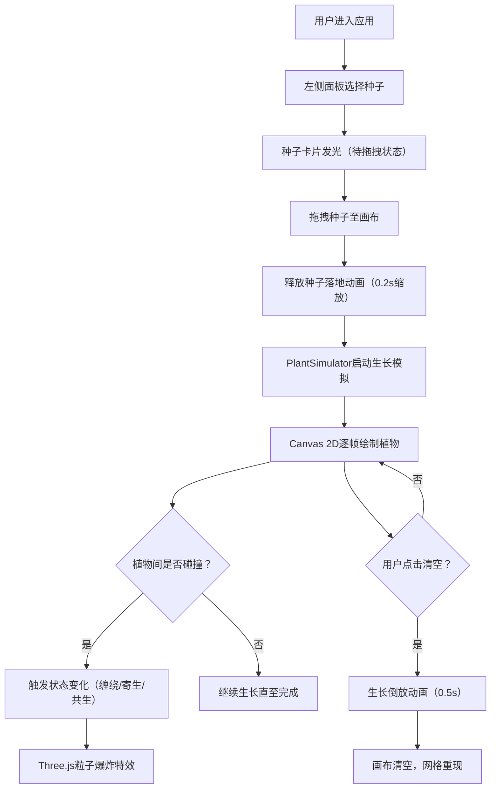

## 1. 产品概述

基于网格的植物魔法交互沙盒应用，玩家通过拖拽释放种子在画布上培育动态植物，植物生长过程中与环境和其他植物发生交互，产生缠绕、枯萎、共生等魔法效果。

- 目标用户：游戏设计师、创意爱好者、休闲玩家
- 核心价值：提供沉浸式的植物魔法创作体验，通过简单的拖拽操作创造丰富的动态生态系统

## 2. 核心功能

### 2.1 用户角色
| 角色 | 注册方式 | 核心权限 |
|------|----------|----------|
| 普通用户 | 无需注册 | 使用全部功能，培育植物，观察交互效果 |

### 2.2 功能模块
1. **种子面板**：种子选择卡片、拖拽状态指示、清空画布按钮
2. **网格画布**：20×14网格系统、深棕土壤背景、拖拽释放交互
3. **植物生长系统**：递归分形生长算法、三种植物类型差异化表现
4. **植物交互系统**：碰撞检测（AABB+像素级）、三种交互状态（缠绕/寄生/共生）
5. **粒子特效系统**：Three.js 3D粒子渲染、碰撞爆炸特效、光晕效果
6. **动画系统**：生长动画、叶片颤动、缩放过渡、清空倒放动画

### 2.3 页面详情
| 页面名称 | 模块名称 | 功能描述 |
|----------|----------|----------|
| 主界面 | 左侧种子面板 | 3种种子卡片展示（藤蔓/蘑菇/光藓），选中状态发光动画，清空按钮 |
| 主界面 | 中央画布区域 | 1000×700像素网格画布，响应式16:9缩放，拖拽释放交互 |
| 主界面 | 植物生长渲染 | Canvas 2D绘制茎干叶片，逐帧延伸效果，透明度渐变 |
| 主界面 | 交互状态反馈 | 碰撞检测触发状态变化，颜色/形态改变，粒子爆炸特效 |

## 3. 核心流程

用户从左侧面板选择种子 → 拖拽至画布网格 → 释放种子触发落地动画 → 植物按生长曲线自动生长 → 植物间碰撞触发交互状态 → 粒子特效反馈状态变化 → 可随时清空画布重新创作

## 4. 用户界面设计

### 4.1 设计风格
- **主色调**：深棕土壤色 `#3E2723`（画布背景）、深灰色 `#2C2C2C`（面板背景）
- **强调色**：藤蔓翠绿 `#4CAF50`、蘑菇橙红 `#FF5722`、光藓淡蓝 `#81D4FA`、按钮红色 `#C62828`
- **整体风格**：暗色魔法主题，高对比度色彩突出植物元素，毛玻璃半透明面板
- **字体**：系统无衬线字体（system-ui, -apple-system, sans-serif）

### 4.2 页面设计概览
| 页面名称 | 模块名称 | UI元素 |
|----------|----------|--------|
| 主界面 | 左侧种子面板 | 固定宽度200px，深灰毛玻璃背景，3张圆形种子卡片（40px直径），卡片选中时白色发光边缘（1s周期闪烁），底部红色清空按钮 |
| 主界面 | 中央画布 | 1000×700px（16:9比例），深棕土壤背景，20×14浅灰网格线（透明度0.15，1px线宽），响应式等比例缩放 |
| 主界面 | 植物渲染 | 茎干线宽4px末端渐细，绿色椭圆叶片（与分支方向对齐），橙红渐变半球菌盖，淡蓝半透明光斑（边缘模糊5px） |
| 主界面 | 粒子特效 | Three.js Points/Sprite渲染，碰撞时40个粒子爆炸（半径60px，大小2-5px，1.5秒消散），叠加200px半径半透明光晕（0.3秒） |

### 4.3 响应式
- 桌面优先设计，画布按16:9比例等比例缩放适配窗口
- 左侧面板宽度固定200px不随窗口变化
- 触摸设备支持触屏拖拽操作

### 4.4 3D场景指导
- **环境**：Canvas叠加层，无复杂3D场景，仅用于粒子渲染
- **光照**：粒子使用自发光材质，无需额外光照
- **相机**：正交投影，与Canvas 2D坐标系对齐
- **粒子材质**：Three.js PointsMaterial + 圆形Sprite纹理，透明度随生命周期衰减
- **后处理**：粒子颜色混合植物双方颜色，光晕使用径向渐变
