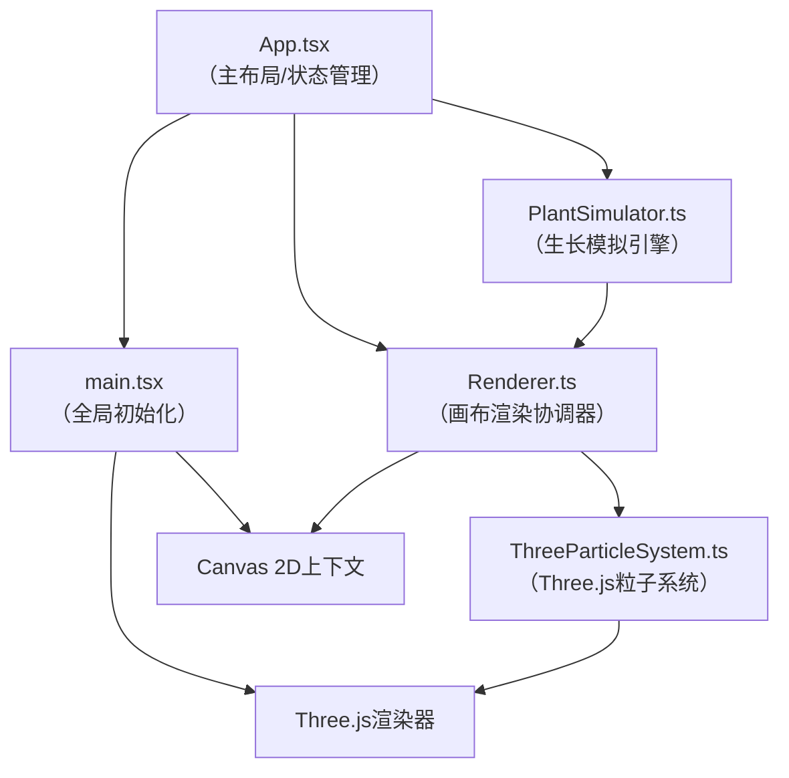

## 1. 架构设计



**数据流向**：App → PlantSimulator → Renderer → ThreeParticleSystem

## 2. 技术说明

- **前端框架**：React 18 + TypeScript 5
- **构建工具**：Vite 5 + @vitejs/plugin-react
- **2D渲染**：Canvas 2D API（植物茎干、叶片、网格）
- **3D渲染**：Three.js 0.160（粒子特效、光晕叠加）
- **工具库**：uuid（唯一ID生成）
- **状态管理**：React useState + useRef（高频数据用ref避免重渲染）
- **动画驱动**：requestAnimationFrame（60FPS）

## 3. 路由定义
| 路由 | 用途 |
|------|------|
| / | 主应用（单页面，无路由） |

## 4. 核心数据模型

### 4.1 类型定义

```typescript
// 种子/植物类型
type SeedType = 'vine' | 'mushroom' | 'glowmoss';

// 植物状态
type PlantState = 'growing' | 'mature' | 'wrapped' | 'parasitized' | 'symbiotic';

// 2D坐标点
interface Point {
  x: number;
  y: number;
}

// 藤蔓分支节点
interface BranchNode {
  start: Point;
  end: Point;
  angle: number;
  length: number;
  thickness: number;
  hasLeaf: boolean;
  leafAngle: number;
  growthProgress: number; // 0-1
}

// 蘑菇结构
interface MushroomStructure {
  center: Point;
  capRadius: number;
  stemHeight: number;
  brightness: number; // 0-1
  dots: Point[]; // 白色圆点位置
}

// 光藓结构
interface GlowMossStructure {
  center: Point;
  radius: number;
  opacity: number;
  color: { r: number; g: number; b: number };
  expansion: number; // 共生扩展系数
}

// 植物实例
interface Plant {
  id: string;
  type: SeedType;
  gridX: number;
  gridY: number;
  position: Point;
  state: PlantState;
  growthTime: number; // 已生长时间（秒）
  maxGrowthTime: number;
  opacity: number;
  scale: number; // 落地动画缩放
  vineBranches?: BranchNode[];
  mushroom?: MushroomStructure;
  glowmoss?: GlowMossStructure;
  interactedWith: Set<string>; // 已交互的植物ID
  stateTimer: number; // 状态变化计时
}

// 粒子
interface Particle {
  id: string;
  position: Point;
  velocity: Point;
  color: string;
  size: number;
  life: number; // 剩余生命周期（秒）
  maxLife: number;
}

// 应用状态
interface AppState {
  plants: Plant[];
  selectedSeed: SeedType | null;
  isDragging: boolean;
  dragPosition: Point | null;
}
```

### 4.2 碰撞检测数据

```typescript
// AABB包围盒
interface AABB {
  minX: number;
  minY: number;
  maxX: number;
  maxY: number;
}

// 碰撞对
interface CollisionPair {
  plantA: string;
  plantB: string;
}
```

## 5. 性能约束实现方案

### 5.1 帧率保障
- 高频更新数据（植物生长进度、粒子位置）使用 `useRef` 存储，避免React重渲染
- 碰撞检测每5帧执行一次，而非每帧
- Canvas 2D使用分层渲染（静态网格层 + 动态植物层）

### 5.2 粒子池管理
- 最大粒子数：200
- 采用环形缓冲区（Ring Buffer）管理粒子，超过时淘汰最旧粒子
- Three.js使用单个Points对象批量渲染所有粒子，避免频繁创建销毁Mesh

### 5.3 植物数量控制
- 最大植物数：20
- 生长模拟使用增量计算，每帧仅更新生长进度而非重新计算全部结构
- 碰撞检测使用空间哈希（Spatial Hash）优化粗检测阶段

## 6. 文件结构

```
auto113/
├── package.json
├── vite.config.js
├── tsconfig.json
├── index.html
└── src/
    ├── main.tsx              # 入口：挂载React，初始化Canvas和Three渲染器
    ├── App.tsx               # 主布局：侧边面板+画布，全局状态管理
    ├── types.ts              # 共享类型定义
    ├── PlantSimulator.ts     # 核心：植物生长模拟（递归分形算法）
    ├── Renderer.ts           # 渲染协调：Canvas 2D绘制+调用粒子系统
    └── ThreeParticleSystem.ts # Three.js粒子：Points渲染+生命周期管理
```

## 7. 关键算法说明

### 7.1 递归分形生长（藤蔓）
```
函数 generateBranches(startPoint, directionAngle, depth, progress):
  如果 depth > MAX_DEPTH 或 progress < 当前分支起始阈值:
    返回空数组
  
  生成分支长度（30-60px随机）
  计算终点坐标
  以 ±45° 内随机角度生成2-3个子分支递归调用
  每隔50px标记一个叶片节点
  返回分支节点数组
```

### 7.2 碰撞检测流程
```
每5帧执行:
  1. 为每株植物计算AABB包围盒
  2. 空间哈希分桶，仅检测同桶内植物对
  3. AABB粗检测筛选重叠候选对
  4. 对候选对执行像素级细检测：
     - 藤蔓：采样茎干路径点，计算点到线段距离
     - 蘑菇：圆心距离检测
     - 光藓：圆形区域重叠检测
  5. 检测到碰撞后触发对应交互逻辑
```

### 7.3 粒子系统更新
```
每帧:
  1. 淘汰 life <= 0 的粒子
  2. 对存活粒子:
     - position += velocity * deltaTime
     - life -= deltaTime
     - opacity = life / maxLife
  3. 超过200个时，移除最早加入的粒子
  4. 更新Three.js Points的position和color属性数组
```
