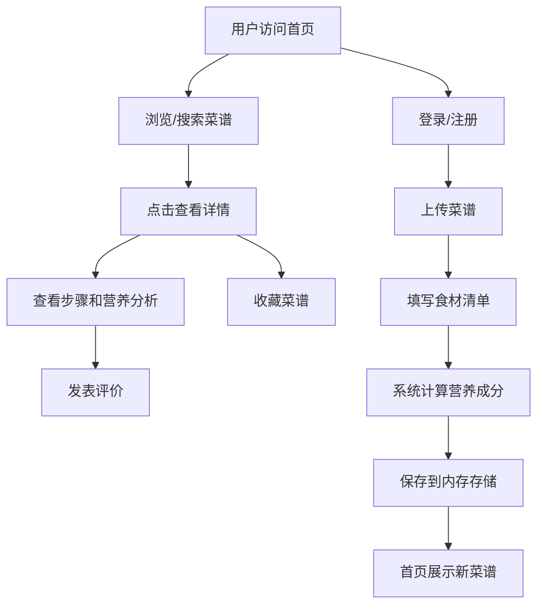

## 1. 产品概述

在线食谱分享与营养分析平台，用户可上传菜谱，系统自动计算营养成分，支持浏览、收藏和评价。

- 主要目的：为美食爱好者提供菜谱分享和营养分析的一站式平台
- 解决的问题：帮助用户了解食物营养成分，促进健康饮食
- 目标用户：家庭主妇、健身人士、美食爱好者、营养师

## 2. 核心功能

### 2.1 用户角色

| 角色 | 注册方式 | 核心权限 |
|------|----------|----------|
| 普通用户 | 模拟登录（昵称） | 浏览菜谱、上传菜谱、评价菜谱、收藏菜谱 |

### 2.2 功能模块

1. **首页**：瀑布流菜谱展示、搜索过滤、分类筛选
2. **上传页**：菜谱信息填写、食材清单输入、营养自动计算
3. **详情页**：菜谱步骤展示、食材清单、营养分析表、用户评价
4. **登录页**：用户昵称输入、模拟登录

### 2.3 页面详情

| 页面名称 | 模块名称 | 功能描述 |
|----------|----------|----------|
| 首页 | 顶部导航栏 | 固定导航，深绿色#2D6A4F，左侧logo+名称，右侧登录/上传按钮 |
| 首页 | 搜索栏 | 支持菜名搜索，分类过滤，300ms防抖 |
| 首页 | 瀑布流卡片 | 三列布局，16px间距，12px圆角，悬浮上移4px，渐变色封面 |
| 上传页 | 表单区域 | 菜名、分类、烹饪时间、步骤描述（富文本基础）、食材清单 |
| 上传页 | 食材清单 | 每行一个食材（名称+用量），提交后自动计算营养 |
| 详情页 | 菜谱信息 | 左侧步骤列表和食材清单，右侧固定300px侧边栏 |
| 详情页 | 营养分析 | 每100g的蛋白质、脂肪、碳水、热量，梯度色块显示 |
| 详情页 | 用户评价 | 评价列表、星星评分、添加评论功能 |

## 3. 核心流程

用户登录后可上传菜谱，填写食材清单后系统自动计算营养成分并存储。其他用户可在首页浏览搜索，点击卡片查看详情，查看营养分析并发表评价。

## 4. 用户界面设计

### 4.1 设计风格

- **主色调**：深绿色 #2D6A4F（健康、自然）
- **辅助色**：浅绿 #52B788、淡绿 #D8F3DC
- **分类渐变色**：中餐暖橙渐变、西餐冷绿渐变、甜品粉紫渐变
- **按钮风格**：圆角8px，主色填充，hover时加深
- **字体**：使用系统字体栈，标题粗体，正文常规
- **布局风格**：卡片式布局，顶部固定导航，响应式瀑布流
- **图标**：叶子图标作为logo，使用SVG图标

### 4.2 页面设计概述

| 页面名称 | 模块名称 | UI元素 |
|----------|----------|--------|
| 首页 | 导航栏 | 深绿色背景，白色文字，叶子logo，圆角按钮 |
| 首页 | 搜索区 | 圆角输入框，下拉分类选择器，实时更新结果 |
| 首页 | 瀑布流卡片 | 渐变色封面，菜名字体加粗，作者信息小字，悬浮动画0.3s |
| 上传页 | 表单 | 分组标签，圆角输入框，有序列表步骤编辑，动态添加食材行 |
| 详情页 | 营养侧边栏 | 固定宽度300px，梯度色块显示营养高低，表格对齐 |
| 详情页 | 评价区 | 星星评分组件，圆角评价卡片，提交按钮 |

### 4.3 响应式

- 桌面端优先，三列瀑布流
- 平板端两列瀑布流
- 移动端单列瀑布流
- 触摸优化：增大点击区域，滑动流畅

### 4.4 动效设计

- 页面加载：元素渐入，瀑布流卡片交错出现
- 卡片悬浮：上移4px，阴影加深，0.3s过渡
- 按钮点击：缩放反馈0.1s
- 搜索无结果：弹性动画"上传"按钮
- 营养色块：数值变化时颜色过渡
