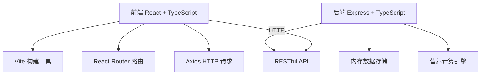
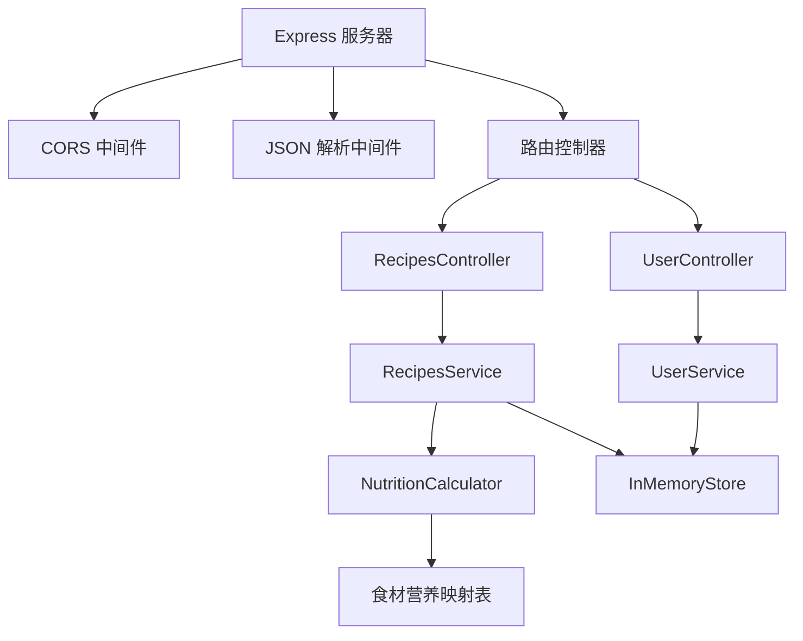
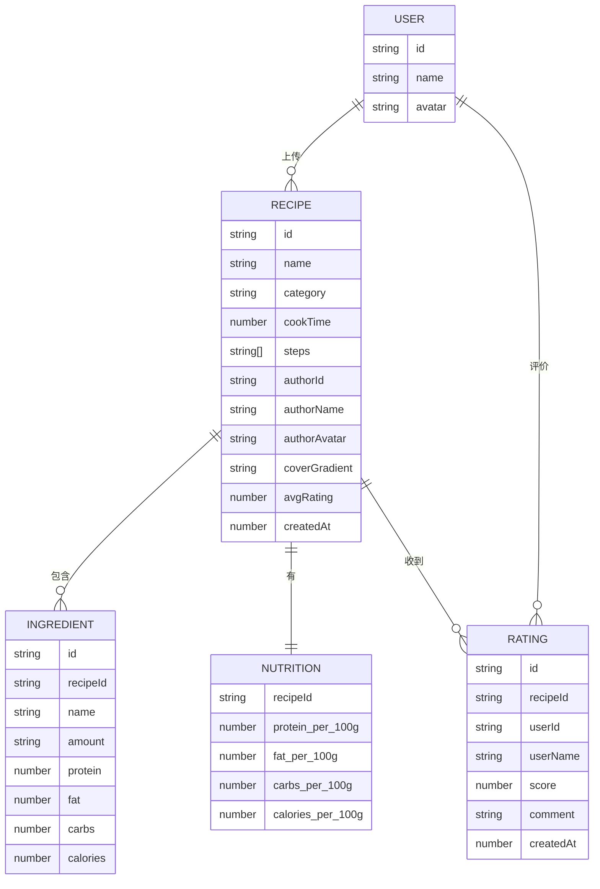

## 1. 架构设计



## 2. 技术描述

- **前端**：React@18 + TypeScript@5 + Vite@5
- **路由**：react-router-dom@6
- **HTTP客户端**：axios@1
- **后端**：Express@4 + TypeScript@5
- **唯一ID**：uuid@9
- **跨域**：cors@2
- **数据存储**：内存存储（Map对象）
- **初始化工具**：手动配置项目结构

## 3. 路由定义

| 路由 | 页面 | 目的 |
|------|------|------|
| / | Home | 首页，瀑布流展示菜谱，搜索过滤 |
| /upload | Upload | 上传菜谱表单页 |
| /recipe/:id | Detail | 菜谱详情页，营养分析和评价 |
| /login | Login | 用户登录页 |

## 4. API 定义

### TypeScript 类型定义

```typescript
interface Ingredient {
  name: string;
  amount: string;
  protein: number;
  fat: number;
  carbs: number;
  calories: number;
}

interface NutritionPer100g {
  protein: number;
  fat: number;
  carbs: number;
  calories: number;
}

interface Recipe {
  id: string;
  name: string;
  category: '中餐' | '西餐' | '甜品' | '其他';
  cookTime: number;
  steps: string[];
  ingredients: Ingredient[];
  nutritionPer100g: NutritionPer100g;
  author: string;
  authorAvatar: string;
  coverGradient: string;
  ratings: { userId: string; score: number; comment: string; userName: string }[];
  avgRating: number;
  createdAt: number;
}

interface User {
  id: string;
  name: string;
  avatar: string;
}
```

### API 接口

| 方法 | 路径 | 描述 | 请求体 | 响应 |
|------|------|------|--------|------|
| GET | /api/recipes | 获取菜谱列表（支持搜索和分类过滤） | query: search, category | Recipe[] |
| GET | /api/recipes/:id | 获取菜谱详情 | - | Recipe |
| POST | /api/recipes | 上传菜谱 | { name, category, cookTime, steps, ingredients: {name, amount}[] } | Recipe |
| POST | /api/recipes/:id/rate | 评价菜谱 | { userId, userName, score, comment } | Recipe |
| POST | /api/login | 登录 | { name } | User |

## 5. 服务器架构图



## 6. 数据模型

### 6.1 数据模型定义



### 6.2 食材营养映射表（内存）

```typescript
const nutritionMap: Record<string, { protein: number; fat: number; carbs: number; calories: number }> = {
  '鸡胸肉': { protein: 20, fat: 2.5, carbs: 0, calories: 110 },
  '牛肉': { protein: 26, fat: 15, carbs: 0, calories: 250 },
  '鸡蛋': { protein: 13, fat: 11, carbs: 1.1, calories: 155 },
  '米饭': { protein: 2.7, fat: 0.3, carbs: 28, calories: 130 },
  '面条': { protein: 5, fat: 1, carbs: 25, calories: 130 },
  '西红柿': { protein: 0.9, fat: 0.2, carbs: 4, calories: 20 },
  '西兰花': { protein: 2.8, fat: 0.4, carbs: 7, calories: 34 },
  '胡萝卜': { protein: 0.9, fat: 0.2, carbs: 10, calories: 41 },
  '洋葱': { protein: 1.1, fat: 0.1, carbs: 9, calories: 40 },
  '大蒜': { protein: 6.4, fat: 0.5, carbs: 33, calories: 149 },
  '橄榄油': { protein: 0, fat: 100, carbs: 0, calories: 900 },
  '盐': { protein: 0, fat: 0, carbs: 0, calories: 0 },
  '糖': { protein: 0, fat: 0, carbs: 100, calories: 400 },
  '酱油': { protein: 8, fat: 0.3, carbs: 10, calories: 75 },
  '醋': { protein: 0, fat: 0, carbs: 3, calories: 12 },
  '面粉': { protein: 10, fat: 1.2, carbs: 76, calories: 364 },
  '牛奶': { protein: 3.4, fat: 3.2, carbs: 5, calories: 60 },
  '黄油': { protein: 0.9, fat: 81, carbs: 0.1, calories: 717 },
  '巧克力': { protein: 7.6, fat: 43, carbs: 54, calories: 627 },
  '草莓': { protein: 0.8, fat: 0.4, carbs: 8, calories: 32 },
  '苹果': { protein: 0.3, fat: 0.2, carbs: 14, calories: 52 },
  '香蕉': { protein: 1.1, fat: 0.3, carbs: 23, calories: 89 },
};
```

## 7. 性能优化

- **搜索防抖**：300ms防抖，避免频繁请求
- **结果过滤**：前端过滤，100ms内更新
- **首次加载**：预加载mock数据，交互响应<200ms
- **CSS动画**：使用transform和opacity，GPU加速
- **组件优化**：React.memo避免不必要重渲染
- **请求优化**：axios实例复用，缓存静态数据
