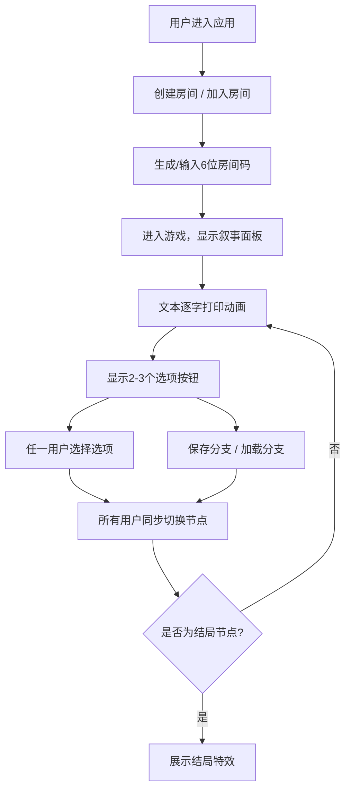

## 1. 产品概述

多人在线文字冒险叙事协作平台，解决传统文字冒险游戏单人游玩、缺乏实时协作与分支叙事结构可保存性的问题。玩家可创建或加入房间，共同体验分支剧情，保存和加载叙事分支路径。

- 核心目标：提供沉浸式多人协作文字冒险体验，支持实时同步叙事进度和分支选择
- 目标用户：喜欢文字冒险、叙事游戏的玩家，以及希望进行协作式故事创作的用户群体
- 市场价值：填补多人实时协作文字冒险游戏的空白，提供社交化叙事体验

## 2. 核心特性

### 2.1 用户角色

| 角色 | 注册方式 | 核心权限 |
|------|----------|----------|
| 玩家 | 无需注册，进入即玩 | 创建房间、加入房间、选择剧情选项、保存/加载分支 |

### 2.2 功能模块

1. **房间系统**：创建房间生成房间码、输入房间码加入房间、在线人数实时显示
2. **叙事面板**：逐字打字动画、剧情文本展示、选项按钮渲染、节点切换动画
3. **剧情引擎**：节点图数据结构、分支逻辑、多结局系统
4. **分支管理**：保存当前分支路径、从历史记录加载分支、时间回溯动画
5. **实时同步**：模拟WebSocket多人同步、所有用户界面同步更新

### 2.3 页面详情

| 页面名称 | 模块名称 | 功能描述 |
|----------|----------|----------|
| 首页/游戏页 | 导航栏 | 显示游戏名称（霓虹效果）、在线人数、房间码 |
| 首页/游戏页 | 房间入口 | 创建房间按钮、输入房间码加入功能 |
| 首页/游戏页 | 叙事面板 | 剧情文本逐字打印、2-3个选项按钮、结局特效展示 |
| 首页/游戏页 | 分支控制 | 保存分支按钮（软盘图标）、加载分支按钮 |
| 首页/游戏页 | 加载分支弹窗 | 显示已保存的分支记录列表、选择后恢复 |

## 3. 核心流程

用户进入应用后，可选择创建新房间或输入房间码加入已有房间。创建房间后生成6位房间码，其他用户可通过该房间码加入。游戏开始后，叙事面板显示开场文本（逐字打印效果），打印完毕显示选项按钮。任一用户点击选项后，所有用户界面同步切换到新节点（淡入动画）。用户可随时保存当前分支路径到内存，或从已保存记录中加载分支（缩放回溯动画）。当到达结局节点时，展示对应结局特效（胜利金色粒子/失败暗色消散）。

## 4. 用户界面设计

### 4.1 设计风格

- **主色调**：深蓝黑背景 #0D0D2B，叙事面板 #1A1A2E，导航栏 #16213E
- **辅助色**：文字 #E0E0FF，强调色 #6C63FF，按钮渐变 #6C63FF → #8B5CF6
- **文字渐变**：游戏名称霓虹效果 #9D4EDD → #FF6B6B
- **按钮样式**：圆角矩形渐变按钮，悬停上浮4px并加深渐变，点击回弹（scale 0.95→1.0，0.2s）
- **字体**：使用现代感无衬线字体，搭配霓虹发光效果
- **布局**：顶部固定导航栏，中央叙事面板（80%宽，最大900px），毛玻璃半透明效果
- **动画**：打字效果80ms/字，淡入0.4s，人数跳动0.3s，回溯缩放0.3s

### 4.2 页面设计概览

| 页面名称 | 模块名称 | UI元素 |
|----------|----------|----------|
| 游戏主页面 | 导航栏 | 固定顶部、毛玻璃模糊6px、左侧霓虹文字游戏名、右侧在线人数+房间码 |
| 游戏主页面 | 叙事面板 | 毛玻璃模糊8px、半透明背景、文本逐字打印、选项按钮底部排列 |
| 游戏主页面 | 分支按钮 | 右下角软盘图标保存按钮、左侧加载按钮、保存后绿色对勾1.5s |
| 游戏主页面 | 结局特效 | 胜利金色粒子爆发、失败暗色渐变消散 |

### 4.3 响应式

桌面端优先设计：
- 面板宽度80%，最大900px，打字速度80ms/字
- 手机端（<768px）：面板宽度95%，打字速度100ms/字，选项按钮全宽排列

### 4.4 视觉特效

- **毛玻璃效果**：backdrop-filter: blur(6-8px)
- **霓虹发光**：text-shadow 多层发光模拟霓虹效果
- **粒子系统**：结局时Canvas粒子动画
- **微交互**：按钮悬停上浮、点击回弹、数字跳动动画
