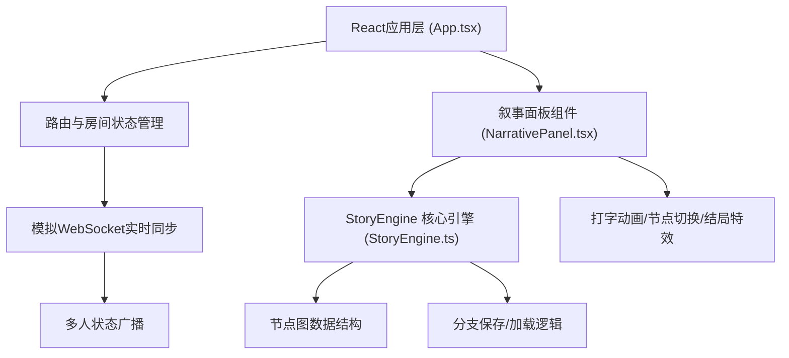

## 1. 架构设计



## 2. 技术说明

- **前端框架**：React@18 + TypeScript + Vite@5
- **路由**：react-router-dom@6
- **状态管理**：React useState/useEffect + useContext（轻量级场景，无需额外状态库）
- **工具库**：uuid（生成唯一标识）
- **样式方案**：原生CSS + CSS Modules，使用CSS变量管理主题色
- **动画**：原生CSS Animations/Transitions + requestAnimationFrame（打字/粒子效果）
- **实时同步**：基于 Browser 的 BroadcastChannel + localStorage 事件模拟 WebSocket 多标签/多用户同步

## 3. 路由定义

| 路由 | 用途 |
|------|------|
| / | 首页/游戏主页面，包含房间入口与叙事面板 |

本应用为单页应用，所有功能在同一页面内完成，通过组件状态切换房间入口与游戏界面。

## 4. 数据模型

### 4.1 叙事节点数据结构

```typescript
interface NarrativeChoice {
  id: string;
  text: string;
  nextNodeId: string;
}

interface NarrativeNode {
  id: string;
  text: string;
  choices: NarrativeChoice[];
  isEnding?: boolean;
  endingType?: 'victory' | 'defeat' | 'neutral';
}
```

### 4.2 房间状态数据结构

```typescript
interface BranchHistory {
  id: string;
  timestamp: number;
  nodeId: string;
  choices: { nodeId: string; choiceId: string }[];
}

interface RoomState {
  roomCode: string;
  currentNodeId: string;
  choiceHistory: { nodeId: string; choiceId: string }[];
  onlineUsers: number;
  savedBranches: BranchHistory[];
}
```

### 4.3 剧情节点图

预置10个节点形成有分支的树状剧情：
- 起始节点：1个（node-0）
- 分支节点：5个（node-1 ~ node-5）
- 结局节点：4个（victory × 2, defeat × 2）

## 5. 核心文件结构

```
src/
├── main.tsx          # React入口，渲染App组件
├── App.tsx           # 主应用，房间状态、同步逻辑、UI布局
├── NarrativePanel.tsx # 叙事面板，打字动画、选项按钮、特效
└── StoryEngine.ts    # 剧情引擎，节点图、分支管理
```

## 6. 性能指标

- 节点切换动画：60FPS
- JSON配置解析：<100ms
- 打字动画：requestAnimationFrame 驱动，80ms/字（桌面），100ms/字（移动端）
- 状态同步延迟：模拟 WebSocket，<100ms 广播延迟
