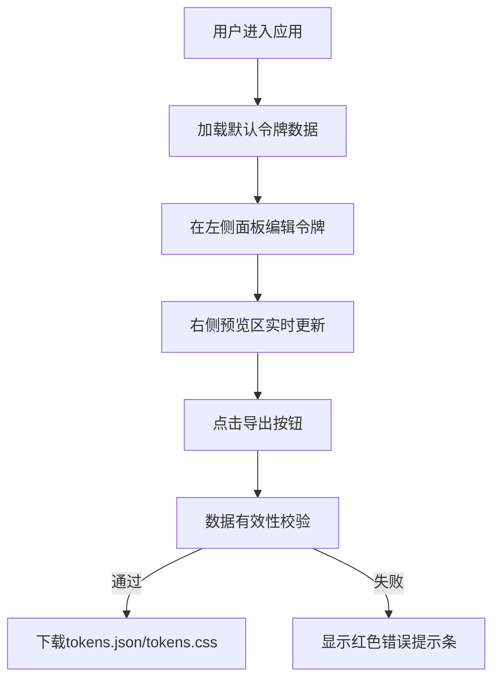

## 1. 产品概述

设计令牌（Design Tokens）可视化管理与代码导出工具，解决UI设计师与前端工程师协作中组件命名不一致和样式变量不统一的问题，提高设计稿到代码的还原效率。目标用户为UI设计师和前端开发人员。

通过可视化界面管理颜色、间距、字体等设计令牌，实时预览效果并一键导出为代码，实现设计系统的规范化和自动化。

## 2. 核心功能

### 2.1 用户角色
| 角色 | 注册方式 | 核心权限 |
|------|---------|---------|
| 普通用户 | 无需注册 | 创建、编辑、删除令牌，预览效果，导出代码 |

### 2.2 功能模块
1. **令牌管理面板**：分组展示令牌，支持新增、编辑、删除令牌
2. **组件预览区**：实时展示令牌在模拟UI组件上的效果
3. **代码导出功能**：导出为JSON或CSS变量格式

### 2.3 页面详情
| 页面名称 | 模块名称 | 功能描述 |
|---------|---------|----------|
| 主页面 | 令牌编辑面板 | 按分组展示颜色、间距、字体三类令牌，支持原位编辑、复制、删除操作 |
| 主页面 | 组件预览区 | 展示按钮、卡片、标题、输入框四个预设组件，实时响应令牌变化 |
| 主页面 | 导出操作区 | 提供导出JSON和导出CSS按钮，包含数据校验和错误提示 |

## 3. 核心流程

用户进入应用 → 查看默认示例令牌 → 在左侧面板编辑/新增/删除令牌 → 右侧预览区实时更新样式 → 点击导出按钮 → 系统校验数据有效性 → 校验通过下载文件 / 校验失败显示错误提示

## 4. 用户界面设计

### 4.1 设计风格
- 深色主题：背景色#1E1E2E，卡片背景#2A2A3E，主文字色#E0E0F0
- 左侧面板宽度360px，右侧自适应
- 圆角设计：分组卡片12px圆角，预览组件8px圆角
- 交互反馈：卡片悬停上浮4px，样式变化0.3秒过渡动画

### 4.2 页面设计概述
| 页面名称 | 模块名称 | UI元素 |
|---------|---------|---------|
| 主页面 | 令牌编辑面板 | 分组卡片（可折叠）、令牌条目（色块预览、滑块、下拉选择）、编辑面板（名称、值、分组输入）、复制/删除按钮、气泡提示 |
| 主页面 | 组件预览区 | 实心按钮、卡片容器、标题文本、边框输入框 |
| 主页面 | 导出操作区 | 导出JSON按钮、导出CSS按钮、底部错误提示条 |

### 4.3 响应式
- 桌面端：左右双栏布局
- 最小宽度900px，低于该宽度时左右面板堆叠为上下布局
- 令牌面板在上，预览面板在下

### 4.4 性能约束
- 令牌更新到预览重新渲染响应时间 ≤ 50ms
- 首次加载时间 ≤ 2秒
