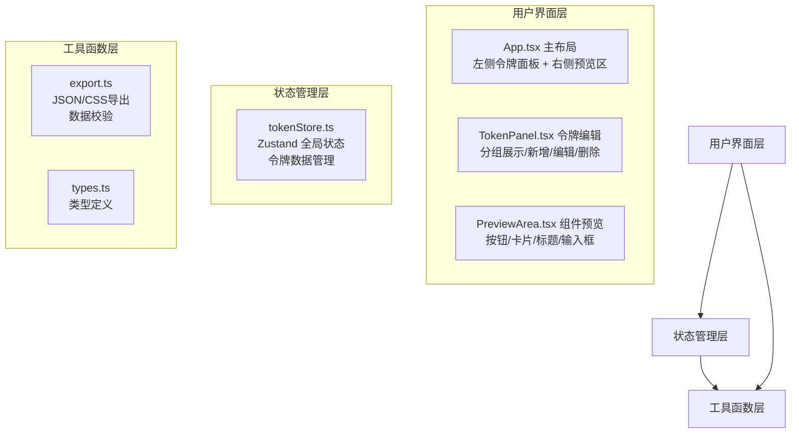
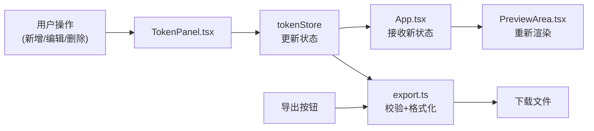
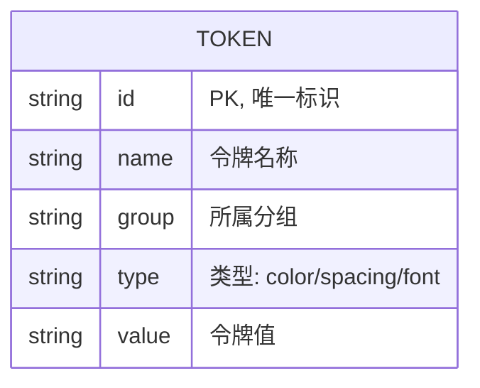

## 1. 架构设计



## 2. 技术描述

- 前端：React@18 + TypeScript@5 + Vite@5
- 状态管理：Zustand（轻量级状态管理）
- 构建工具：Vite + @vitejs/plugin-react
- 依赖库：uuid（唯一ID生成）、file-saver（文件下载）
- 无后端，数据存储在内存中

## 3. 目录结构

```
d:\Pro\tasks\auto122
├── package.json
├── vite.config.js
├── tsconfig.json
├── index.html
└── src/
    ├── main.tsx          # React应用入口
    ├── App.tsx         # 主布局组件
    ├── TokenPanel.tsx  # 左侧令牌编辑面板
    ├── PreviewArea.tsx # 右侧组件预览区
    ├── store/
    │   └── tokenStore.ts  # 令牌状态管理
    ├── types/
    │   └── index.ts     # TypeScript类型定义
    └── utils/
        └── export.ts    # 导出工具函数
```

## 4. 数据流向



## 5. 数据模型

### 5.1 数据模型定义



### 5.2 类型定义

```typescript
type TokenType = 'color' | 'spacing' | 'font';

interface Token {
  id: string;
  name: string;
  group: string;
  type: TokenType;
  value: string;
}

interface TokenStore {
  tokens: Token[];
  addToken: (token: Omit<Token, 'id'>) => void;
  updateToken: (id: string, updates: Partial<Token>) => void;
  deleteToken: (id: string) => void;
}
```

### 5.3 初始数据

- 6个颜色令牌（主色、次色、背景色、文字色、边框色、成功色
- 4个间距令牌（xs、sm、md、lg）
- 2个字体令牌（字体族、字号）
