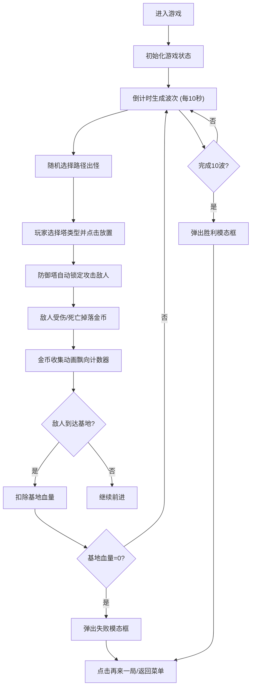

## 1. 产品概述

像素塔防是一款基于浏览器的轻量级像素风格塔防游戏，专为移动端触屏操作优化。玩家通过放置不同类型的防御塔阻止敌人到达基地，体验即时策略的乐趣。

- 核心目标：解决移动端触屏操作下即时策略游戏配置繁琐、体验不佳的问题
- 目标用户：喜欢休闲策略游戏的移动端用户
- 市场价值：提供零配置、即开即玩的高品质浏览器塔防游戏体验

## 2. 核心特性

### 2.1 功能模块

1. **游戏主界面**：Canvas 画布渲染、网格系统、路径系统
2. **防御塔系统**：三种塔类型（箭塔、炮塔、魔法塔）、放置动画、攻击逻辑
3. **敌人系统**：波次生成、路径寻路、血量显示、受伤动画
4. **经济系统**：金币掉落、金币收集动画、实时计数器
5. **UI 信息栏**：波次显示、击杀计数、金币统计、基地血量
6. **控制面板**：防御塔选择、建造操作、按钮动画
7. **结果系统**：胜利/失败判断、模态框弹窗、重开/返回操作

### 2.2 页面详情

| 页面名称 | 模块名称 | 功能描述 |
|-----------|-------------|---------------------|
| 游戏主界面 | 顶部信息栏 | 显示当前波次、击杀数、金币、基地血量 |
| 游戏主界面 | Canvas 游戏画布 | 800x600像素网格，渲染路径、防御塔、敌人、特效 |
| 游戏主界面 | 底部控制面板 | 三个建造按钮，选择防御塔类型，悬停/选中动画 |
| 模态弹窗 | 结果展示 | 胜利/失败文本，再来一局/返回主菜单按钮 |

## 3. 核心流程

玩家进入游戏后，系统自动开始波次倒计时。玩家通过底部按钮选择防御塔类型，点击画布网格放置防御塔。敌人沿随机路径移动，防御塔自动锁定并攻击射程内的敌人。击杀敌人获得金币，敌人到达基地扣除血量。完成10波后胜利，或基地血量为0时失败。

## 4. 用户界面设计

### 4.1 设计风格

- **主色调**：深色像素复古主题
  - 主背景色：`#1A1A2E`
  - 网格/面板底色：`#2D2D2D`
  - 顶部栏底色：`#16213E`
- **强调色**：
  - 箭塔按钮：`#4CAF50` (绿色)
  - 炮塔按钮：`#FF7043` (橙色)
  - 魔法塔按钮：`#7E57C2` (紫色)
  - 胜利文本：`#FFD700` (金色)
  - 失败文本：`#FF5252` (红色)
  - 路径颜色：`#FFE082` (浅金色)
- **按钮样式**：64x64方形按钮，圆角4px，悬停上移4px
- **字体**：系统等宽字体，大小16px（信息栏）、28px（结果文本）
- **布局风格**：顶部固定信息栏 + 中央Canvas画布 + 底部建造按钮面板
- **像素风格**：32x32像素网格，整体像素化视觉效果

### 4.2 页面设计概述

| 页面名称 | 模块名称 | UI元素 |
|-----------|-------------|-------------|
| 游戏主界面 | 顶部信息栏 (48px高) | 左：波次文本+击杀数，右：金币图标(金色)+基地血量图标(红色圆形) |
| 游戏主界面 | Canvas画布 (800x600) | 网格背景、三条敌人路径、蓝色城堡(基地)、防御塔(带攻击范围)、敌人(带血条)、攻击特效、光晕扩散、金币拖尾 |
| 游戏主界面 | 底部控制面板 | 三个方形塔按钮(箭/炮/魔法图标)，选中态白色2px边框，悬停上移+变色 |
| 模态弹窗 | 结果展示 | 半透明黑色背景(blur 15px)，居中卡片，结果文本，两个操作按钮(绿/灰)，悬停缩放1.05倍 |

### 4.3 响应式设计

- **设计原则**：Desktop-first，移动端自适应
- **画布缩放**：保持800x600宽高比，根据视口宽度等比缩放
- **按钮区域**：自适应容器宽度，按钮间距在移动端自动调整
- **触屏优化**：按钮最小触控区域64x64px，支持点击反馈动画
- **适配断点**：
  - 桌面端：画布800x600，按钮水平排列
  - 平板端：画布缩放至容器宽度，按钮保持尺寸
  - 移动端：画布缩放至屏幕宽度(留边距)，按钮水平排列自动适应

### 4.4 动画与交互

- **防御塔放置**：塔基座从网格中心0.2秒弹跳动画(0.5x→1.0x)，40px半径光晕扩散0.3秒
- **敌人受伤**：血条0.1秒闪烁动画
- **按钮点击**：0.1秒缩放脉冲动画
- **金币收集**：拖尾光效飘向屏幕右上角，持续0.8秒
- **按钮悬停**：上移4px + 颜色加深，缩放1.05倍(模态按钮)
- **波次生成**：敌人沿路径平滑移动，基础速度60px/秒
