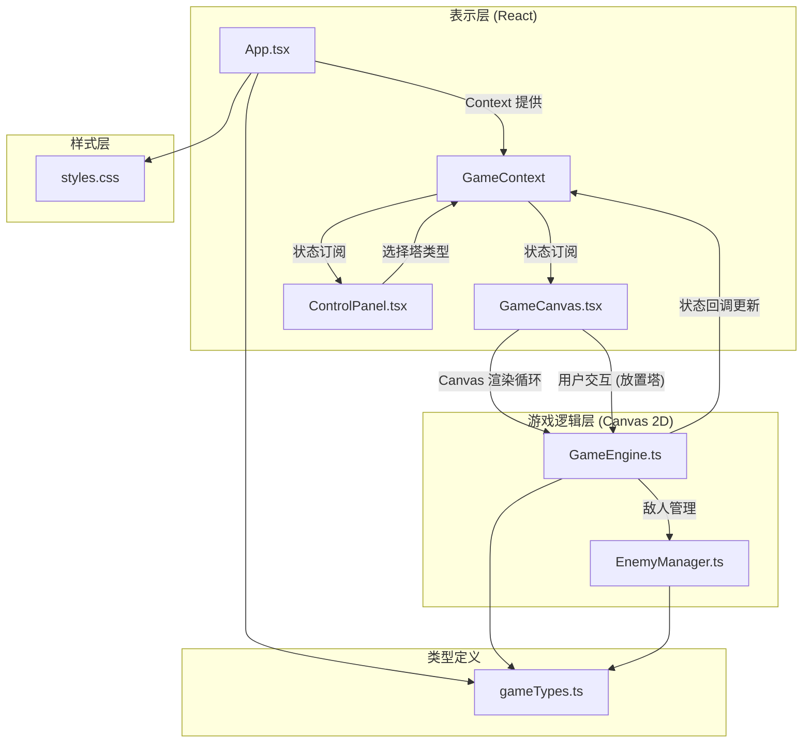

## 1. 架构设计



## 2. 技术描述

- **前端框架**：React@18 + TypeScript
- **构建工具**：Vite@5 (base: './')
- **渲染引擎**：Canvas 2D API (requestAnimationFrame 渲染循环)
- **状态管理**：React Context API (跨组件传递游戏状态)
- **样式方案**：原生 CSS (深色像素主题，CSS 动画)
- **运行目标**：ES2020，支持现代浏览器与移动端 WebView

## 3. 目录结构与文件职责

```
auto123/
├── package.json              # 项目依赖与脚本配置
├── vite.config.js            # Vite 构建配置 (base: './')
├── tsconfig.json             # TypeScript 严格模式配置
├── index.html                # 入口 HTML 页面 (标题：像素塔防)
└── src/
    ├── main.tsx              # React 应用入口，渲染 App 组件
    ├── App.tsx               # 顶层组件，状态管理 + Context 提供者
    ├── styles.css            # 全局样式：主题、响应式、动画
    ├── components/
    │   ├── GameCanvas.tsx    # Canvas 渲染：网格、路径、塔、敌人、特效
    │   └── ControlPanel.tsx  # 底部建造按钮面板
    ├── game/
    │   ├── GameEngine.ts     # 游戏核心引擎：攻击判定、血量、金币、波次
    │   └── EnemyManager.ts   # 敌人波次生成与属性管理
    └── types/
        └── gameTypes.ts      # 类型定义：Tower, Enemy, Path, GameState 等
```

## 4. 核心数据结构与类型定义

```typescript
// 塔类型
type TowerType = 'arrow' | 'cannon' | 'magic';

// 防御塔接口
interface Tower {
  id: string;
  type: TowerType;
  gridX: number;      // 网格坐标 X (0-24)
  gridY: number;      // 网格坐标 Y (0-18)
  x: number;          // 像素中心坐标
  y: number;
  range: number;      // 射程像素
  damage: number;
  fireRate: number;   // 每秒攻击次数
  lastFireTime: number;
  target: Enemy | null;
  placementTime: number;  // 用于放置动画
}

// 敌人接口
interface Enemy {
  id: string;
  x: number;
  y: number;
  hp: number;
  maxHp: number;
  speed: number;           // 像素/秒
  pathIndex: number;       // 当前路径索引
  waypointIndex: number;   // 当前路径点索引
  hitFlashTime: number;    // 受伤闪烁时间
  reward: number;          // 击杀金币
}

// 路径点
interface PathPoint {
  x: number;
  y: number;
}

// 攻击/收集特效
interface Effect {
  id: string;
  type: 'halo' | 'coin' | 'damage';
  x: number;
  y: number;
  startTime: number;
  duration: number;
  targetX?: number;  // 用于金币飘向目标
  targetY?: number;
}

// 游戏状态
interface GameState {
  wave: number;            // 当前波次
  kills: number;           // 击杀数
  coins: number;           // 金币
  baseHp: number;          // 基地血量
  selectedTower: TowerType | null;  // 当前选中的塔类型
  gameStatus: 'playing' | 'victory' | 'defeat' | 'menu';
}

// 塔配置表
const TOWER_CONFIG: Record<TowerType, {
  range: number;
  damage: number;
  fireRate: number;
  color: string;
  cost: number;
}> = {
  arrow:  { range: 120, damage: 10, fireRate: 2, color: '#4CAF50', cost: 50 },
  cannon: { range: 90,  damage: 30, fireRate: 1, color: '#FF7043', cost: 80 },
  magic:  { range: 150, damage: 15, fireRate: 1.5, color: '#7E57C2', cost: 100 },
};
```

## 5. 核心算法与流程

### 5.1 Canvas 渲染循环

```
requestAnimationFrame → deltaTime 计算
  → 更新所有敌人位置 (按路径移动)
  → 更新所有防御塔 (锁定目标、冷却判定、发射攻击)
  → 处理受伤/死亡/金币掉落
  → 绘制：网格 → 路径 → 塔(含放置动画) → 敌人(含血条闪烁) → 特效(光晕/金币拖尾) → 基地城堡
```

### 5.2 路径规划

预设3条波次路径（从画布左侧到右侧中央基地），每条路径由一系列 PathPoint 组成。每波开始时随机选择一条。敌人沿路径点顺序移动，到达终点扣基地血。

### 5.3 攻击判定

对每个塔，遍历敌人列表，计算与塔中心的欧几里得距离 ≤ 塔射程，则锁定目标。按 `fireRate` 频率造成伤害，记录 `lastFireTime`。

### 5.4 性能优化

- **对象池化**：敌人/特效对象复用，减少 GC
- **空间裁剪**：Canvas 只渲染可见区域
- **渲染优化**：减少状态切换，同类元素批量绘制
- **FPS 目标**：稳定 30FPS+，单帧 ≤ 33ms

## 6. 状态更新流程

```
GameEngine 逻辑层 (每帧)
  → 调用传入的 React 回调 setGameState 子集更新
  → React Context 触发订阅组件重渲染
  → GameCanvas 每帧通过 ref 读取最新状态 (避免重渲染影响 Canvas 循环)
  → ControlPanel 通过 Context 响应 selectedTower 切换
```

## 7. 响应式实现

CSS 使用 CSS 变量控制画布缩放：
```css
--canvas-scale: min(1, calc(100vw / 820));
canvas {
  width: calc(800px * var(--canvas-scale));
  height: calc(600px * var(--canvas-scale));
}
```
触屏点击通过 Canvas 的 getBoundingClientRect + 比例换算映射到 800x600 坐标系。
