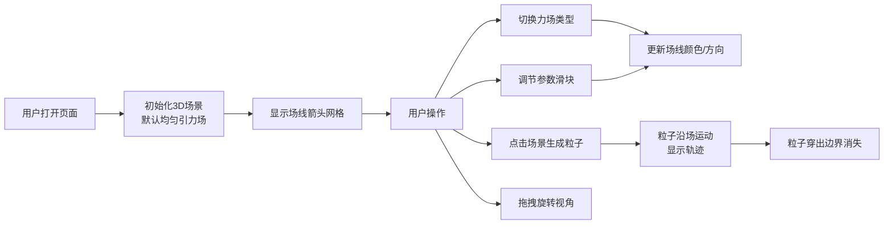

## 1. 产品概述

三维空间力场交互式可视化工具，帮助用户直观理解力场在三维空间中的分布与动态变化。解决传统物理模拟中难以实时观察力场方向、强度随时间演变的问题，面向物理教学、科学可视化和工程分析场景。

## 2. 核心功能

### 2.1 功能模块

1. **3D 力场场景**：三维空间场线箭头网格、粒子运动模拟、视角控制
2. **控制面板**：场类型切换、参数调节滑块、重置视角、FPS 显示、面板折叠
3. **粒子交互**：点击生成粒子、粒子沿场运动、轨迹拖尾效果

### 2.2 功能详情

| 模块 | 功能点 | 功能描述 |
|------|--------|----------|
| 3D 场景 | 场线箭头网格 | 在 -10~10 立方体空间内，间隔 2 单位均匀分布锥体箭头，带半透明尾迹 |
| 3D 场景 | Billboard 效果 | 箭头始终面向摄像机，任意角度都能看清方向 |
| 3D 场景 | 颜色渐变 | 箭头颜色从蓝 #0066CC 到红 #FF3300 表示场强从低到高 |
| 3D 场景 | 平滑动画 | 箭头大小 0.3 秒平滑缩放，朝向实时更新 |
| 力场类型 | 均匀引力场 | 向下均匀力场，可调节强度参数 |
| 力场类型 | 涡旋旋转场 | 绕 Y 轴旋转的涡旋场，可调节旋转速度 |
| 粒子系统 | 点击生成 | 点击场景生成白色发光粒子，最多同时 5 个 |
| 粒子系统 | 沿场运动 | 粒子以每秒 2 单位速度沿场向量方向运动 |
| 粒子系统 | 轨迹拖尾 | 粒子拖出淡化轨迹线，持续 0.8 秒，颜色与场强一致 |
| 控制面板 | 场类型选择 | 下拉框切换力场类型 |
| 控制面板 | 参数滑块 | 带数值标签的滑块，实时调节参数 |
| 控制面板 | 重置视角 | 一键恢复默认摄像机视角 |
| 控制面板 | FPS 显示 | 面板底部实时显示帧率 |
| 控制面板 | 折叠功能 | 点击箭头收起/展开面板 |

## 3. 核心流程

用户打开页面 → 看到默认均匀引力场的 3D 场景 → 通过左侧面板切换力场类型或调节参数 → 场景中箭头颜色/大小实时变化 → 点击场景生成粒子 → 粒子沿场线运动并拖出轨迹 → 旋转视角观察力场分布

## 4. 用户界面设计

### 4.1 设计风格

- **主色调**：纯黑背景 #000，深灰面板 #2D2D2D（透明度 0.85）
- **强调色**：青蓝色 #00B4D8，悬停亮青色 #00E5FF
- **场强渐变**：蓝色 #0066CC → 红色 #FF3300
- **文字颜色**：#CCC（次要）、#FFF（主要）
- **按钮风格**：圆角矩形 8px，悬停上浮动 2px
- **整体风格**：暗色科技风，简洁专业，沉浸式 3D 体验

### 4.2 页面设计概览

| 区域 | 模块 | UI 元素 |
|------|------|---------|
| 主场景 | 3D 力场 | 黑色背景+星点装饰、网格箭头、粒子与轨迹 |
| 左侧面板 | 控制面板 | 深灰半透明卡片、下拉框、滑块组、按钮、FPS |
| 交互层 | 鼠标交互 | 拖拽旋转视角、点击生成粒子 |

### 4.3 响应式设计

- **桌面端**（≥768px）：控制面板固定左侧，宽度 280px
- **移动端**（<768px）：控制面板移至底部，高度自适应
- 触摸设备支持手势旋转视角

### 4.4 3D 场景设计

- **环境**：纯黑背景 + 随机星点装饰（白点 1-2px，透明度 0.3-0.7）
- **光照**：环境光 + 方向光，保证箭头立体感
- **摄像机**：透视相机，初始位置可观察整个力场立方体
- **交互**：OrbitControls 拖拽旋转，滚轮缩放
- **动画**：所有过渡动画 0.3-0.5 秒，保证视觉统一流畅
- **性能目标**：主流笔记本 Chrome 上 30FPS 以上，5 个粒子时稳定运行
