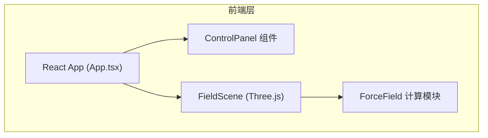

## 1. 架构设计



## 2. 技术选型

- **前端框架**：React 18 + TypeScript
- **构建工具**：Vite
- **3D 引擎**：Three.js（直接使用，非 R3F）
- **状态管理**：React useState/useRef（轻量级，无需 zustand）
- **样式方案**：纯 CSS + CSS Modules（组件内联样式为主）
- **UI 交互**：原生 DOM 事件 + Three.js Raycaster

## 3. 文件结构

```
src/
├── main.tsx          # React 入口
├── App.tsx           # 根组件，组合场景与面板
├── FieldScene.ts     # Three.js 场景核心逻辑
├── ForceField.ts     # 力场计算函数（纯逻辑，无UI）
├── ControlPanel.tsx  # 控制面板 React 组件
└── index.css         # 全局样式
```

## 4. 核心模块说明

### 4.1 ForceField.ts
- 纯函数模块，无 UI 依赖
- 导出 `getVector(point: Vector3, fieldType, params): Vector3`
- 支持两种力场：`gravity`（均匀引力场）、`vortex`（涡旋旋转场）
- 同时返回向量大小用于颜色映射

### 4.2 FieldScene.ts
- Three.js 场景管理类
- 负责初始化：场景、相机、渲染器、灯光、网格辅助线
- 动态生成 11×11×11 网格点的箭头（约 1331 个）
- 管理粒子系统（最多 5 个）
- 导出 `startAnimation()` 和 `updateField(type, params)` 方法
- 处理射线检测与点击交互
- Billboard 效果：每帧更新箭头朝向相机

### 4.3 ControlPanel.tsx
- React 函数组件
- 场类型下拉选择
- 参数滑块（带数值标签）
- 重置视角按钮
- FPS 显示
- 折叠/展开功能
- 通过 props 回调与 App 通信

### 4.4 App.tsx
- 根组件
- useRef 管理 canvas 引用
- 组合 FieldScene 和 ControlPanel
- 维护力场参数状态
- 处理窗口大小变化

## 5. 性能优化策略

- **箭头复用**：使用 InstancedMesh 批量渲染箭头，减少 draw call
- **Billboard 优化**：每帧统一更新所有箭头旋转矩阵
- **粒子池**：对象池复用粒子，避免频繁创建销毁
- **轨迹优化**：使用 BufferGeometry + LineSegments，定点数控制
- **帧率监控**：实时 FPS 计算，便于性能调优

## 6. 构建配置

- Vite 配置路径别名 `@` 指向 `src`
- TypeScript 严格模式，target ES2020
- 开发脚本：`npm run dev`
