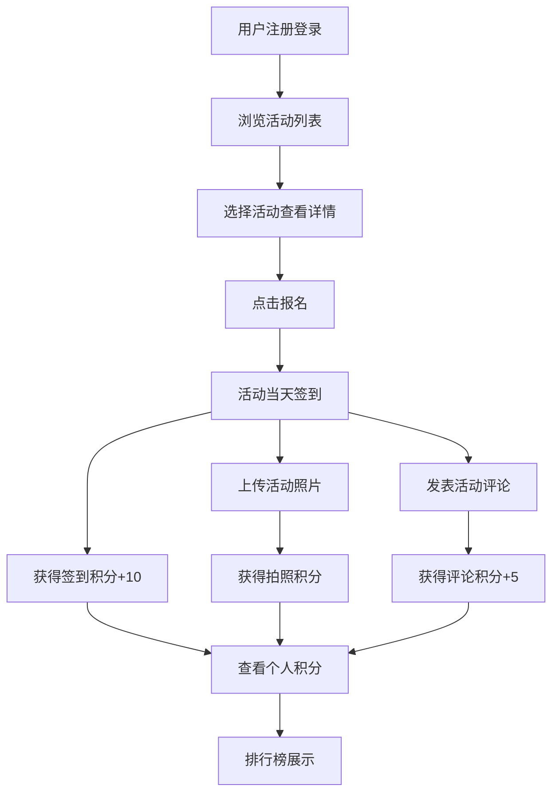

## 1. 产品概述
社区活动管理与参与激励应用，旨在通过积分奖励机制促进社区居民参与各类活动，提升社区活跃度和凝聚力。
- 主要面向社区管理员和居民，解决活动组织难、居民参与度低的问题
- 通过签到、评论、上传照片等行为获得积分，排行榜展示激励居民持续参与

## 2. 核心功能

### 2.1 用户角色

| 角色 | 注册方式 | 核心权限 |
|------|----------|----------|
| 社区管理员 | 昵称 + 头像URL注册 | 发布活动、设置积分奖励、查看所有活动数据 |
| 社区居民 | 昵称 + 头像URL注册 | 浏览活动、报名活动、签到、上传照片、发表评论、查看排行榜 |

### 2.2 功能模块
1. **首页**：即将开始的活动卡片列表、排行榜前3名用户展示、发布活动入口
2. **活动列表页**：按状态筛选活动、网格布局展示活动卡片、报名功能
3. **活动详情页**：活动照片轮播、活动描述、报名用户列表、签到功能、评论区域
4. **排行榜页**：积分前10名展示、完整用户排名列表、活动参与次数统计

### 2.3 页面详情

| 页面名称 | 模块名称 | 功能描述 |
|----------|----------|----------|
| 首页 | 活动卡片列表 | 展示即将开始的活动，卡片悬停上浮动画 |
| 首页 | 排行榜前三名 | 显示积分最高的3位用户，带有金/银/铜奖牌图标 |
| 首页 | 发布活动按钮 | 管理员点击弹出表单面板，提交后创建新活动 |
| 活动列表页 | 筛选栏 | 按活动状态分类：全部、进行中、已结束 |
| 活动列表页 | 活动网格 | 响应式网格布局，每张卡片显示活动信息和报名按钮 |
| 活动详情页 | 照片轮播 | 顶部大图轮播展示活动照片 |
| 活动详情页 | 报名用户列表 | 头像圆圈排列展示已报名用户 |
| 活动详情页 | 签到功能 | 点击签到获得积分，弹出成功提示动画 |
| 活动详情页 | 评论区域 | 文本输入、提交评论、点赞功能、淡入动画 |
| 排行榜页 | 前十名展示 | 排名数字弹跳动画，显示头像、昵称、积分、参与次数 |
| 排行榜页 | 完整排名列表 | 可滚动列表，表头固定，行悬停背景变化 |

## 3. 核心流程

用户注册登录 → 浏览活动列表 → 选择感兴趣的活动 → 点击报名 → 活动当天签到（获得积分）→ 上传活动照片/发表评论（获得积分）→ 查看个人积分和排行榜

## 4. 用户界面设计

### 4.1 设计风格
- 主色调：深蓝渐变 #1E3A8A 到 #3B82F6
- 辅助色：白色背景、浅蓝 #E0F2FE 悬停色、绿色成功提示
- 按钮风格：圆角12px，悬停上浮2px，点击缩小0.95倍
- 卡片风格：白色背景，阴影 rgba(0,0,0,0.08)，圆角12px
- 字体：标题使用粗体无衬线字体，正文使用清晰易读的无衬线字体
- 图标：使用 lucide-react 图标库，活动使用 Calendar，排行榜使用 Trophy

### 4.2 页面设计概述

| 页面名称 | 模块名称 | UI元素 |
|----------|----------|--------|
| 首页 | 活动卡片 | 封面图、标题、时间、地点、名额、悬停上浮8px动画 |
| 首页 | 排行榜前三名 | 奖牌图标（金/银/铜色）、头像、昵称、积分 |
| 活动列表页 | 筛选栏 | 三个状态标签，选中状态高亮蓝色 |
| 活动列表页 | 活动网格 | 每行最多4列，响应式适配，卡片间距统一 |
| 活动详情页 | 轮播图 | 大图展示，左右切换按钮，指示器 |
| 活动详情页 | 签到按钮 | 蓝色渐变背景，签到后灰色不可点击 |
| 活动详情页 | 评论输入框 | focus动画，边框从灰变蓝，0.2秒过渡 |
| 排行榜页 | 前十名卡片 | 排名数字弹跳动画（0.5倍→1倍，0.4秒） |
| 排行榜页 | 排名列表 | 表头固定，行悬停背景 #E0F2FE |

### 4.3 响应式
- 桌面端（>768px）：活动列表每行4列
- 平板端（480px-768px）：活动列表每行2列
- 移动端（<480px）：活动列表每行1列
- 顶栏和侧边栏在移动端自适应折叠

### 4.4 动效设计
- 页面切换：≤200ms 平滑过渡
- 卡片悬停：上浮8px，阴影加深，0.2秒过渡
- 按钮交互：悬停上浮2px，点击缩小0.95倍
- 签到成功：绿色文字从底部上浮，1.5秒后消失
- 评论提交：淡入动画，0.3秒透明度从0到1
- 排行榜数字：弹跳动画，0.4秒从0.5倍到1倍
- 弹窗面板：缩放淡入动画，0.3秒
