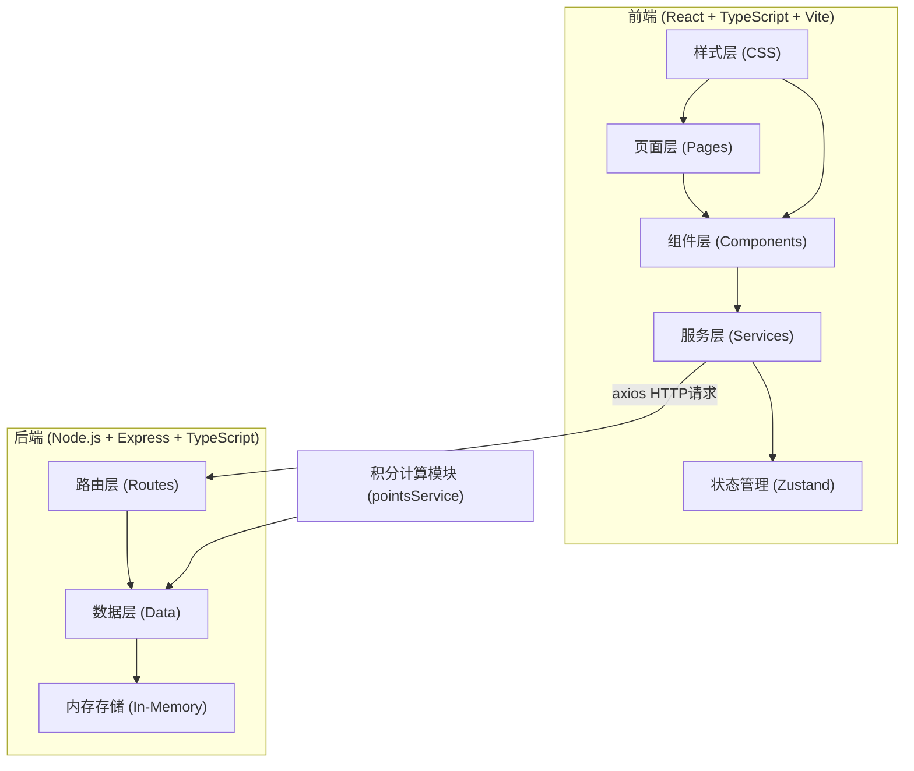
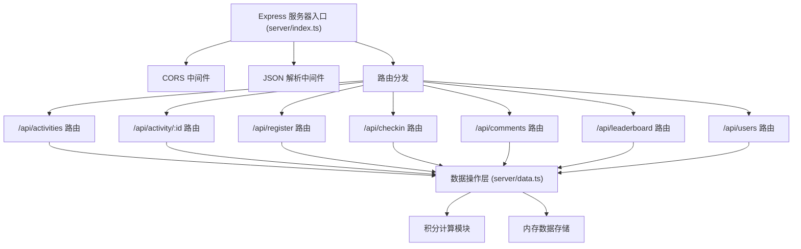
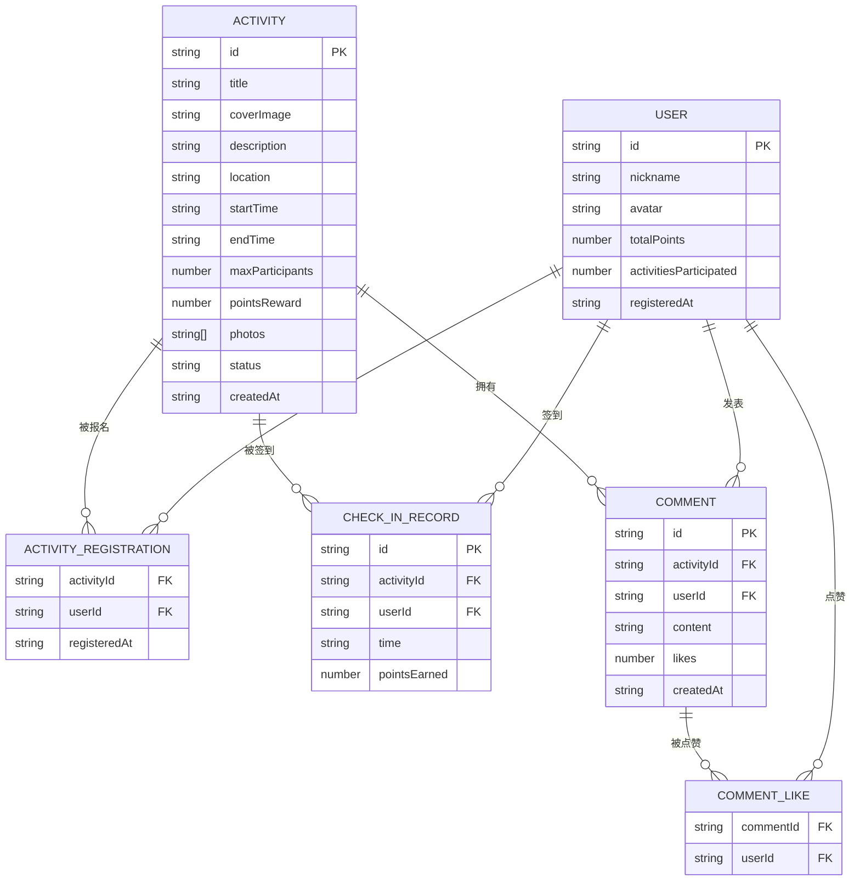

## 1. 架构设计



## 2. 技术描述

- **前端框架**: React@18 + TypeScript + Vite@5
- **路由管理**: react-router-dom@6
- **HTTP客户端**: axios@1
- **状态管理**: zustand@4
- **图标库**: lucide-react@latest
- **日期处理**: date-fns@3
- **唯一ID**: uuid@9
- **后端框架**: Express@4 + TypeScript
- **跨域处理**: cors@2
- **内存存储**: 内存对象存储（无需数据库）
- **构建工具**: Vite（前端） + ts-node（后端开发）
- **代码规范**: TypeScript 严格模式

## 3. 路由定义

| 路由路径 | 页面组件 | 功能描述 |
|----------|----------|----------|
| `/` | HomePage | 首页，展示即将开始的活动和排行榜前三名 |
| `/activities` | ActivityListPage | 活动列表页，支持按状态筛选 |
| `/activity/:id` | ActivityDetailPage | 活动详情页，包含签到和评论功能 |
| `/leaderboard` | LeaderboardPage | 排行榜页，展示用户积分排名 |

## 4. API 定义

### 4.1 类型定义

```typescript
// 活动类型
interface Activity {
  id: string;
  title: string;
  coverImage: string;
  description: string;
  location: string;
  startTime: string;
  endTime: string;
  maxParticipants: number;
  registeredUsers: string[];
  checkedInUsers: { userId: string; time: string }[];
  pointsReward: number;
  photos: string[];
  status: 'upcoming' | 'ongoing' | 'ended';
  createdAt: string;
}

// 用户类型
interface User {
  id: string;
  nickname: string;
  avatar: string;
  totalPoints: number;
  activitiesParticipated: number;
  registeredAt: string;
}

// 评论类型
interface Comment {
  id: string;
  activityId: string;
  userId: string;
  content: string;
  likes: number;
  likedBy: string[];
  createdAt: string;
}

// 签到记录
interface CheckInRecord {
  id: string;
  activityId: string;
  userId: string;
  time: string;
  pointsEarned: number;
}
```

### 4.2 接口定义

| 方法 | 路径 | 请求参数 | 响应格式 | 功能描述 |
|------|------|----------|----------|----------|
| GET | `/api/activities` | `status?: string` | `Activity[]` | 获取活动列表，支持按状态筛选 |
| GET | `/api/activity/:id` | - | `Activity` | 获取单个活动详情 |
| POST | `/api/activities` | `ActivityFormData` | `Activity` | 创建新活动 |
| POST | `/api/register` | `{ activityId: string; userId: string }` | `{ success: boolean; message: string }` | 用户报名活动 |
| POST | `/api/checkin` | `{ activityId: string; userId: string }` | `{ success: boolean; points: number }` | 用户签到，返回获得积分 |
| POST | `/api/comments` | `{ activityId: string; userId: string; content: string }` | `Comment` | 发表评论 |
| PUT | `/api/comments/:id/like` | `{ userId: string }` | `{ likes: number }` | 点赞/取消点赞 |
| GET | `/api/comments` | `{ activityId: string; page: number; pageSize: number }` | `{ comments: Comment[]; total: number }` | 分页获取评论 |
| GET | `/api/leaderboard` | `{ limit?: number }` | `User[]` | 获取排行榜用户 |
| POST | `/api/users` | `{ nickname: string; avatar: string }` | `User` | 用户注册 |
| GET | `/api/users/:id` | - | `User` | 获取用户信息 |

## 5. 服务器架构图



## 6. 数据模型

### 6.1 数据模型 ER 图



### 6.2 初始化数据

- **活动数据**: 10条演示活动数据，包含不同状态（即将开始、进行中、已结束）
- **用户数据**: 20条演示用户数据，包含不同积分和参与次数
- **评论数据**: 100条演示评论数据，分布在不同活动中

## 7. 项目结构

```
auto129/
├── .trae/documents/
│   ├── PRD.md
│   └── Technical-Architecture.md
├── src/
│   ├── components/
│   │   ├── ActivityCard.tsx
│   │   ├── CommentItem.tsx
│   │   └── TopBar.tsx
│   ├── pages/
│   │   ├── HomePage.tsx
│   │   ├── ActivityListPage.tsx
│   │   ├── ActivityDetailPage.tsx
│   │   └── LeaderboardPage.tsx
│   ├── services/
│   │   ├── apiService.ts
│   │   └── pointsService.ts
│   ├── store/
│   │   └── useStore.ts
│   ├── types/
│   │   └── index.ts
│   ├── App.tsx
│   ├── main.tsx
│   └── index.css
├── server/
│   ├── index.ts
│   └── data.ts
├── index.html
├── vite.config.js
├── tsconfig.json
└── package.json
```

## 8. 性能优化

1. **路由切换优化**: 使用 React Router 6 的 `<Link>` 组件，预加载页面组件，确保切换时间 ≤ 200ms
2. **活动列表虚拟滚动**: 当活动数量超过20个时，使用虚拟滚动或分页加载
3. **评论分页加载**: 评论列表每页加载10条，滚动到底部自动加载下一页
4. **图片懒加载**: 活动封面图使用懒加载，减少首屏加载时间
5. **状态管理优化**: 使用 Zustand 轻量级状态管理，避免不必要的重渲染
6. **防抖节流**: 搜索、筛选等操作使用防抖处理
