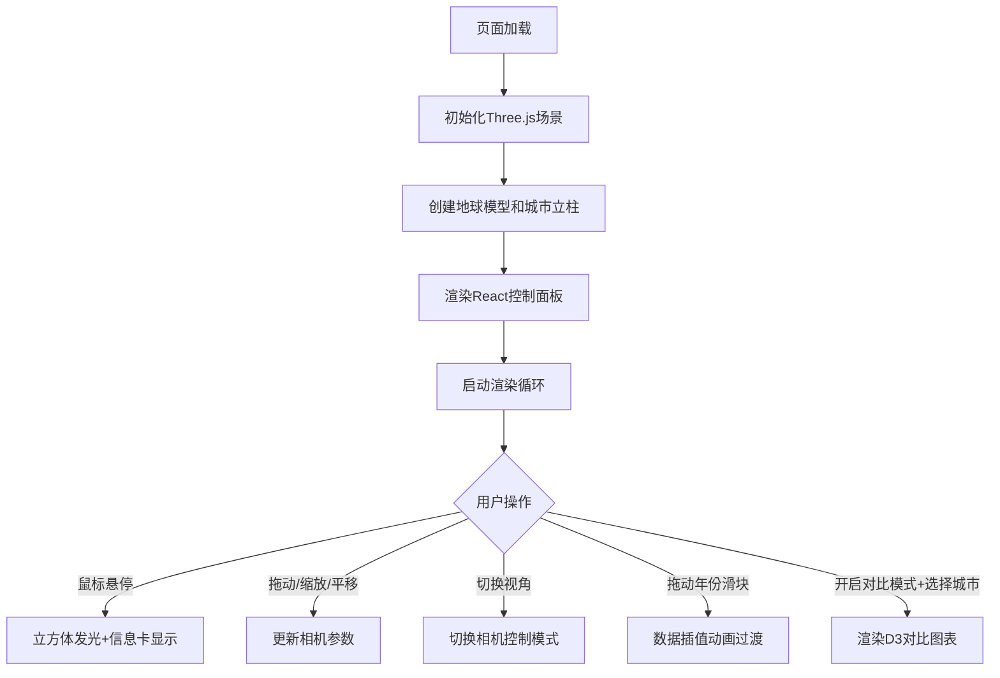

## 1. 产品概述

三维城市历史天气气候可视化工具，帮助用户在三维空间中直观地对比和分析多个城市的历史天气气候模式（气温和降水量），解决静态图表难以同时呈现时间序列、地理分布和气候统计特征的问题。

- 主要用途：气象数据可视化、城市气候对比分析、教育展示
- 目标用户：气象研究人员、教育工作者、数据分析师
- 市场价值：将抽象的气候数据转化为沉浸式3D交互体验，提升数据理解效率

## 2. 核心功能

### 2.1 功能模块

1. **3D地球场景**：旋转地球模型、城市位置标记、气候立柱展示
2. **控制面板**：视角切换、年份选择、对比模式开关
3. **对比图表面板**：双城市全年气温/降水量二维对比图
4. **浮动统计面板**：全球平均气温、全球总降水量实时显示
5. **交互系统**：鼠标悬停信息卡、拖拽旋转、滚轮缩放、右键平移

### 2.2 功能详情

| 页面名称 | 模块名称 | 功能描述 |
|-----------|-------------|---------------------|
| 主界面 | 3D地球场景 | 半径5单位低多边形地球，自西向东10秒一圈自转，陆地渐变#2E5C4E到#4A7C6E，海洋#0B3D5B |
| 主界面 | 城市气候立柱 | 至少8个预设城市（北京、纽约、伦敦、东京、悉尼、巴黎、莫斯科、开罗），12个立方体堆叠代表1-12月，高度=降水量(每单位10mm)，颜色=气温（蓝#0066CC→红#FF3300，0°C=#00CCFF，范围-10°C至40°C） |
| 主界面 | 悬停交互 | 鼠标悬停立方体边缘发白光（强度0.5），弹出200px宽信息卡（圆角8px，白色半透明模糊背景，显示城市名、月份、降水量、气温） |
| 控制面板 | 视角切换 | 下拉选择器：自动旋转、自由探索、锁定视角，0.3秒淡入淡出过渡 |
| 控制面板 | 年份滑块 | 范围2010-2020，步长1，轨道200x4px圆角2px，手柄直径16px颜色#4FC3F7，拖动时0.2秒缩放心跳，切换时立柱0.6秒线性插值动画 |
| 控制面板 | 对比模式 | 开关开启后点击两个城市，右侧弹出两个300x200px面板（白底深色边框），显示12个月气温折线（红色）和降水量柱状图（蓝色0.7透明度），双Y轴，切换城市0.4秒过渡动画 |
| 浮动面板 | 全球统计 | 两个180x120px圆角12px面板（半透明深蓝#1A252C99），显示全球平均气温和总降水量，每0.5秒更新，数字向上滚动切换动画 |
| 交互系统 | 场景控制 | 左键拖拽旋转地球，滚轮缩放0.5-3倍，右键拖拽平移 |

## 3. 核心流程

## 4. 用户界面设计

### 4.1 设计风格

- **主色调**：深空蓝到黑色径向渐变背景（#0A0E27到#000000）
- **辅助色**：控制栏半透明深灰#2C3E5080（模糊12px），浮动面板#1A252C99
- **强调色**：滑块手柄#4FC3F7，气温刻度蓝#0066CC→青#00CCFF→红#FF3300
- **控件风格**：所有UI控件圆角8px矩形，Material Design Outlined图标
- **字体**：Sans-serif无衬线字体

### 4.2 页面设计概览

| 页面名称 | 模块名称 | UI元素 |
|-----------|-------------|-------------|
| 主界面 | 3D场景区域 | 全屏Three.js渲染，深空渐变背景，地球居中，立柱环绕球面分布 |
| 主界面 | 左侧控制面板 | 固定280px宽，垂直排列视角下拉框、年份滑块、对比模式开关 |
| 主界面 | 右上浮动面板 | 两个统计卡片水平排列，带滚动数字动画 |
| 主界面 | 对比图表区 | 右侧两个并排面板，显示D3绘制的双轴图表 |
| 主界面 | 信息卡 | 跟随鼠标定位，带模糊玻璃效果 |

### 4.3 响应式

- Desktop-first设计，主场景自适应全屏
- 控制面板固定左侧，最小屏幕宽度1280px
- 不针对移动端做特殊适配

### 4.4 3D场景指引

- **环境**：深空背景径向渐变，无HDRI，保持简约太空主题
- **光照**：环境光+方向光，突出地球球体和立柱立体感
- **相机**：初始距离适中，可0.5-3倍缩放，支持任意角度旋转
- **后处理**：信息卡半透明模糊，面板使用CSS backdrop-filter
- **性能**：240个独立几何体，稳定30FPS以上

## 5. 性能指标

- 20个立柱（240个立方体）稳定30FPS以上
- 信息卡弹出响应延迟≤100ms
- 所有交互视觉响应≤300ms
