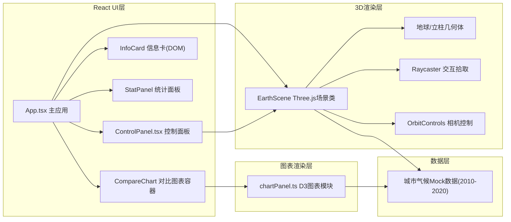

## 1. 架构设计



## 2. 技术描述

- **前端框架**：React@18 + TypeScript
- **构建工具**：Vite@5 + @vitejs/plugin-react
- **3D渲染**：Three.js@0.160 + @types/three
- **图表可视化**：D3.js@7 + @types/d3
- **状态管理**：React useState/useRef（轻量级场景，无需zustand）
- **样式方案**：原生CSS + CSS Variables，Tailwind不作为依赖（用户未要求）
- **图标**：Material Design Outlined（通过CDN或内联SVG）
- **其他依赖**：react-colorful（用户指定）、file-saver（用户指定）

## 3. 项目文件结构

```
d:\Pro\tasks\auto131/
├── package.json
├── vite.config.js
├── tsconfig.json
├── index.html
└── src/
    ├── main.ts              # React挂载入口，初始化Three场景
    ├── App.tsx              # 根组件，整合各模块
    ├── earthScene.ts        # Three.js场景类（核心3D逻辑）
    ├── ControlPanel.tsx     # React控制面板组件
    ├── chartPanel.ts        # D3图表渲染模块
    ├── data/
    │   └── climateData.ts   # 城市气候Mock数据(2010-2020)
    ├── types/
    │   └── index.ts         # 类型定义
    └── styles/
        └── global.css       # 全局样式
```

## 4. 核心数据模型

### 4.1 类型定义

```typescript
interface CityClimate {
  cityId: string;
  cityName: string;
  lat: number;       // 纬度
  lng: number;       // 经度
  monthlyData: MonthlyRecord[];  // 12个月数据
}

interface MonthlyRecord {
  year: number;      // 2010-2020
  month: number;     // 1-12
  temperature: number;  // °C，范围-10~40
  precipitation: number; // mm
}

interface HoverInfo {
  cityName: string;
  month: number;
  temperature: number;
  precipitation: number;
  screenX: number;
  screenY: number;
}

type ViewMode = 'auto-rotate' | 'free-explore' | 'locked';
```

### 4.2 预设城市坐标

| 城市 | 纬度 | 经度 |
|------|------|------|
| 北京 | 39.9°N | 116.4°E |
| 纽约 | 40.7°N | 74.0°W |
| 伦敦 | 51.5°N | 0.1°W |
| 东京 | 35.7°N | 139.7°E |
| 悉尼 | 33.9°S | 151.2°E |
| 巴黎 | 48.9°N | 2.3°E |
| 莫斯科 | 55.8°N | 37.6°E |
| 开罗 | 30.0°N | 31.2°E |

## 5. 关键实现方案

### 5.1 Three.js场景管理（earthScene.ts）

- **地球构造**：SphereGeometry(radius=5, low-poly分段)，自定义ShaderMaterial实现陆地/海洋渐变
- **立柱生成**：经纬度→球面坐标转换，每个城市12个BoxGeometry堆叠，Y轴正方向
- **颜色映射**：temperature∈[-10,40] → t∈[0,1] → lerp(#0066CC, #00CCFF, #FF3300)三段线性插值
- **高度映射**：precipitation(mm) / 10 = 立方体高度
- **动画系统**：年份切换时，目标值与当前值线性插值(lerp)，600ms过渡
- **Raycaster拾取**：每帧检测鼠标与立方体交集，悬停立方体添加EdgesGeometry发光效果
- **相机控制**：OrbitControls，enableDamping=true，区分自动旋转/自由探索/锁定模式
- **性能优化**：所有立方体使用共享Geometry，仅Material实例独立

### 5.2 React UI层（ControlPanel.tsx等）

- **ControlPanel**：固定定位left:0，width:280px，backdrop-filter: blur(12px)
- **年份滑块**：原生input[type=range]自定义样式，onChange触发EarthScene.updateYear()
- **对比模式**：useState管理选中城市数组，达到2个时触发图表渲染
- **统计面板**：setInterval每500ms更新，用CSS transform实现数字滚动动画

### 5.3 D3图表模块（chartPanel.ts）

- **renderCompareChart**：初始化SVG、双Y轴比例尺、坐标轴、line generator
- **updateCompareChart**：新数据进入时，selection.transition().duration(400)平滑过渡
- **双Y轴**：左轴temperature[-10,40]，右轴precipitation[0,300]，X轴月份[1-12]
- **渲染内容**：红色path折线（气温）+ 蓝色rect柱状图（降水量opacity=0.7）

### 5.4 交互响应

- **悬停响应**：requestAnimationFrame中Raycaster检测，命中时立即更新悬停状态（<100ms）
- **信息卡定位**：将3D坐标project到NDC→屏幕坐标，CSS transform定位
- **缩放限制**：OrbitControls.minDistance=2.5, maxDistance=15（对应0.5x~3x）

## 6. 性能保障策略

1. **几何体复用**：所有立方体共享同一个BoxGeometry实例
2. **材质复用**：气温色通过顶点色或uniform动态更新，避免每帧创建新Material
3. **Raycaster优化**：仅在鼠标移动时进行拾取检测，不每帧检测
4. **渲染帧率**：启用requestAnimationFrame自适应帧率，必要时降采样
5. **DOM更新节流**：信息卡位置更新使用requestAnimationFrame合并
