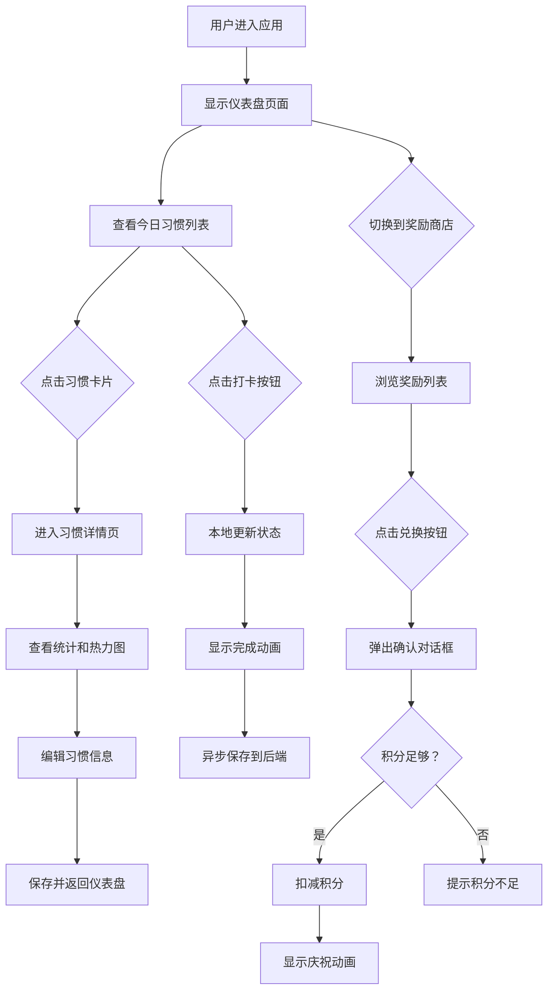

## 1. 产品概述

个人习惯跟踪与奖励系统是一款帮助用户培养良好习惯的Web应用。用户可以定义习惯项目，每日打卡记录完成情况，系统根据连续打卡天数计算积分，积分累积后可兑换自定义奖励。

- 核心目标：通过游戏化机制激励用户坚持良好习惯
- 目标用户：希望培养自律习惯的个人用户
- 产品价值：将习惯养成过程可视化、奖励化，提升用户持续动力

## 2. 核心功能

### 2.1 用户角色

| 角色 | 注册方式 | 核心权限 |
|------|----------|----------|
| 普通用户 | 无需注册（本地存储） | 习惯管理、打卡记录、奖励兑换 |

### 2.2 功能模块

1. **仪表盘页面**：今日日期展示、随机励志格言、待打卡习惯卡片列表
2. **习惯详情页**：打卡统计、30天热力图、习惯编辑功能
3. **奖励商店页**：奖励列表展示、积分兑换、庆祝动画

### 2.3 页面详情

| 页面名称 | 模块名称 | 功能描述 |
|-----------|----------|-----------|
| 仪表盘 | 顶部区域 | 渐变背景、今日日期、随机励志格言 |
| 仪表盘 | 习惯卡片 | 习惯名称、连续打卡天数（火焰图标）、圆形打卡按钮、点击动画 |
| 习惯详情 | 统计区域 | 总打卡天数、最长连续记录 |
| 习惯详情 | 热力图 | Chart.js绘制30天打卡记录，颜色深浅表示打卡状态 |
| 习惯详情 | 编辑功能 | 修改习惯名称、目标描述、打卡频率 |
| 奖励商店 | 奖励卡片 | 奖励名称、所需积分、兑换次数 |
| 奖励商店 | 兑换功能 | 确认对话框、积分扣减、庆祝动画 |
| 全局导航 | 底部导航栏 | 仪表盘、奖励商店、个人资料三个标签页切换动画 |

## 3. 核心流程

## 4. 用户界面设计

### 4.1 设计风格
- 主色调：天蓝色（#3B82F6）和薰衣草紫色（#8B5CF6）搭配
- 顶部渐变背景：从浅蓝（#E0F2FE）到浅紫（#EDE9FE）
- 卡片风格：白色圆角矩形（圆角12px），浅灰边框（#E5E7EB）
- 字体：无衬线体
- 交互反馈：卡片悬停上浮（transform: translateY(-2px)），阴影加深
- 按钮反馈：点击缩放（transform: scale(0.95)，0.1秒）

### 4.2 页面设计概述

| 页面名称 | 模块名称 | UI元素 |
|-----------|----------|---------|
| 仪表盘 | 顶部区域 | 渐变背景、日期显示、随机格言、柔和阴影 |
| 仪表盘 | 习惯卡片 | 白色卡片、圆角12px、浅灰边框、火焰emoji、圆形打卡按钮、绿色对勾、100ms缩放动画 |
| 习惯详情 | 统计卡片 | 大数据展示、浅蓝/浅紫渐变强调色 |
| 习惯详情 | 热力图 | 方格矩阵、浅灰到深绿渐变、Chart.js渲染 |
| 奖励商店 | 奖励卡片 | 积分标签、兑换按钮、兑换次数统计 |
| 奖励商店 | 庆祝动画 | CSS关键帧彩纸飘落、持续2秒 |
| 全局导航 | 底部导航栏 | 三个标签图标、0.3秒滑动切换动画 |

### 4.3 响应式设计
- 采用桌面优先设计，移动端自适应
- 卡片布局在小屏幕上自动调整为单列
- 触摸区域不小于48px，适配移动端触控

### 4.4 性能优化
- 虚拟路由懒加载，页面初次加载不超过2秒
- 打卡操作本地先更新，响应时间不超过100ms
- 异步保存数据到后端
