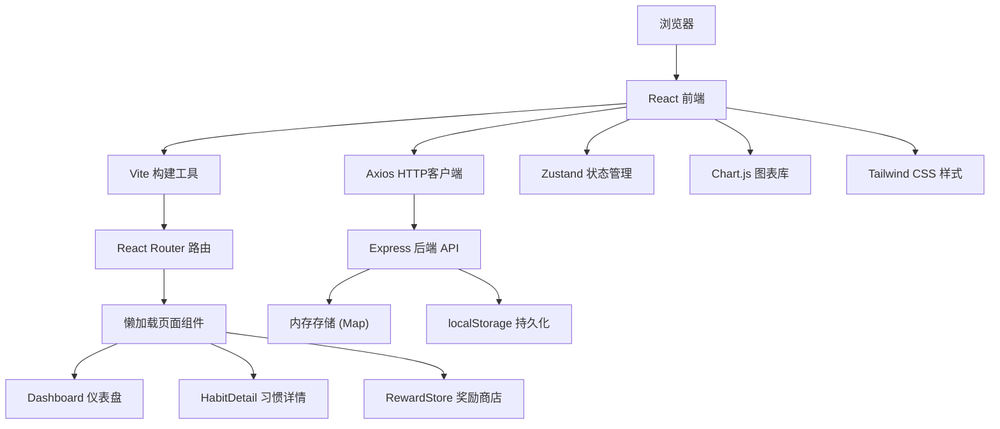
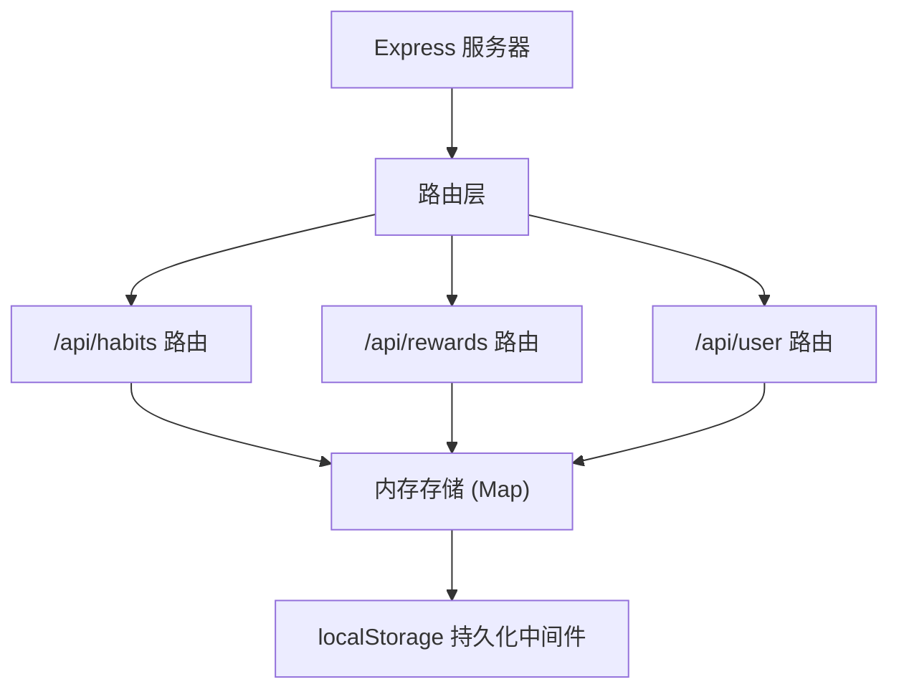
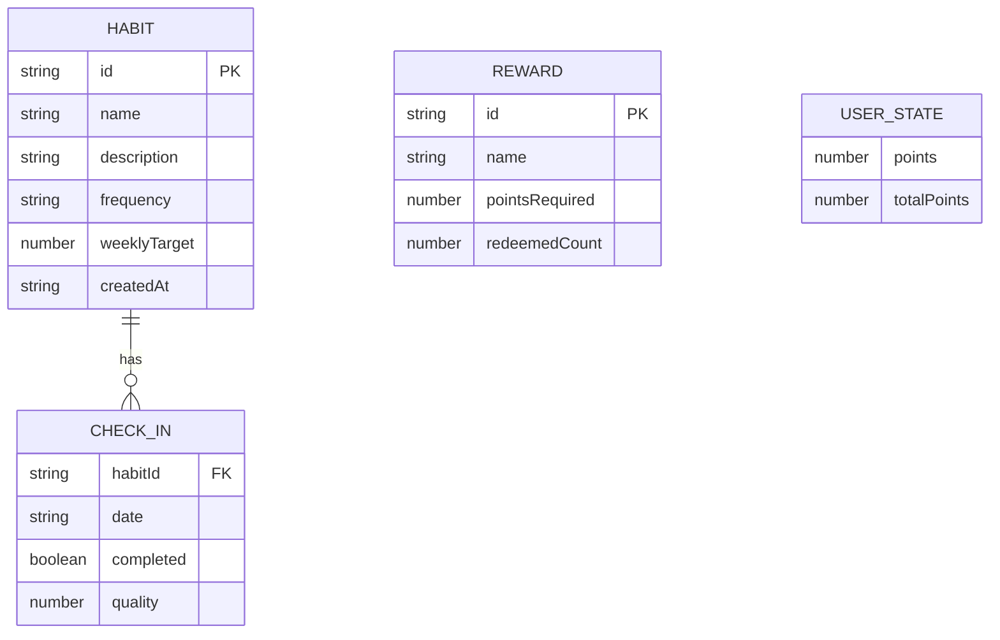

## 1. 架构设计



## 2. 技术栈

- **前端框架**：React 18 + TypeScript
- **构建工具**：Vite
- **路由管理**：React Router DOM v6
- **状态管理**：Zustand
- **HTTP客户端**：Axios
- **图表库**：Chart.js + react-chartjs-2
- **样式方案**：Tailwind CSS
- **后端框架**：Express 4
- **数据存储**：内存 Map + localStorage 持久化
- **唯一ID**：uuid

## 3. 路由定义

| 路由 | 用途 |
|-------|------|
| / | 仪表盘页面 |
| /habit/:id | 习惯详情页 |
| /rewards | 奖励商店页 |
| /profile | 个人资料页 |

## 4. API 定义

### 4.1 类型定义

```typescript
// 习惯类型
interface Habit {
  id: string;
  name: string;
  description: string;
  frequency: 'daily' | 'weekly';
  weeklyTarget?: number;
  createdAt: string;
  checkIns: CheckIn[];
}

// 打卡记录类型
interface CheckIn {
  date: string;
  completed: boolean;
  quality: number; // 0-5 质量评分
}

// 奖励类型
interface Reward {
  id: string;
  name: string;
  pointsRequired: number;
  redeemedCount: number;
}

// 用户状态类型
interface UserState {
  points: number;
  totalPoints: number;
}
```

### 4.2 接口列表

| 方法 | 路径 | 描述 | 请求体 | 响应 |
|------|------|------|--------|------|
| GET | /api/habits | 获取所有习惯 | - | Habit[] |
| POST | /api/habits | 创建新习惯 | { name, description, frequency, weeklyTarget } | Habit |
| PUT | /api/habits/:id | 更新习惯信息 | { name, description, frequency, weeklyTarget } | Habit |
| DELETE | /api/habits/:id | 删除习惯 | - | { success: boolean } |
| POST | /api/habits/:id/checkin | 打卡 | { date, quality } | Habit |
| GET | /api/rewards | 获取所有奖励 | - | Reward[] |
| POST | /api/rewards | 创建奖励 | { name, pointsRequired } | Reward |
| POST | /api/rewards/:id/redeem | 兑换奖励 | - | { success: boolean, newPoints: number } |
| GET | /api/user/points | 获取用户积分 | - | { points: number } |

## 5. 服务端架构



## 6. 数据模型

### 6.1 数据模型定义



### 6.2 数据持久化

数据采用内存 Map 存储，并通过 localStorage 实现持久化。每次数据变更后自动同步到 localStorage，应用启动时从 localStorage 恢复数据。
