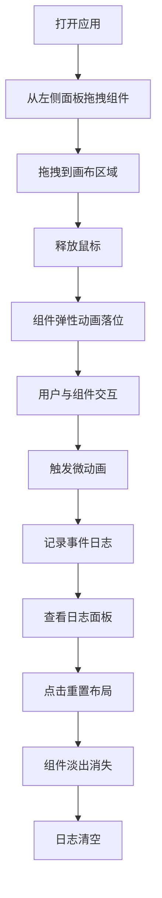

## 1. 产品概述

交互式UI原型预览与微交互调试应用，旨在解决产品设计师在评审高保真原型时交互细节难以提前体验的痛点，提供轻量方式让开发者和设计师在同一环境中预览和验证交互行为，减少反复修改成本。

- 核心目标：提供拖拽式组件布局 + 微交互实时预览 + 事件日志追踪
- 目标用户：产品设计师、前端开发者、交互设计师
- 产品价值：缩短原型评审效率，提前发现交互问题，统一设计与开发的协作鸿沟

## 2. 核心功能

### 2.1 用户角色

| 角色 | 注册方式 | 核心权限 |
|------|----------|----------|
| 设计师/开发者 | 无需注册，本地使用 | 使用全部功能，创建布局、预览交互、查看日志 |

### 2.2 功能模块

1. **主工作台页面**：顶部导航、左侧组件面板、中央预览画布、右侧事件日志面板

### 2.3 页面详情

| 页面名称 | 模块名称 | 功能描述 |
|---------|---------|---------|
| 主工作台 | 顶部导航栏 | 应用名称、帮助/设置图标按钮、重置布局按钮 |
| 主工作台 | 左侧预设组件面板 | 8种预设组件网格展示，支持拖拽，悬停缩放效果 |
| 主工作台 | 中央预览画布 | 1200x700px画布，支持拖放组件，支持再次拖拽调整位置，淡蓝色虚线网格背景 |
| 主工作台 | 右侧事件日志面板 | 实时显示交互事件，时间倒序，一键清空，最多保留100条 |

## 3. 核心流程

用户从左侧面板拖拽预设组件至中央画布 → 组件以弹性动画落位 → 用户在画布上与组件交互（悬停/点击/长按） → 组件触发预定微动画 → 事件被记录到右侧日志面板 → 用户可点击重置布局清空画布和日志 → 组件以淡出动画消失

## 4. 用户界面设计

### 4.1 设计风格

- 主色调：蓝紫色调（主色 #6366F1，辅色 #A5B4FC）
- 背景色：#F1F5F9
- 按钮风格：圆角8px，悬停有过渡效果
- 字体：现代无衬线字体，标题加粗18px，正文常规
- 布局风格：三栏布局（左侧面板+中央画布+右侧面板），顶部导航栏
- 毛玻璃效果：左右面板使用 backdrop-filter: blur(8px)
- 所有过渡：cubic-bezier(0.4, 0, 0.2, 1) 缓动函数

### 4.2 页面设计概览

| 页面名称 | 模块名称 | UI元素 |
|---------|---------|--------|
| 主工作台 | 顶部导航栏 | 56px高度，应用名称（#1E1B4B，加粗18px），帮助/设置图标（悬停旋转10deg），重置布局按钮（#EF4444背景，圆角8px） |
| 主工作台 | 左侧组件面板 | 220px固定宽度，白色半透明毛玻璃，8个90x90px组件缩略图网格，悬停缩放1.1倍+背景#E0E7FF |
| 主工作台 | 中央画布 | 1200x700px，#F9FAFB背景，32px间距淡蓝色虚线网格，组件支持悬停/点击/长按动画 |
| 主工作台 | 右侧日志面板 | 280px固定宽度，白色半透明毛玻璃，事件日志时间倒序，最新日志淡入，一键清空按钮 |

### 4.3 响应式设计

- Desktop-first设计
- 窗口宽度 < 1024px 时自动隐藏左右面板
- 画布自适应剩余空间
- 面板展开/收起带有0.3s宽度过渡动画
- 可通过按钮展开面板

### 4.4 性能要求

- 拖拽帧率稳定在55fps以上
- 事件日志最多保留100条，超出自动移除最早条目
- CSS过渡动画硬件加速
