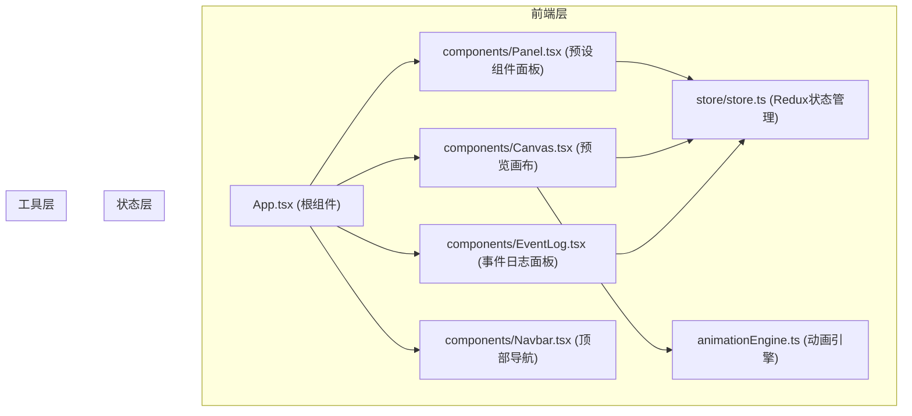
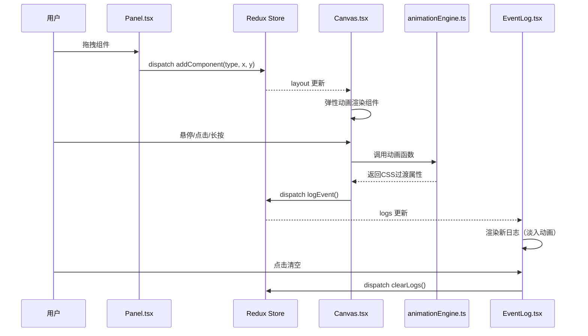

## 1. 架构设计



## 2. 技术说明

- 前端框架：React 18 + TypeScript
- 构建工具：Vite 5 + @vitejs/plugin-react
- 状态管理：Redux Toolkit + React-Redux
- 唯一ID生成：uuid
- 初始化方式：npm create vite-init@latest . --template react-ts --force

## 3. 项目文件结构与调用关系

```
src/
├── components/
│   ├── App.tsx              # 根组件，布局容器
│   ├── Navbar.tsx            # 顶部导航栏组件
│   ├── Panel.tsx             # 左侧预设组件面板（拖拽源）
│   ├── Canvas.tsx            # 中央预览画布（放置目标+事件监听）
│   └── EventLog.tsx          # 右侧事件日志面板
├── store/
│   └── store.ts             # Redux Store (布局数组、组件属性、事件日志)
├── animationEngine.ts         # 微动画函数集合
├── main.tsx                   # 入口文件
└── index.css                  # 全局样式
```

**文件间调用关系：**

- `App.tsx` → 组合 `Navbar` + `Panel` + `Canvas` + `EventLog`
- `Panel.tsx` → `useDispatch` → dispatch `addComponent` action
- `Canvas.tsx` → `useSelector` 读取布局 → `useDispatch` dispatch `moveComponent` / `logEvent` → 调用 `animationEngine`
- `EventLog.tsx` → `useSelector` 读取日志 → `useDispatch` dispatch `clearLogs`
- `store.ts` → 定义 `LayoutItem` / `EventLog` 类型、`addComponent` / `moveComponent` / `logEvent` / `clearLogs` / `resetLayout` actions
- `animationEngine.ts` → 导出 `bounce()` / `fade()` / `rotate()` / `scale()` / `floatUp()` 等动画函数，返回CSS样式对象

## 4. 数据流向



## 5. 数据模型

### 5.1 类型定义

```typescript
// 组件类型枚举
type ComponentType = 
  | 'primary-button'
  | 'secondary-button'
  | 'card'
  | 'modal'
  | 'accordion'
  | 'switch'
  | 'spinner'
  | 'notification';

// 画布上的组件项
interface LayoutItem {
  id: string;           // uuid
  type: ComponentType;
  x: number;           // 画布内x坐标
  y: number;           // 画布内y坐标
  width: number;
  height: number;
}

// 事件日志项
interface EventLogEntry {
  id: string;         // uuid
  componentId: string;
  eventType: 'onHover' | 'onClick' | 'onLongPress';
  timestamp: string;  // HH:mm:ss格式
}

// 应用状态
interface AppState {
  layout: LayoutItem[];
  logs: EventLogEntry[];
}
```

### 5.2 Redux Actions

| Action | 用途 |
|--------|------|
| `addComponent(payload: { type, x, y, width, height })` | Panel拖放结束时调用 |
| `moveComponent(payload: { id, x, y })` | Canvas内再次拖拽调整位置 |
| `logEvent(payload: { componentId, eventType })` | 组件触发交互事件时调用 |
| `clearLogs()` | 清空事件日志 |
| `resetLayout()` | 重置布局+清空日志 |

## 6. 动画引擎函数

| 函数名 | 参数 | 返回值 | 用途 |
|-------|------|--------|------|
| `bounce(duration)` | 持续时间(秒) | CSS过渡样式 | 点击按钮弹跳效果 |
| `fade(duration)` | 持续时间(秒) | CSS过渡样式 | 透明度渐变 |
| `rotate(deg, duration)` | 角度、持续时间 | CSS过渡样式 | 旋转动画 |
| `scale(from, to, duration)` | 起始/结束缩放、持续时间 | CSS过渡样式 | 缩放动画 |
| `floatUp(offset, duration)` | 上浮距离、持续时间 | CSS过渡样式 | 卡片悬停上浮 |

## 7. 性能优化策略

1. 使用CSS transform/opacity 硬件加速
2. 拖拽使用requestAnimationFrame确保55fps+
3. 事件日志超过100条自动FIFO淘汰
4. 组件重渲染优化（memo）
