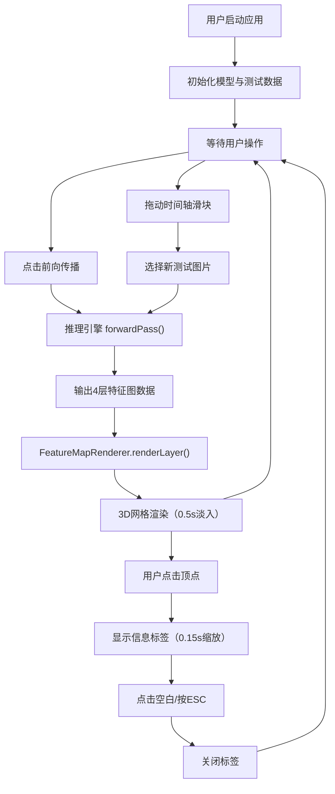

## 1. 产品概述
神经网络中间层特征图可视化应用，帮助机器学习工程师直观理解CNN模型在训练过程中的特征激活模式与响应分布变化。
- 目标用户：机器学习工程师、深度学习研究者、AI教育者
- 核心价值：将抽象的神经网络中间计算结果转化为可交互的3D可视化形态，辅助模型调试与理解

## 2. 核心功能

### 2.1 用户角色
| 角色 | 注册方式 | 核心权限 |
|------|----------|----------|
| 工程师用户 | 本地使用无需注册 | 模型选择、推理执行、3D交互、时间轴切换 |

### 2.2 功能模块
1. **控制面板（左侧）**：模型选择器、前向传播触发按钮、当前标签与预测置信度展示
2. **3D可视化场景（右侧主区域）**：四层特征图3D网格渲染、顶点高度映射、颜色渐变、淡入动画
3. **时间轴（底部）**：10张测试图片滑块切换、平滑过渡动画
4. **交互系统**：顶点点击信息标签、ESC关闭、平滑插值过渡

### 2.3 页面详情
| 页面名称 | 模块名称 | 功能描述 |
|----------|----------|----------|
| 主应用页 | 控制面板 | 选择预设轻量CNN模型（LeNet-5简化版），点击前向传播触发推理，展示真实标签与预测置信度百分比 |
| 主应用页 | 3D可视化区 | 基于Three.js渲染4层（Conv1→Pool1→Conv2→Pool2）特征图，每层为平面网格，顶点高度=激活值，颜色蓝→红渐变，0.5秒中心扩散淡入 |
| 主应用页 | 时间轴面板 | 滑块调节切换前10张测试图片，网格顶点0.6秒缓入缓出平滑过渡，重新推理与渲染在2秒内完成 |
| 主应用页 | 顶点交互 | 点击网格顶点弹出半透明标签（Ch/Pos/Val信息），0.15秒缩放动画，点击空白或ESC关闭 |

## 3. 核心流程
用户启动应用 → 系统自动初始化模型权重与测试图片数据 → 用户点击"前向传播"按钮 → 推理引擎逐层计算4层特征图 → 特征图数据传递给渲染模块 → 3D场景以中心扩散动画渲染四层网格 → 用户拖动底部时间轴滑块切换图片 → 重新执行推理 → 顶点高度与颜色平滑过渡到新值 → 用户点击任意顶点查看详细激活信息 → 点击空白或按ESC关闭标签

## 4. 用户界面设计

### 4.1 设计风格
- **色彩主题**：深色科技风
  - 主背景：#1A1A2E（深蓝紫夜空色）
  - 面板背景：#16213E（深邃藏蓝）
  - 分隔线：#2A2A4E
  - 主色控件：#0F3460（海蓝）
  - 高亮色：#E94560（洋红强调）
  - 文字：#E0E0E0（浅灰白）
  - 激活低值色：#003366（深蓝）
  - 激活高值色：#FF3300（炽热红）
- **按钮风格**：扁平矩形，4px圆角，hover态边框高亮为#E94560，点击态轻微缩放0.97
- **字体**：'JetBrains Mono'等宽字体用于数值显示，'Segoe UI'用于界面文字，字号12-16px
- **布局风格**：三栏式刚性布局，左侧300px固定边栏，右侧自适应主区，底部80px固定时间轴，2px硬朗分隔线
- **视觉增强**：面板内轻微内阴影营造嵌入感，3D场景雾化效果（FogExp2）增加空间深度

### 4.2 页面设计概览
| 页面名称 | 模块名称 | UI元素 |
|----------|----------|---------|
| 主应用页 | 左侧控制面板 | 顶部标题区"FeatureViz Pro"，模型选择下拉框（LeNet-5简化版），主按钮"▶ 前向传播"，分隔线下方当前图片信息卡（标签Label + 预测Prediction置信度条），底部模型结构列表（4层带激活维度信息） |
| 主应用页 | 右侧3D场景 | 全屏Three.js Canvas，OrbitControls支持旋转缩放，4层网格垂直堆叠（每层间距2.5单位），每层左上角文字标签"Layer N: Conv/Pool H×W"，场景内方向光+环境光组合 |
| 主应用页 | 底部时间轴 | 左侧"Image Index"标签（0-9），中间滑块轨道（选中处#E94560高亮圆点），右侧当前图片缩略图（28×28放大显示），顶部进度指示线随滑块位置填充 |

### 4.3 响应式
- Desktop-first设计，标准适配1280×800及以上
- 768px以下断点：左侧300px面板折叠为顶部水平菜单栏（高度60px），3D场景占满剩余视口，时间轴保持80px
- 触控设备：滑块与按钮触控热区≥44×44px，3D场景支持双指缩放

### 4.4 3D场景指导
- **环境氛围**：深色太空感，FogExp2(0x1A1A2E, 0.04)雾化随距离衰减
- **灯光设置**：AmbientLight(0xffffff, 0.5)基础环境光 + DirectionalLight(0xffffff, 0.8, position(5,10,7))方向光 + 每层网格下方点光源PointLight(0x4488ff, 0.3)营造科技蓝底光
- **相机设置**：PerspectiveCamera(fov=50)，初始位置(8, 6, 12)，lookAt(0, 1, 0)，OrbitControls启用阻尼，禁用pan
- **构图布局**：4层网格沿Y轴等距堆叠（y=4.5, 2.0, -0.5, -3.0），每层XY平面居中，X轴=特征图宽度方向，Z轴=特征图高度方向，每层多通道沿X轴偏移排列（通道间距0.15单位）
- **交互动画**：首次渲染：每层从scale(0.01)弹性缩放至(1,1,1) + 材质opacity 0→1（0.5s）；切换图片：顶点Y坐标线性插值（0.6s easeInOutCubic）；顶点点击：该点0.2秒临时放大1.3倍后回弹
- **后处理**：无需额外后处理，使用MeshStandardMaterial的roughness=0.6, metalness=0.2体现质感
- **性能预算**：单网格顶点数 ≤ 特征图分辨率²，总顶点数控制在5000以内，目标帧率≥30FPS
